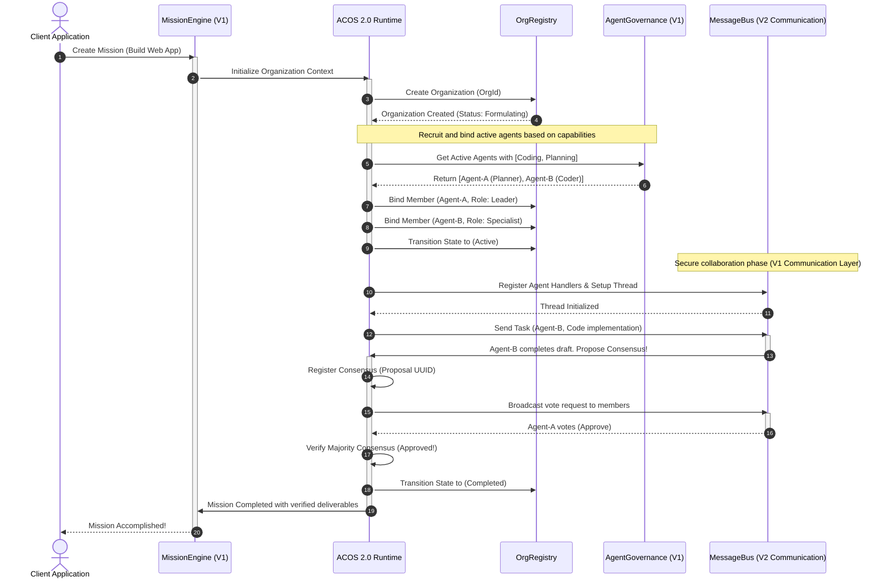

# AI Operating System (ACOS 2.0) - Implementation Specification Document
**Author:** Lead Software Engineer, ORIGIN Core Team  
**Version:** 2.0.0-Draft  
**Target Architecture:** Clean Architecture & Domain-Driven Design (DDD)  
**Scalability Goal:** 1000+ Active Agents concurrent execution & self-organizing capabilities

---

## Executive Summary: Evolution to ACOS 2.0

Version 1.x successfully established the **AI Runtime** paradigm—governing single missions, tracking individual agent state machines, executing modular tools safely, and implementing a zero-trust `MessageBus` for secure agent-to-agent communication.

In **Version 2.0 (ACOS 2.0)**, we evolve from an *application-layer runtime* to an **Agentic Operating System (AI OS)**. The core atomic unit of execution shifts from isolated individual agents to **Dynamic Agent Organizations (Orgs)**. ACOS 2.0 manages resources, scheduling, permissions, consensus, and process trees across federated organizations of 1000+ collaborative agents.

---

## Key Design Principles

1. **Strict Version 1.x Compatibility**: All existing entities (`Mission`, `AgentGovernanceRecord`, `MessageBus`, `SafetyPolicyEngine`) remain unaffected. ACOS 2.0 sits *above* the individual Agent Runtime, treating individual agents as threads/processes and Organizations as virtual address spaces/process groups.
2. **Clean Architecture & DDD**: Clear separation of concern layers:
   - `Domain`: Pure business rules, Domain Events, entities, and value objects.
   - `Application`: Command/Query handlers, use cases, and coordination logic.
   - `Infrastructure`: Event brokers, database repositories, and IPC (Inter-Process Communication) handlers.
3. **Hyper-Scalability (1000+ Agents)**:
   - Event-driven, non-blocking asynchronous I/O.
   - Partitioned actor-style state machines.
   - Light-weight logical concurrency (micro-tick event loops) preventing thread exhaustion.

---

## 1. Organization Model (Domain Layer)

Using DDD, we model the **Organization** as an **Aggregate Root** (`OrganizationAggregate`). It encapsulates its member agents, active communication channels, sub-structures, and shared context.

```
[OrganizationAggregate] (Aggregate Root)
 ├── OrgId (Value Object)
 ├── OrgProfile (Value Object)
 ├── OrgStatus (Value Object)
 ├── Members (Entity List)
 │    ├── AgentId (Value Object)
 │    ├── OrgRole (Enum)
 │    └── ActiveStatus (Enum)
 ├── SubOrganizations (Entity List)
 ├── SharedMemoryContext (Entity)
 └── PolicyBoundary (Value Object)
```

### Domain Entities & Value Objects

#### 1.1 OrganizationAggregate (Aggregate Root)
- `id: OrgId` (UUID, globally unique identifier)
- `profile: OrgProfile` (name, mission objectives, taxonomy)
- `status: OrgStatus` (current lifecycle state)
- `members: Map<AgentId, OrganizationMember>` (active members and roles)
- `subOrgs: Set<OrgId>` (child organizations for hierarchical division of labor)
- `context: SharedMemoryContext` (isolated workspace memory and virtual file tree)
- `policyBoundary: PolicyBoundary` (strict security boundaries, maximum resource usage)
- `version: number` (optimistic locking version counter)

#### 1.2 OrganizationMember (Entity)
- `agentId: AgentId` (references V1 `AgentGovernanceRecord.id`)
- `role: OrgRole` (e.g., `Leader`, `Strategist`, `Specialist`, `Auditor`)
- `joinedAt: Date`
- `assignedLoad: number` (current task allocations, 0 to 100)

#### 1.3 SharedMemoryContext (Entity)
- `memoryId: string`
- `documents: Map<string, SharedDocument>` (knowledge, workspace state, artifact output drafts)
- `consensusState: Map<string, ConsensusRecord>` (active propositions, vote records)

---

## 2. Organization Registry (Domain & Application Layer)

The **Organization Registry** provides centralized discovery, parent-child topology mapping, and life-cycle auditing for all active agent organizations.

```
[OrganizationRegistry]
 ├── orgMap: Map<OrgId, OrganizationAggregate>
 ├── topology: HierarchyTree<OrgId>
 ├── Query & Discovery Engine
 └── Lifecycle Factory
```

### Responsibilities
- **Dynamic Org Discovery**: Allows agents and external runtimes to look up active organizations by capability labels, parent missions, or strategic goals.
- **Topology Management**: Maintains structural tree graphs showing sub-organization relationships (e.g., Parent Marketing Org -> Child Copywriting Sub-Org).
- **Life-cycle Factory**: Handles transaction-safe creation, structural mutations, merging (Orgs merging to pool resources), and division (Orgs splitting into sub-groups).

### Interface Specification
```typescript
interface IOrganizationRegistry {
  register(org: OrganizationAggregate): void;
  getById(id: OrgId): OrganizationAggregate | null;
  getByMissionId(missionId: string): OrganizationAggregate[];
  getChildren(parentOrgId: OrgId): OrganizationAggregate[];
  search(criteria: OrganizationSearchCriteria): OrganizationAggregate[];
  deregister(id: OrgId): boolean;
}
```

---

## 3. Organization Runtime (Application & Infrastructure Layer)

The **Organization Runtime** serves as the operating system's CPU scheduler and process executor. It coordinates tick cycles, allocates system resources, triggers individual agents, and manages consensus phases.

```
+--------------------------------------------------------------+
|                    Organization Runtime                      |
|                                                              |
|  +--------------------------------------------------------+  |
|  |                Micro-Tick Scheduler                    |  |
|  |  - Controls time slices for 1000+ parallel agents      |  |
|  |  - Prevents resource starvation via dynamic priorities |  |
|  +--------------------------------------------------------+  |
|  +--------------------------------------------------------+  |
|  |                Shared Virtual Memory                   |  |
|  |  - IPC / Ephemeral State exchange buffers              |  |
|  |  - Transactional rollback on consensus failures         |  |
|  +--------------------------------------------------------+  |
+--------------------------------------------------------------+
```

### Core Mechanisms

#### 3.1 Micro-Tick Scheduler
To scale to 1000+ active agents, the ACOS 2.0 Runtime utilizes a non-blocking asynchronous task event loop:
- **Priority-Queued Slices**: Agent activations are divided into tiny, interruptible logic steps (Micro-Ticks).
- **Backpressure Controller**: If message queues grow rapidly, the runtime throttles low-priority communications (`LOW`/`NORMAL` messages under V1 Communication Layer) and allocates CPU cycles to `URGENT` consensus-critical messages.

#### 3.2 Shared Virtual Memory & Inter-Process Communication (IPC)
- Shared workspace contexts act as local volatile RAM pages.
- Access is strictly governed to prevent race conditions. Agents write proposed drafts to sandbox zones, which are merged into the main organization context only upon passing validation or gaining majority consensus.

---

## 4. Organization State Machine (Domain Layer)

Every agent organization progresses through a rigid state lifecycle. Transition boundaries are strictly enforced to guarantee consistency.

```
     [Draft] 
        │
        ▼ (Formulate)
  [Formulating]
        │
        ├──────────────────────┐
        ▼ (Activate)           ▼ (Cancel)
     [Active]               [Failed]
        │   ▲
        │   │ (Review / Reject)
        ▼   │
   [Consensus] ──(Finalize Approval)──► [Completed]
        │
        ▼ (Emergency Halt / Suspend)
   [Suspended]
```

### State Definitions
- **Draft**: Initial configuration phase. Roles are declared, capabilities mapped, and rules of engagement set.
- **Formulating**: Agents are recruited from the governance registry and assigned to roles. Member-to-role compatibility is verified.
- **Active**: Members are concurrently processing tasks, executing tools, and communicating via the message bus.
- **Consensus**: A proposal, draft, or deliverable is under active collective review. Majority vote, leader approval, or multi-sig consensus is being evaluated.
- **Completed**: Organization goals are accomplished, output is locked, and members are released back to the global pool.
- **Suspended**: Emergency halt triggered due to safety policy violations (e.g., prompt injection, payload block) or manual operator intervention.
- **Failed**: Incapable of reaching goals (e.g., budget exceeded, timeout breached).

---

## 5. Organization Permission (Domain Layer)

ACOS 2.0 implements **Contextual Role-Based Access Control (C-RBAC)** to ensure maximum security boundaries when multiple organizations execute on the same system.

```
+---------------------------------------------------------------+
|                       Security Boundary                       |
|                                                               |
|  [Organization Alpha]                   [Organization Beta]   |
|  +-------------------------+            +-------------------+ |
|  | - Members only          |   BLOCKED  | - Members only    | |
|  | - Private Virtual Files | <========> | - Private Files   | |
|  | - Direct Local IPC      |    X-Org   | - Direct IPC      | |
|  +-------------------------+            +-------------------+ |
|               \                              /                |
|                \                            /                 |
|                 ▼                          ▼                  |
|          +----------------------------------------+           |
|          |    Unified Cross-Org Security Gateway  |           |
|          |    - Handled via MessageBus            |           |
|          |    - Validated by SafetyPolicyEngine   |           |
|          +----------------------------------------+           |
+---------------------------------------------------------------+
```

### Authorization Rules
1. **Intra-Org Access (Internal)**: Any active member can read shared workspace memory. Write permissions to protected artifact documents require the `Leader` or designated `Editor` role.
2. **Inter-Org Access (External)**: Members of Org A cannot access files, history, or IPC of Org B directly. Cross-organization collaboration must occur via formal cross-org messages routed through the V1 `MessageBus` with designated `SYSTEM` or `BROADCAST` scope.
3. **Escalation Prevention**: Agents running under sub-organizations cannot inherit permissions from parent organizations unless explicitly delegated via cryptographic tokens or signed parent-org grants.

---

## 6. Organization Event (Domain & Application Layer)

ACOS 2.0 is fully **Event-Driven**. Internal transitions, member communications, and external integrations trigger immutable Domain Events.

```
                     [Event Bus / Broker]
                              │
     ┌────────────────────────┼────────────────────────┐
     ▼                        ▼                        ▼
[OrgCreated]            [MemberJoined]           [ConsensusReached]
  - Org Schema Setup      - Map permissions        - Lock workspace
  - Workspace Gen         - Allocate queues        - Emit deliverables
```

### Canonical Domain Events
- **OrgCreated**: Fired immediately when an organization is instantiated. Initializes the workspace virtual folder.
- **MemberJoined**: Fired when an agent is bound to a role. Sets up dedicated messaging queues and subscribes the agent's handler in `MessageRouter`.
- **TaskDelegated**: Emitted when an organization allocates a subset of the mission's tasks to a member agent.
- **ConsensusProposed**: Initiates a vote sequence within the organization.
- **ConsensusReached / ConsensusRejected**: Logs the outcome of a collective vote.
- **OrgSuspended**: High-priority alert. Halts the micro-tick engine for this Org instantly.
- **OrgTerminated**: Cleans up memory buffers, archives history, and unlocks resources.

---

## 7. Organization API (Application Layer)

The application layer exposes a structured, highly consistent API. This can be adapted to gRPC or HTTP endpoints.

### API Endpoint Blueprints

```http
# 1. Organization Lifecycle Management
POST /api/v2/organizations
Request: { "name": "FeatureDevSquad", "missionId": "ms-101", "template": "HierarchicalTeam" }
Response: { "orgId": "org-uuid-111", "status": "Formulating" }

# 2. Member Recruitment & Assignment
POST /api/v2/organizations/{orgId}/members
Request: { "agentId": "agt-coder-55", "role": "Specialist" }
Response: { "status": "Success", "roleBound": "Specialist" }

# 3. Consensus Submission
POST /api/v2/organizations/{orgId}/consensus/propose
Request: { "proposerAgentId": "agt-coder-55", "proposalType": "DeliverableApproval", "content": "package.json draft..." }
Response: { "proposalId": "prop-99", "votesRequired": 2, "timeout": "2026-06-29T12:00:00Z" }

# 4. Shared Memory Query
GET /api/v2/organizations/{orgId}/memory
Response: { "documents": [ { "id": "doc-1", "title": "Design Doc", "lastEditedBy": "agt-planner-11" } ] }
```

---

## 8. Organization Database Schema (Infrastructure Layer)

A relational/hybrid hybrid schema designed for PostgreSQL & Drizzle. It enforces complete referential integrity while allowing schema flexibility for metadata/virtual files using JSONB fields.

```
+------------------+         +--------------------------+         +------------------+
|   organizations  |         |   organization_members   |         |  org_consensus   |
|------------------|         |--------------------------|         |------------------|
| PK  id (UUID)    |1       *| PK  id (UUID)            |         | PK  id (UUID)    |
|     name (VARCHAR)◄--------| FK  org_id (UUID)        |         | FK  org_id (UUID)|
|     mission_id   |         |     agent_id (VARCHAR)   |         |     status       |
|     status       |         |     role (VARCHAR)       |         |     proposal_data|
|     created_at   |         |     joined_at            |         |     votes_json   |
|     metadata     |         +--------------------------+         +------------------+
+------------------+
```

### SQL/Drizzle Code Specification
```typescript
import { pgTable, uuid, varchar, timestamp, jsonb, integer } from "drizzle-orm/pg-core";

export const organizations = pgTable("organizations", {
  id: uuid("id").primaryKey().defaultRandom(),
  name: varchar("name", { length: 255 }).notNull(),
  missionId: varchar("mission_id", { length: 255 }).notNull(),
  status: varchar("status", { length: 50 }).notNull(), // Draft, Formulating, Active, Consensus, Completed, Suspended, Failed
  createdAt: timestamp("created_at").defaultNow().notNull(),
  updatedAt: timestamp("updated_at").defaultNow().notNull(),
  metadata: jsonb("metadata").default({}).notNull(),
});

export const organizationMembers = pgTable("organization_members", {
  id: uuid("id").primaryKey().defaultRandom(),
  orgId: uuid("org_id").references(() => organizations.id, { onDelete: "cascade" }).notNull(),
  agentId: varchar("agent_id", { length: 255 }).notNull(), // Links to V1 Agent ID
  role: varchar("role", { length: 100 }).notNull(), // Leader, Strategist, Specialist, Auditor
  joinedAt: timestamp("joined_at").defaultNow().notNull(),
});

export const organizationConsensus = pgTable("organization_consensus", {
  id: uuid("id").primaryKey().defaultRandom(),
  orgId: uuid("org_id").references(() => organizations.id, { onDelete: "cascade" }).notNull(),
  status: varchar("status", { length: 50 }).notNull(), // Proposed, Approved, Rejected, Expired
  proposerId: varchar("proposer_id", { length: 255 }).notNull(),
  proposalType: varchar("proposal_type", { length: 100 }).notNull(),
  payload: jsonb("payload").notNull(), // The document, code change, or decision draft
  votes: jsonb("votes").default([]).notNull(), // Array of { agentId: string, approve: boolean, votedAt: string }
  expiresAt: timestamp("expires_at").notNull(),
  createdAt: timestamp("created_at").defaultNow().notNull(),
});
```

---

## 9. Organization Sequence Diagram (Application Execution)

This sequence diagram displays a complete workflow from **Organization Formation**, through to **Consensus Voting**, and **Mission Completion** in the ACOS 2.0 system.



---

## 10. Implementation Roadmap

```
+---------------------------------------------------------------------------------+
|                               ACOS 2.0 Roadmap                                  |
|                                                                                 |
|   Phase 1: Foundations                                                          |
|   [========================]                                                    |
|   - Establish DDD models and database schemas.                                  |
|   - Ensure strict zero-regression compatibility with V1 elements.               |
|                                                                                 |
|   Phase 2: Registry & Orchestration                                             |
|   [================================]                                            |
|   - Develop OrgRegistry and life-cycle state machines.                          |
|   - Implement hierarchical topology and C-RBAC permissions.                      |
|                                                                                 |
|   Phase 3: Micro-Tick Scheduler & IPC                                           |
|   [========================================]                                    |
|   - Deploy non-blocking actor loop for 1000+ Agents.                            |
|   - Embed real-time consensus engine (majority vote / multi-sig).               |
|                                                                                 |
|   Phase 4: Optimization & Unified APIs                                          |
|   [================================================]                            |
|   - Connect to external gRPC/HTTP channels.                                     |
|   - Execute volume integration tests and stress-test scaling targets.           |
+---------------------------------------------------------------------------------+
```

### Phase Details

#### Phase 1: Foundations & Schemas (Weeks 1-2)
- Define all domain interfaces (`IOrganization`, `IOrganizationMember`, `SharedMemory`).
- Set up Drizzle migrations to apply the relational database table changes.
- Ensure strict zero-regression compatibility with Version 1.x tests.

#### Phase 2: Registry & Role Coordination (Weeks 3-4)
- Develop `OrganizationRegistry` with capacity checks.
- Code the `OrganizationStateMachine` and state transition logic.
- Implement Contextual Role-Based Access Control (C-RBAC) to isolate multi-organization execution spaces.

#### Phase 3: Micro-Tick Scheduler & Consensus (Weeks 5-6)
- Develop the asynchronous Micro-Tick scheduler.
- Build the `ConsensusEngine` capable of running parallel polls (Majority, Multi-Signature, Leader-veto).
- Connect the consensus outcomes directly with workspace virtual folder file merges.

#### Phase 4: Production Integration & Scale Testing (Weeks 7-8)
- Implement REST API controller endpoints and gRPC interfaces.
- Execute full integration test suites targeting 1000+ mock agents executing inside sub-structures.
- Benchmark database query patterns and index setups to avoid locking scenarios under heavy write loads.
