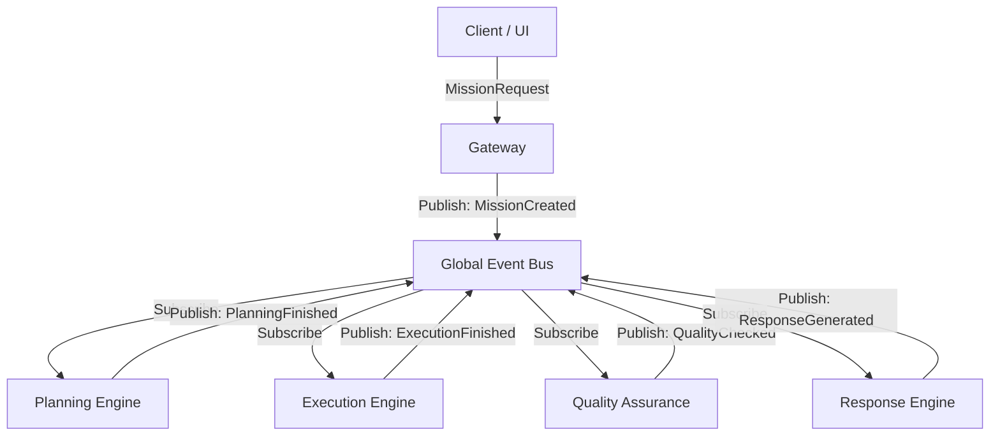

# ACOS 2.0 Event-Driven Runtime 設計提案

## 【概要】
従来の同期的な関数呼び出しベース（Controller -> Service -> Agent -> LLM）の実行モデルから、**Event-Driven Runtime（イベント駆動アーキテクチャ）** への移行を提案します。

## 【なぜイベント駆動にするのか？ (メリット)】
1. **非同期・並行処理のネイティブ対応**:
   複数のAI（Agent）が同時に思考し、回答が出揃った段階で次の処理に進むようなスウォーム（Swarm）処理が容易になります。
2. **システム全体の疎結合化**:
   Workflow EngineやUI、Logger、MetricsなどがCoreロジックに依存せず、イベントをListenするだけで機能を追加できます。
3. **レジリエンス (回復力)**:
   Execution Planeでエラーやタイムアウトが発生しても、Control Planeはイベント（例: `ExecutionFailed`）を受け取り、別のモデルにフォールバックさせるなどのリカバリが容易になります。
4. **リアクティブなUI**:
   WebSocketを通じてそのままフロントエンドにイベントを流すことで、AIの思考プロセスをリアルタイムにユーザーへフィードバックできます。

---

## 【アーキテクチャ設計】



---

## 【イベント一覧とPayload設計】

各イベントはすべて共通のベースプロパティ (`eventId`, `timestamp`, `missionId`) を持ちます。

### 1. `MissionCreated`
ミッション（タスク）が作成され、システムに投入されたことを示します。
```typescript
interface MissionCreatedPayload {
  missionId: string;
  creatorId: string; // ユーザーIDまたは親エージェントID
  objective: string; // 指示内容
  context: Record<string, any>; // セッションや環境変数のコンテキスト
  timestamp: number;
}
```

### 2. `PlanningStarted`
プランナーAIが目標達成のためのタスク分解・計画策定を開始したことを示します。
```typescript
interface PlanningStartedPayload {
  missionId: string;
  plannerAgentId: string; // 担当するAIのID
  timestamp: number;
}
```

### 3. `PlanningFinished`
計画が完了し、実行可能なタスクグラフ（DAG）が生成されたことを示します。
```typescript
interface PlanningFinishedPayload {
  missionId: string;
  plan: {
    taskId: string;
    description: string;
    dependencies: string[]; // 依存するtaskId
  }[];
  timestamp: number;
}
```

### 4. `ExecutionStarted`
個別のタスクの実行が開始されたことを示します。
```typescript
interface ExecutionStartedPayload {
  missionId: string;
  taskId: string;
  executorAgentId: string; // 実行担当のAIモデルID (例: gpt-4o)
  timestamp: number;
}
```

### 5. `ExecutionFinished`
タスクの実行が完了（成功または失敗）したことを示します。
```typescript
interface ExecutionFinishedPayload {
  missionId: string;
  taskId: string;
  result: any; // 実行結果
  success: boolean;
  error?: string; // 失敗時のエラーメッセージ
  timestamp: number;
}
```

### 6. `ConsensusFinished`
複数AIでの実行や議論が終わり、合意された結果が出たことを示します。
```typescript
interface ConsensusFinishedPayload {
  missionId: string;
  taskId: string;
  agreedResult: any;
  participatingAgentIds: string[]; // 参加したAIモデルのリスト
  timestamp: number;
}
```

### 7. `QualityChecked`
実行結果に対する品質評価（レビュー）が完了したことを示します。
```typescript
interface QualityCheckedPayload {
  missionId: string;
  taskId: string;
  reviewerAgentId: string;
  passed: boolean; // 合格したかどうか
  score: number; // 0-100の品質スコア
  feedback: string; // 修正点やフィードバック
  timestamp: number;
}
```

### 8. `ResponseGenerated`
最終的なユーザーへの返答が生成されたことを示します。
```typescript
interface ResponseGeneratedPayload {
  missionId: string;
  response: string; // 最終的なマークダウン等のテキスト
  timestamp: number;
}
```

---

## 【設計のポイント (Google/OpenAIレベルのベストプラクティス)】

1. **At-Least-Once Delivery**:
   メモリ上のEventEmitterだけでなく、耐久性のあるメッセージキュー（KafkaやRedis Streams）のAdapterを用意し、コンテナが再起動しても処理が再開できるように設計します。
2. **Idempotency (冪等性)**:
   イベントの重複受信に備え、DBの保存や外部API呼び出しは `eventId` をキーにして冪等に処理するようにします。
3. **Dead Letter Queue (DLQ)**:
   `ExecutionFailed` イベントが既定の回数ループした場合や、処理できないイベントはDLQに流し、人手が介入できるデバッグ機構（Swarm Debugger）に接続します。
