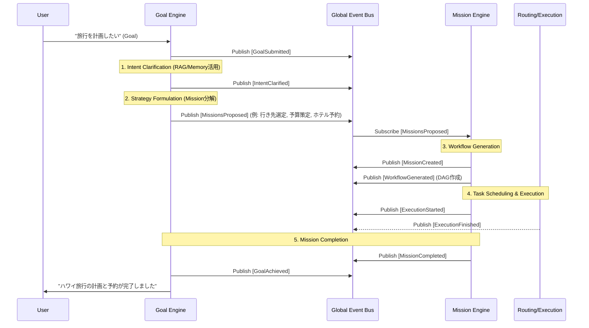

# ACOS 2.0 Goal Engine Architecture Design

## 0. Executive Summary
Google DeepMind / OpenAI の Agent Runtime 開発の知見を基に、ACOS 2.0の最上位レイヤーとなる **「Goal Engine (自律目標達成エンジン)」** のアーキテクチャ設計を定義します。
このエンジンは、ユーザーの曖昧な「願望 (Goal)」を入力として受け取り、文脈を補完して「意図 (Intent)」を明確化し、実行可能な「戦略 (Missions)」へと自動分解する **戦略レイヤー (Strategic Layer)** として機能します。

本設計は DDD (ドメイン駆動設計)、Clean Architecture、Event-Driven、Plugin Architecture に完全準拠し、既存の Mission Engine と明確に責務を分離します。

---

## 1. 責務分離 (Bounded Contexts in DDD)

システム全体を「何を・なぜやるか（Strategic）」と「どうやってやるか（Tactical）」に明確に分離します。

### 🛡️ Bounded Context 1: Goal Engine (Strategic Layer)
*   **関心事**: 「What (何を達成するか)」「Why (なぜやるのか)」
*   **責務**:
    *   **Intent Clarification (意図の明確化)**: ユーザーの「売上を伸ばしたい」という曖昧なGoalを、ユーザーの過去データ・環境変数を元に「ECサイトの秋のキャンペーンでCPAを維持しつつ売上を20%向上させる」という明確な Intent に変換する。
    *   **Strategy Formulation (戦略の策定)**: Intent を達成するために必要なサブゴールを定義し、それぞれを自律実行可能なサイズの「Mission」として切り出す。
    *   **Success Criteria (成功基準の定義)**: 各Missionが達成されたかどうかのKPI/評価基準を定義する。
*   **出力**: `MissionProposed` イベント群（Mission Engineへの実行依頼）。

### ⚔️ Bounded Context 2: Mission Engine (Tactical & Operational Layer) - *既存拡張*
*   **関心事**: 「How (どうやって実行するか)」「Who (どのAI/Agentがやるか)」
*   **責務**:
    *   **Workflow Generation (ワークフロー生成)**: Goal Engine から渡された Mission を、具体的な順序関係を持つ DAG (有向非巡回グラフ) の Workflow に分解する。
    *   **Task Execution (タスク実行)**: Workflow を Task に落とし込み、Routing Engine を使って最適な AI Model (Agent) にアサインして実行させる。
    *   **State Management (状態管理)**: 実行状況、リトライ、フェイルオーバーの管理。

---

## 2. データフローとイベント連鎖 (Event-Driven Flow)

GoalからTaskに至るまでの状態遷移と、発行されるイベントの連鎖（Saga）を定義します。



---

## 3. Clean Architecture & Plugin Design

Goal Engine 内部も Core を純粋なドメインモデルに保ち、LLM呼び出しやデータアクセスは Plugin として注入します。

### 🔌 Core Interfaces (Port)

```typescript
// ドメインエンティティ
export interface Goal {
  id: string;
  rawInput: string; // "売上を伸ばしたい"
  status: "pending" | "clarifying" | "formulating" | "executing" | "achieved";
}

export interface Intent {
  goalId: string;
  clarifiedObjective: string;
  contextUsed: string[];
  successCriteria: string;
}

export interface ProposedMission {
  title: string;
  description: string;
  successCriteria: string;
}

// プラグインインターフェース (Adapterが実装する)
export interface IIntentAnalyzerPlugin extends IPlugin {
  analyze(goal: string, context: UserContext): Promise<Intent>;
}

export interface IStrategyPlannerPlugin extends IPlugin {
  plan(intent: Intent): Promise<ProposedMission[]>;
}
```

### 🧩 Plugin Implementation Examples (Adapter)
*   **`OpenAIStrategyPlannerPlugin`**: GPT-4o の推論能力 (`Reasoning`) を活用し、IntentからMECE（漏れなくダブりなく）にMissionを洗い出すプラグイン。
*   **`MemoryContextPlugin`**: Vector DBからユーザーの過去の行動履歴や好みを抽出し、曖昧なGoalを補完するプラグイン。

---

## 4. イベントペイロード設計 (Event Definitions)

Goal Engine が新たに発行・管理する主要イベントです。

### `GoalSubmitted`
ユーザーから新しいゴールが投入された時点。
```typescript
interface GoalSubmittedPayload extends BaseEventPayload {
  goalId: string;
  rawInput: string;
  userId: string;
}
```

### `IntentClarified`
AI（IntentAnalyzerPlugin）が文脈を補完し、曖昧さを排除した明確な意図（Intent）が生成された時点。
```typescript
interface IntentClarifiedPayload extends BaseEventPayload {
  goalId: string;
  intent: {
    clarifiedObjective: string;
    targetAudience?: string;
    constraints: string[]; // 予算、期限など
  };
}
```
*※ Human-in-the-loop (HITL) を導入する場合、ここでユーザーに Intent の承認（Approve）を求めるフェーズを挟むことができます。*

### `MissionsProposed`
明確化された Intent に基づき、Strategy Planner が複数の Mission を起案した時点。
このイベントを Mission Engine がリッスンし、実際の Workflow 生成へと引き継ぎます。
```typescript
interface MissionsProposedPayload extends BaseEventPayload {
  goalId: string;
  proposedMissions: {
    missionId: string;
    title: string;
    description: string;
    order: number; // 並列/直列の優先順位
  }[];
}
```

---

## 5. Principal Architect からの提言 (高度な設計の勘所)

1. **Human-in-the-Loop (HITL) の標準サポート**
   自律性が高まるほど「AIの暴走」や「的外れな実行」のリスクが高まります。Goal Engine には `IntentClarified` の直後、および `MissionsProposed` の直後に、**ユーザーの承認待ち（Awaiting User Approval）** 状態に移行できるステートマシンを標準で組み込むべきです。
2. **Dynamic Abstraction (抽象度の動的調整)**
   ユーザーの入力が「Webサイトを作って」であれば、Goal EngineはすぐにMission Engineに渡せば良いですが、「起業したい」のような極めて抽象度の高いGoalの場合、Goal Engineが自問自答（Chain of Thought）やリサーチ（Research）を内部でループさせ、具体化するまでMission Engineに渡さない「Thinking Loop機構」を持たせることが重要です。
3. **Goal-Mission-Task のフラクタル構造**
   本質的に「Goalを分解してMissionにする」ことと「Missionを分解してTaskにする」ことはフラクタル（自己相似）な処理です。設計上はインターフェースを統一し、再帰的に適用可能なアーキテクチャにしておくと、将来的な AGI（汎用人工知能）レベルの複雑なタスクにも耐えられます。
