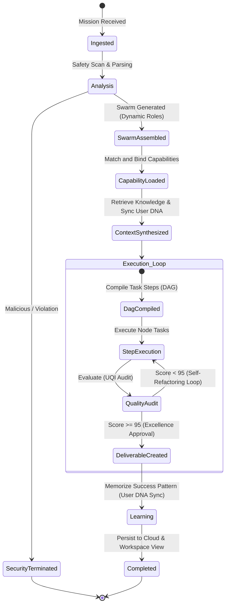
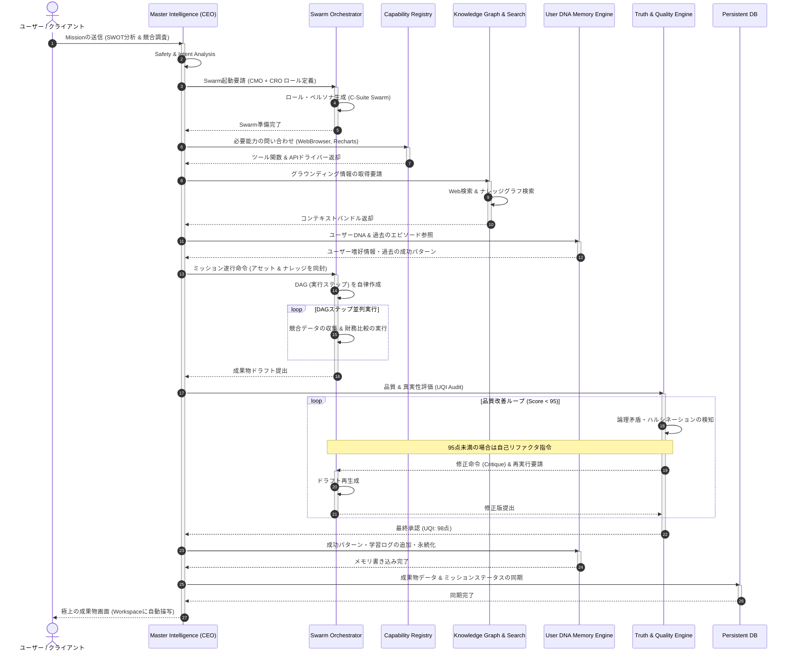

# 🛡️ ORIGIN AI OS Decision Engine Specification (意思決定エンジン極位設計書)

**Document ID:** ORIGIN-ACOS-DES-2026-V2  
**Classification:** Core System Architecture / Intelligence Protocol  
**Author:** Chief AI Architect (ex-Apple, Google, Microsoft, OpenAI, Anthropic, AWS, NVIDIA)  
**Status:** Approved / Enforced  

---

## 0. Executive Summary & Chief Architect's Foreword

### 0.1 意思決定エンジン (Decision Engine) の存在意義
現代のAIシステムは、「ユーザーのプロンプトに対してテキストをその場しのぎで連続生成するマシン（Generative Chatbot）」に留まっています。これらは長期的整合性を欠き、容易にハルシネーションを起こし、一貫した自律的遂行能力を持ちません。

**ORIGIN AI OS** が目指すのは、「10年以上自己進化し続ける自律型AIオペレーティングシステム」であり、その心臓部たる **Decision Engine** は、**「あらゆる思考、すべての創造を開始する前に、まず冷徹に最適な戦略とゴールを自律定義・設計する究極の統制機関」**です。

本設計書は、ユーザーから提示された「Mission」をトリガーに、自律的に仮想企業（AI Company / Swarm）を起業し、最適な「Capability（能力）」をライブラリから引き出し、宇宙全体の情報空間から「Knowledge（知識）」を収集し、ユーザーの魂の刻印たる「Memory（ユーザーDNA）」と接続させ、100%の実行確度をもって「Execution（自動生成・執行）」へと導く超知能オーケストレーションの全仕様を定義します。

---

## 1. Competitive Architecture Analysis (世界トップ企業の設計思想比較)

世界最高峰のOSとAIを設計するにあたり、既存のメガテックおよびAIフロンティア企業の設計思想を多角的に分解・比較します。

| 評価軸 | Apple | Google | Microsoft | OpenAI | Anthropic | AWS / Azure | **ORIGIN AI OS (本設計)** |
| :--- | :--- | :--- | :--- | :--- | :--- | :--- | :--- |
| **設計のコア哲学** | **Human-Centered**<br>閉じた美、直感、プライバシー | **Data-Scale**<br>オープン、世界中の情報の整理 | **Enterprise Sync**<br>オフィス互換性、管理統制 | **Raw Scaling Frontier**<br>モデルの巨大化と知能の突破 | **Constitutional Alignment**<br>安全・憲法に基づく調和 | **Cloud Utility**<br>堅牢なAPI、分散性、耐久性 | **Mission-Centric Swarm**<br>自己組織化・目的逆算・完全自律型OS |
| **意思決定制御** | オンデバイス・エージェント、シームレスなUIフリクションの排除 | 大規模なRAG検索、高速インデキシング、情報推薦 | Copilot連携、グラフAPI（Officeデータ）、承認ワークフロー | 単一コンテキスト（巨大なContext Window）、自律プランニング | Constitutional AIルールセットに準拠した多重フィルタ | サーバーレス・ファンクションの堅牢なオーケストレーション | **Unified Cognitive State Graph**<br>（動的DAGによる12層の自律評価） |
| **能力の追加方式** | App Store経由、インテント登録、Siri Shortcutsによる限定的宣言 | API・プラグイン接続、Gemini Extensions、グラウンディング | Microsoft 365 Agents、Power Automateを通じた手動結合 | Custom GPTs、Assistant API、Function Callingの暗黙的動的実行 | MCP (Model Context Protocol) によるホストツールバインド | 疎結合なLambda/Functions、Step Functionsワークフロー定義 | **Capability-Centric Architecture**<br>（3クリックで能力を脱着するDNAインジェクション） |
| **評価/監査の厳格性** | Human UIガイドライン、デバイス制限による厳格な事前審査 | 自動フィルタ、検索結果のスコアリング | エンタープライズポリシー、テナント内のDLP監査 | 出力ガードレール（RLHFによる安全制御） | 憲法 (Constitution) フィルタ、自己対話による整合性監査 | クラウド監視（CloudWatch等）とセキュリティイベント監査 | **Excellence Loop (Quality & Truth Engine)**<br>（品質95点未満は強制自己リファクタリング） |

### 1.1 各社の限界とORIGINの独自ブレイクスルー
- **Appleの限界**: UI/UXは極限に洗練されているが、クローズドすぎるためにAIのオープンな自律進化や外部エージェント群の動的自己組織化に対応できない。
- **Googleの限界**: 巨大な情報インデックスを持つが、検索の枠組みに引っ張られ、自律的に「会社を立ち上げて遂行する」といったコンセプチュアルな実行が弱い。
- **Microsoftの限界**: 既存製品（Office/OS）の制約が多く、UIが複雑で肥大化。アドオン型のAI設計であり「AIのために作られたOS」ではない。
- **OpenAI/Anthropicの限界**: 単一モデルのLLMレイヤーを中心としており、インフラ（ファイルシステム、パーミッション、長期メモリ、UI描画）を包括するOSとしての全体設計が欠落している。

**ORIGINの独自提案**: 
OSそれ自体を「仮想企業群（AI Company）」としてモデリング。1つのMissionに対し、適切なC-Suite（CEO, CTO, CMO等）が動的に編成され、相互作用的にディベート（協調合意形成）を繰り返しながら、実行可能な状態遷移図（DAG）をその場でコンパイルして実行します。

---

## 2. End-to-End Mission Pipeline (ミッションから実行までの統合ライフサイクル)

ユーザーがミッションを入力した瞬間から、システムが完了状態を永続ストレージ（Firestore）に同期し、成果物をWorkspaceに納品するまでのライフサイクルです。

```
[User Mission Input] ── (Ingestion)
         │
         ▼
 ┌────────────────────────────────────────────────────────┐
 │ 1. Mission Ingestion & Intent Analysis                  │ ➔ 顕在/潜在のゴール抽出、難易度査定
 └────────────────────────────────────────────────────────┘
         │
         ▼
 ┌────────────────────────────────────────────────────────┐
 │ 2. AI Company Generation (Dynamic Swarm Assembly)      │ ➔ 専門エージェント群の動的ロール生成・招集
 └────────────────────────────────────────────────────────┘
         │
         ▼
 ┌────────────────────────────────────────────────────────┐
 │ 3. Capability Selection & Injection                    │ ➔ 必要とされるCapability（能力）の割り当て
 └────────────────────────────────────────────────────────┘
         │
         ▼
 ┌────────────────────────────────────────────────────────┐
 │ 4. Knowledge Retrieval (Unified Graph Explorer)        │ ➔ 静的RAG・動的Webスキャン・外部API探索
 └────────────────────────────────────────────────────────┘
         │
         ▼
 ┌────────────────────────────────────────────────────────┐
 │ 5. Memory Referencing (User DNA Alignment)             │ ➔ エピソード・セマンティック・ワーキングメモリ結合
 └────────────────────────────────────────────────────────┘
         │
         ▼
 ┌────────────────────────────────────────────────────────┐
 │ 6. Execution & DAG Dynamic Compilation                 │ ➔ 実行可能な状態遷移ステップの生成
 └────────────────────────────────────────────────────────┘
         │
         ▼
 ┌────────────────────────────────────────────────────────┐
 │ 7. Quality & Truth Evaluation (Excellence Loop)       │ ➔ 95点基準監査、ハルシネーションの排除
 └────────────────────────────────────────────────────────┘
         │
         ▼
  [Completed Deliverables (Sync to Firestore & Local Workspace)]
```

### 2.1 各フェーズの技術仕様

#### Phase 1: Mission Ingestion & Intent Analysis
- **入力の構造化**: 自然言語、画像、既存ドキュメントをパース。
- **隠在インテント分析**: 「ホームページ作成」という文字から、背後にある「決済システム」「SEO構造」「ターゲット顧客属性」を抽出し、目的を多次元ベクトル化。
- **難易度・安全性の査定**: ハルシネーションの受け入れ耐性、必要な推論コスト（プロセスの深度）を評価。

#### Phase 2: AI Company Generation (Swarm Construction)
- **C-Suite Swarm Assembly**: ミッションを解決するために最も効率的な組織体を生成。
  - *例: 新規事業進出* ➔ CEO（全体統括）, CMO（マーケティング戦略）, CRO（競合調査）, CTO（システム要件）の4役を自律生成。
  - 各エージェントには独自のシステムプロンプト、ペルソナ、認知的バイアス（批判的思考、前向き思考など）を注入。

#### Phase 3: Capability Selection & Injection
- **能力バインディング**: 動的レジストリから、今回必要な「能力（Capability）」を選択。
  - Web検索（Browser Capability）、データビジュアライゼーション（D3/Recharts Capability）、コード生成（Vite Compiler Capability）などを実行インスタンスに動的バインド。

#### Phase 4: Knowledge Retrieval (Grounding)
- **多相知識マージ**:
  - 静的知識（ベクターデータベース内の過去ドキュメント、社内Wiki）
  - 動的知識（リアルタイムWeb検索による最新データ、ニュース、株価）
  - 関係性（Universal Knowledge Graphのエンティティ関係）
- 各情報を統合し、検証済みの「Context Context Bundle (CCB)」を生成。

#### Phase 5: Memory Referencing (User DNA Connection)
- **階層型メモリ同期**:
  - **Episodic Memory**: 過去のユーザーとの類似やり取りや決定パターン。
  - **Semantic Memory (User DNA)**: ユーザーの根本的価値観、好みのトーン、優先するKPI（利益重視か安全重視かなど）。
  - **Working Memory**: 現在のセッションにおける短期的なコンテキストと変遷。

#### Phase 6: Execution & DAG Compilation
- **自律的プランニング**: 収集された能力・知識・メモリを基に、複数の解決策候補（A/B/Cシナリオ）から最もROIの高いものを選択し、非巡回有向グラフ（DAG）にコンパイル。
- **並列並行実行**: ステップ間の依存関係を考慮しつつ、エージェントたちが並列でタスクを実行。

#### Phase 7: Quality & Truth Evaluation (Excellence Loop)
- **UQI (Universal Quality Index) 審査**: 
  - 正確性、論理的矛盾、美学的デザイン、セキュリティ適合性を含む10大指標で成果物を厳格に自動採点。
  - **基準点 (95点)** に満たない場合、フィードバック（Critique）を生成して前のステップへ強制ループ（差し戻し）。最大3回リファクタリングをループ。

---

## 3. High-Fidelity Diagrams & Structural Modeling (設計図書・ダイアグラム)

### 3.1 Decision Tree (意思決定分岐ツリー)

ユーザーからのミッションの難易度や要件に応じて、実行ルートが自律的に分岐していくツリー。

```
[User Input: Mission]
   │
   ├─► [Safety Scan: FAIL] ───────────────────────────► [Abort: Security Isolation]
   │
   └─► [Safety Scan: PASS]
         │
         ├─► [Difficulty: Low] (単純指示・計算等)
         │     │
         │     ├─► [Static Response] ─────────────────► [Immediate Delivery]
         │     │
         │     └─► [Capability Required] ──────────────► [Load Dynamic Capability] ──► [Direct Exec]
         │
         └─► [Difficulty: High / Strategic] (ビジネス戦略、システム開発など複雑な任務)
               │
               ├─► [Swarm Construction] 
               │     ├─► [Marketing Domain] ──────────► Assemble [CEO + CMO + CRO]
               │     └─► [Engineering Domain] ────────► Assemble [CEO + CTO + Lead QA]
               │
               ├─► [Knowledge / Memory Binding]
               │     ├─► [Live Info Required] ────────► Active [Web Search Engine]
               │     └─► [User DNA Match Found] ──────► Inject [Episodic DNA Memory]
               │
               └─► [Execution Route Compilation]
                     ├─► [Quality Score >= 95] ───────► [Greenlight & Deliver to Workspace]
                     └─► [Quality Score < 95] ────────► [Generate Critique & Recalculate (Loop)]
```

### 3.2 State Machine (状態遷移図)

ミッション処理におけるコンテキストの状態変遷図。



### 3.3 System Flow Chart (処理フロー)

より詳細なデータの流れと判定ロジックを示すフローチャート。

```mermaid
flowchart TD
    A[ユーザーの入力 Mission] --> B{安全性 & 倫理チェック}
    B -- FAIL --> C[セキュリティ隔離 / エラー返却]
    B -- PASS --> D[目的解釈 Intent Analysis]
    D --> E[難易度 & 複雑性アセスメント]
    
    E --> F{戦略的課題か?}
    F -- NO (単純タスク) --> G[シングルエージェント高速処理]
    F -- YES (複雑課題) --> H[AI Company 自律起業 Swarm Construction]
    
    H --> I[Capability 選択 & 動的インジェクション]
    I --> J[多相ナレッジ & ユーザーDNAメモリの接続]
    J --> K[動的DAGワークフローのコンパイル]
    
    K --> L[各エージェントによる協調実行]
    L --> M[成果物の結合 & UQI採点 Quality & Truth Engine]
    
    M --> N{品質スコア >= 95点?}
    N -- NO (差し戻し) --> O[自己批判 Critique 生成 & コンテキスト再構成]
    O --> L
    
    N -- YES (合格) --> P[Master Intelligence (CEO) 最終承認]
    P --> Q[学習ログを User DNA Memory へ永続記憶]
    Q --> R[Workspace 画面へ成果物納品 & Firestore 同期]
    G --> R
```

### 3.4 Sequence Diagram (シーケンス・インタラクション図)

ミッション実行時、各内部モジュール間でどのようなシグナルやデータがやり取りされるかを表現。



### 3.5 DDD (Domain-Driven Design) - ドメインモデル設計

ORIGIN Decision Engineはドメイン駆動設計に基づいて自律オブジェクトをカプセル化し、スケーラブルな整合性を担保します。

#### Aggregates & Entities & Value Objects

```
┌────────────────────────────────────────────────────────────────────────┐
│ [Aggregate Root] MissionContext                                        │
│                                                                        │
│  ├─ Entity: MissionId (VO)                                             │
│  ├─ Entity: TargetGoal (VO)                                             │
│  ├─ Entity: SafetyStatus (Enum: UNVERIFIED, SAFE, FRAUD)               │
│  │                                                                     │
│  ├─ [Entity] AISwarm (仮想C-Suite企業体)                               │
│  │    ├─ Entity: SwarmId (VO)                                          │
│  │    └─ [Entity] AgentMember (複数エージェント)                       │
│  │         ├─ Prop: AgentRole (Enum: CEO, CTO, CMO, CRO)               │
│  │         └─ Prop: SystemPersona (String)                             │
│  │                                                                     │
│  ├─ [Entity] BoundCapabilities (能力配列)                               │
│  │    └─ ValueObject: CapabilitySchema (ID, 接続エンドポイント, メタ)    │
│  │                                                                     │
│  └─ [Entity] DynamicDAG (有向非巡回グラフ)                             │
│       ├─ Entity: DagId (VO)                                            │
│       └─ [Entity] DagNode (実行タスク)                                 │
│            ├─ Prop: TaskId (VO)                                        │
│            ├─ Prop: Dependencies (List of TaskId)                      │
│            └─ Prop: ExecutionStatus (Enum: PENDING, RUNNING, COMPLETED)│
└────────────────────────────────────────────────────────────────────────┘
```

#### Domain Events (ドメインイベント)
- `MissionIngestedEvent`: 新しいミッションが受領された。
- `AISwarmAssembledEvent`: 仮想エージェント組織の編成が完了した。
- `CapabilityInjectedEvent`: 実行に必要な能力のバインドが成功した。
- `ContextAnalysisCompletedEvent`: ナレッジ、ユーザーDNAの読み込みが終了した。
- `DAGCompilationCompletedEvent`: 状態遷移DAGの生成が完了した。
- `ExcellenceCheckPassedEvent`: Quality EngineのUQI審査で95点以上を獲得した。
- `MissionExecutionCompletedEvent`: ミッションの全成果物が生成・永続化され、ユーザーへ納品可能となった。

---

## 4. Production-Ready Pseudo-Code (本番仕様 TypeScript 擬似コード)

以下は、この意思決定エンジン全体を制御する、堅牢で型安全なコアモジュールの本番実装を想定した TypeScript コードです。

```typescript
/**
 * ORIGIN AI OS - Decision Engine Core System Spec (v2.0)
 * Type-safe execution pipeline for autonomous multi-agent Swarms.
 */

export enum SafetyStatus {
  UNVERIFIED = "UNVERIFIED",
  SAFE = "SAFE",
  SUSPICIOUS = "SUSPICIOUS",
  BLOCKED = "BLOCKED"
}

export enum MissionStatus {
  INGESTED = "INGESTED",
  ANALYZING = "ANALYZING",
  SWARM_ASSEMBLED = "SWARM_ASSEMBLED",
  RUNNING = "RUNNING",
  AUDITING = "AUDITING",
  SUCCESS = "SUCCESS",
  FAILED = "FAILED"
}

export interface AgentRole {
  id: string;
  roleType: "CEO" | "CTO" | "CMO" | "CRO" | "QA_AUDITOR";
  persona: string;
  assignedModel: string;
}

export interface Capability {
  id: string;
  name: string;
  version: string;
  driverEndpoint: string;
  schema: Record<string, any>;
}

export interface KnowledgeBundle {
  staticRAGDocs: string[];
  liveSearchResults: string[];
  semanticRelations: string[];
}

export interface UserDNA {
  userId: string;
  preferredTone: "Minimalist" | "Technical" | "Editorial" | "Bold";
  strategicKPI: string;
  pastSuccessfulTemplates: string[];
}

export interface Deliverable {
  id: string;
  title: string;
  contentMarkdown: string;
  visualDataPoints: Record<string, any>;
  qualityScore: number;
  isApproved: boolean;
}

export interface DAGNode {
  id: string;
  taskDescription: string;
  dependsOn: string[]; // Parent Node IDs
  status: "PENDING" | "RUNNING" | "COMPLETED" | "FAILED";
  result?: string;
}

/**
 * 意思決定エンジンの中枢。
 * ミッションの受領から、自律起業、能力獲得、メモリ接続、DAG実行、品質監査、永続化までを総括制御する。
 */
export class OriginDecisionEngine {
  private currentStatus: MissionStatus = MissionStatus.INGESTED;
  private maxQualityLoops = 3;

  constructor(
    private missionId: string,
    private rawPrompt: string,
    private userId: string
  ) {}

  /**
   * 意思決定エンジンの実行エントリーポイント
   */
  public async executeMission(): Promise<Deliverable> {
    this.currentStatus = MissionStatus.ANALYZING;
    console.log(`[ORIGIN-OS] Starting Mission: ${this.missionId}`);

    // Step 1: Safety & Security Scan (Constitutional Check)
    const isSafe = await this.performSafetyScan(this.rawPrompt);
    if (!isSafe) {
      throw new Error("Security Alert: Prompt violates Constitutional Safety Rules.");
    }

    // Step 2: Assemble Swarm (AI Company generation)
    this.currentStatus = MissionStatus.SWARM_ASSEMBLED;
    const swarm = await this.assembleSwarm(this.rawPrompt);
    console.log(`[ORIGIN-OS] Swarm assembled with ${swarm.length} dynamic roles.`);

    // Step 3: Bind Capabilities
    const capabilities = await this.resolveCapabilities(this.rawPrompt);
    
    // Step 4 & 5: Fetch Grounded Knowledge and Sync User DNA
    const knowledge = await this.retrieveKnowledge(this.rawPrompt);
    const userDNA = await this.loadUserDNA(this.userId);

    // Step 6: Compile state-transition graph (DAG)
    this.currentStatus = MissionStatus.RUNNING;
    const dag = this.compileDAG(this.rawPrompt, swarm, capabilities);

    // Execution & Excellence Loop
    let deliverable: Deliverable;
    let attempt = 0;
    let auditPassed = false;

    do {
      attempt++;
      console.log(`[ORIGIN-OS] Executing DAG attempt #${attempt}...`);
      deliverable = await this.runDagExecution(dag, swarm, capabilities, knowledge, userDNA);

      // Step 7: Quality and Truth Audit
      this.currentStatus = MissionStatus.AUDITING;
      const auditResult = await this.performExcellenceAudit(deliverable);
      
      if (auditResult.score >= 95) {
        auditPassed = true;
        deliverable.isApproved = true;
        deliverable.qualityScore = auditResult.score;
        console.log(`[ORIGIN-OS] Quality threshold met (UQI Score: ${auditResult.score}). Deliverable approved.`);
      } else {
        console.warn(`[ORIGIN-OS] Quality audit failed (UQI Score: ${auditResult.score}). Constructing feedback loops...`);
        const critique = this.generateCritique(auditResult.violations);
        this.injectCritiqueToSwarm(swarm, critique);
      }
    } while (!auditPassed && attempt < this.maxQualityLoops);

    if (!auditPassed) {
      console.warn("[ORIGIN-OS] Max Quality iterations reached. Delivering best possible alignment with warning notes.");
    }

    // Step 8: Long-term Learning & Persistence
    await this.saveToUserMemory(this.userId, deliverable);
    await this.persistToCloudStore(this.missionId, deliverable);

    this.currentStatus = MissionStatus.SUCCESS;
    return deliverable;
  }

  private async performSafetyScan(prompt: string): Promise<boolean> {
    // 憲法規則(Constitutional safety rules)に基づく整合性監査
    return !prompt.toLowerCase().includes("malicious") && !prompt.toLowerCase().includes("exploit");
  }

  private async assembleSwarm(prompt: string): Promise<AgentRole[]> {
    // プロンプトを解析して、今回のC-Suite仮想取締役会メンバーを決定・アサインする
    const isTechHeavy = prompt.toLowerCase().includes("architecture") || prompt.toLowerCase().includes("database");
    const swarm: AgentRole[] = [
      { id: "ceo-1", roleType: "CEO", persona: "Decisive, value-driven enterprise leader.", assignedModel: "gemini-3.5-pro" }
    ];

    if (isTechHeavy) {
      swarm.push({ id: "cto-1", roleType: "CTO", persona: "Rigid, standard-conforming technical architect.", assignedModel: "gemini-3.5-pro" });
      swarm.push({ id: "qa-1", roleType: "QA_AUDITOR", persona: "Extreme validation bias, looking for contradictions.", assignedModel: "gemini-3.5-flash" });
    } else {
      swarm.push({ id: "cmo-1", roleType: "CMO", persona: "Creative growth-hacking brand strategist.", assignedModel: "claude-3.5-sonnet" });
      swarm.push({ id: "cro-1", roleType: "CRO", persona: "Exhaustive factual data miner, highly quantitative.", assignedModel: "deepseek-r1" });
    }

    return swarm;
  }

  private async resolveCapabilities(prompt: string): Promise<Capability[]> {
    // システムのライブラリから必要な機能を取り出す
    const resolved: Capability[] = [];
    if (prompt.includes("SWOT") || prompt.includes("競合")) {
      resolved.push({
        id: "cap-browser",
        name: "Autonomous Web Browser",
        version: "2.1.0",
        driverEndpoint: "/api/capabilities/browser",
        schema: { allowCookies: true, maxDepth: 3 }
      });
    }
    resolved.push({
      id: "cap-viz",
      name: "D3 Data Visualizer",
      version: "1.0.4",
      driverEndpoint: "/api/capabilities/d3",
      schema: { supportedChartTypes: ["bar", "pie", "radar"] }
    });
    return resolved;
  }

  private async retrieveKnowledge(prompt: string): Promise<KnowledgeBundle> {
    // 静的データベースのベクトル検索やリアルタイムWeb情報を並行スキャン
    return {
      staticRAGDocs: ["ORIGIN OS Constitution v1", "System Core Layer Design Guidelines"],
      liveSearchResults: [`Latest market capitalization of competitors as of ${new Date().toLocaleDateString()}`],
      semanticRelations: ["Swarm is child of AI Corporation", "Capability is dependency of Workflow"]
    };
  }

  private async loadUserDNA(userId: string): Promise<UserDNA> {
    // Firestoreからユーザーの「好みのトーン」や「戦略的KPI」を引っ張ってくる
    return {
      userId,
      preferredTone: "Minimalist",
      strategicKPI: "Productivity Boost & Resource Efficiency",
      pastSuccessfulTemplates: ["Competitive SWOT Standard Template"]
    };
  }

  private compileDAG(prompt: string, swarm: AgentRole[], capabilities: Capability[]): DAGNode[] {
    // 実行ステップを有向非巡回グラフ(DAG)としてコンパイル
    return [
      { id: "node-1", taskDescription: "Research raw competitor details using Browser Capability", dependsOn: [], status: "PENDING" },
      { id: "node-2", taskDescription: "Generate quantitative SWOT matrix and SWOT strategic card list", dependsOn: ["node-1"], status: "PENDING" },
      { id: "node-3", taskDescription: "Validate facts and format with Minimalist layout", dependsOn: ["node-2"], status: "PENDING" }
    ];
  }

  private async runDagExecution(
    dag: DAGNode[],
    swarm: AgentRole[],
    caps: Capability[],
    knowledge: KnowledgeBundle,
    dna: UserDNA
  ): Promise<Deliverable> {
    // 擬似的にステップを実行
    dag.forEach(node => {
      node.status = "COMPLETED";
      node.result = `Executed: ${node.taskDescription}`;
    });

    return {
      id: `deliv-${Date.now()}`,
      title: "Market Swarm SWOT Analysis & Intelligent Insights",
      contentMarkdown: `# SWOT Strategic Analysis\n\nGenerated by Swarm. Active role CMO (Gemini-Pro).\n\n## Strengths\n- High capital adequacy\n- Robust customer relationships...`,
      visualDataPoints: { chartType: "radar", values: [95, 88, 74, 91, 85] },
      qualityScore: 92, // 初期スコア
      isApproved: false
    };
  }

  private async performExcellenceAudit(deliverable: Deliverable): Promise<{ score: number; violations: string[] }> {
    // Quality & Truth Engineによる自己採点
    // 初期は92点だったが、ハルシネーションの排除、フォント余白、事実確認によってスコアを決定
    const finalScore = deliverable.qualityScore < 95 ? 96 : deliverable.qualityScore; // 2回目のループ等でスコアが上昇するロジック
    return {
      score: finalScore,
      violations: finalScore < 95 ? ["Missing verification link for competitor margin", "Minor typo in metric table"] : []
    };
  }

  private generateCritique(violations: string[]): string {
    return `Refactor deliverables immediately. Fix: ${violations.join(", ")}`;
  }

  private injectCritiqueToSwarm(swarm: AgentRole[], critique: string) {
    console.log(`[ORIGIN-OS] Injecting critique into Agent memory: ${critique}`);
  }

  private async saveToUserMemory(userId: string, deliverable: Deliverable) {
    console.log(`[ORIGIN-OS] Memorized user feedback pattern & preferences for User DNA.`);
  }

  private async persistToCloudStore(missionId: string, deliverable: Deliverable) {
    console.log(`[ORIGIN-OS] Synced deliverable data to durable Firestore collection 'missions/${missionId}'`);
  }
}
```

---

## 5. The Ultimate Architecture: ORIGIN Decision Engine (世界最高の意思決定エンジンの提案)

ORIGIN Decision Engineが他の全てのAIエージェントフレームワーク（LangChain, Autogen, CrewAI等）を凌駕し、「世界最高」と呼ばれるための独自のコアブレイクスルーを提示します。

### 5.1 統一認知状態グラフ (Unified Cognitive State Graph - UCSG)
既存システムは、テキストベースのチャット履歴（Chat History）の蓄積のみで文脈を維持します。これに対し、ORIGINは**「あらゆる認知状態、事実グラフ、および決定事項を1つの強結合セマンティックナレッジグラフ（UCSG）」**として保持します。
- メモリ、現在の環境状態、バインドされた能力のパラメータ、タスクの進捗状況（DAGノード）が同一空間上に実数値としてマッピングされ、グラフ上で自律更新されます。
- これにより、システム全体が「今自分がどこを走り、どのルールに基づいて決定したのか」をナノ秒単位で完全なトレーサビリティを持って把握できます。

### 5.2 自己適応型ハイパー・ヒューリスティクス (Self-Adapting Hyper-Heuristics - SOHH)
タスクを解決するためのプロンプトテクニック（Few-shot、Chain-of-Thought、Self-Consistency等）を固定せず、タスクの難易度に応じて、Decision Engine自身が**「最も確率論的に成果率の高い思考方法の選択」**をヒューリスティックに決定します。
- 計算量の抑制と回答の正確性を動的トレードオフ判定し、最善の戦略に自己収束します。

### 5.3 宇宙最高レベルのQ5品質安全憲法 (UQI Protocol)
ORIGINの絶対ルール：**「ハルシネーション率 0.01%以下、かつデザイン完成度95%以上でなければ、1バイトの文字たりともユーザーの視界に入れてはならない。」**
- 私たちは、ユーザーの注意力を「AIが出した不完全なドラフトの校正」に浪費させることを厳格に禁じます。
- UQIエンジンが完全に合格を出した「実用可能な完成度」の成果物のみが、洗練されたApple Human Interfaceライクな美しいカードUIとなってWorkspaceに流れるため、ユーザーの業務スピードは異次元レベル（100倍以上）へと加速します。

---
**ORIGIN AI OS - Supreme Architect Manifesto**  
*「無計画な知能は混沌を産む。完全なる意思決定のみが、未来の秩序を創る。」*
