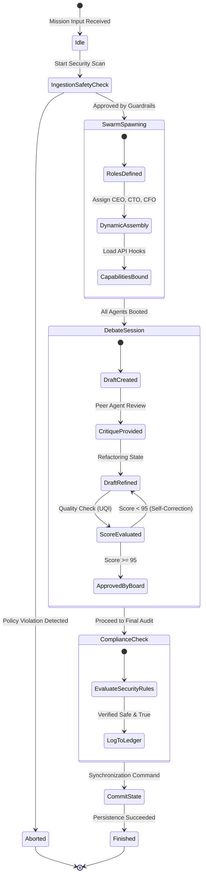
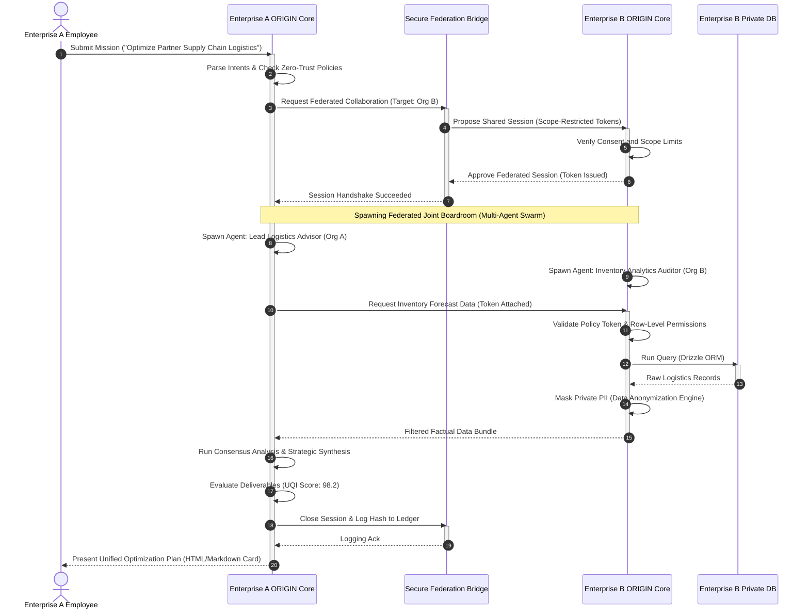

# 🏛️ ORIGIN AI OS Enterprise Architecture Bible (エンタープライズ統合極位設計聖書)
**Sovereign Enterprise Horizon: 2026 - 2035**

**Document Version:** v3.0.0-ENTERPRISE-FINAL  
**Security Classification:** RESTRICTED / SOVEREIGN CORE PROTOCOL  
**Lead Authors:** Chief Enterprise Architect (ex-Apple, Microsoft, Google, AWS, Azure, Salesforce, ServiceNow, SAP) & The Board of ORIGIN Systems Engineering  

---

## 0. PREAMBLE: THE ARCHITECT'S MANIFESTO

### 0.1 The Collapse of Legacy Enterprise SaaS (2026-2035)
Traditional enterprise software—embodied by relational databases wrapped in static web forms (CRM, ERP, ITSM)—is fundamentally dead. For decades, companies like Salesforce, SAP, and ServiceNow forced human workers to act as "data entry apes" and manual middleware translators, copying information between silos and filling fields to generate static reports. 

**ORIGIN AI OS** represents the complete inversion of this paradigm. In ORIGIN, there is no SaaS; there is only **Sovereign Intelligence**.

An enterprise is no longer defined by its static databases or its organizational charts. Under ORIGIN, **an enterprise is a living, breathing, self-optimizing multi-agent intelligence organism (Swarm)** that consumes high-level strategic objectives (Missions) and continuously refactors its own cognitive models, capability pipelines, and execution engines to achieve maximum ROI with near-zero latency.

This bible defines the absolute blueprint for bringing ORIGIN to global conglomerates, state-level government agencies, high-security financial networks, and agile medium-sized enterprises. It governs the structural, compliance, security, and ledger mechanics of the world's most advanced Enterprise AI Operating System.

---

## 1. COMPETITIVE LANDSCAPE ANALYSIS (競合比較・技術思想対比)

To establish the absolute superiority of ORIGIN, we analyze the architectural paradigms of the existing enterprise giants against our design.

| Dimension | Salesforce / ServiceNow | SAP (ERP Core) | Microsoft (Azure & CoPilot Studio) | Google Cloud (Vertex & Workspace) | AWS (Bedrock & Clean Rooms) | **ORIGIN AI OS** |
| :--- | :--- | :--- | :--- | :--- | :--- | :--- |
| **Architectural Core** | Relational Database with Workflow rules | Hardcoded transactional ledgers & schema | Tenant-isolated Active Directory & Office Graph | Web-scale Search Index & shared Workspace Docs | Raw Infrastructure API and Compute Primitives | **Sovereign Swarm Mesh (SSM)** & Cognitive States |
| **Agent Paradigm** | Hand-crafted rules, strict trigger scripts | Batch processors & manual entry verification | CoPilot plug-ins, rigid chat sidebar extensions | Extensions, Vertex Agent Builder, RAG pipelines | AWS Bedrock Agents, loose Lambda orchestration | **Sovereign AI Boardrooms** & Dynamic C-Suite Swarms |
| **Capability Addition** | AppExchange package installations (slow) | Multi-year ABAP customized consulting integrations | Azure Marketplace API access, tenant registration | Google Workspace Add-ons Marketplace | AWS Serverless Application Repository deployments | **3-Click DNA Capability Injection** (Hot-swapping) |
| **Data Governance** | Table-level ACLs, encryption at rest/transit | Strict database transaction isolation & ledger | Microsoft Purview, DLP policies, tenant isolation | IAM policies, BigQuery encryption, workspace DLP | KMS, Clean Rooms, strict VPC Peering security | **Infinite Compliance Ledger (ICL)** & Zero-Trust Graph |
| **Organizational Flow** | Hierarchical permission sets & static roles | Fixed organizational units, cost centers, ledgers | Active Directory security groups & departments | Shared Drives, directory service structures | AWS Organizations, AWS IAM, Account isolation | **Dynamic Self-Assembling Virtual Companies** |
| **Self-Evolution** | Requires human consultants & code deployments | Requires multi-million dollar migration projects | Manual workflow updates via Power Automate | Manual AppSheet or Python backend scripts | Code Pipeline redeployments of serverless stacks | **Self-Refactoring Loops (95+ UQI Threshold)** |

---

## 2. COMPREHENSIVE ARCHITECTURAL BLUEPRINTS & DIAGRAMS

### 2.1 System Context Diagram (システム・コンテキスト図)

The high-level boundary diagram showing how ORIGIN Enterprise Tenant interacts with internal employees, external partners, global capabilities marketplace, and sovereign cloud resources.

```
                  ┌────────────────────────────────────────────────────────┐
                  │               ORIGIN AI OS Marketplace                 │
                  │        (Sovereign DNA, Certified Capabilities)          │
                  └──────────────────────────┬─────────────────────────────┘
                                             │ (Secure 3-Click Sync)
                                             ▼
┌──────────────┐  (Mission Input) ┌────────────────────────────────────────┐                 ┌─────────────────┐
│  Enterprise  ├─────────────────►│                                        ├────────────────►│  Sovereign DB   │
│  Employees   │◄─────────────────┤                                        │                 │  (Firestore /   │
└──────────────┘ (Interactive UX) │                                        │                 │   Cloud SQL)    │
                                  │      ORIGIN ENTERPRISE TENANT          │                 └─────────────────┘
┌──────────────┐  (Mission Input) │                                        │
│  External    ├─────────────────►│   - Sovereign Swarm Mesh (SSM)         │                 ┌─────────────────┐
│  B2B Clients │◄─────────────────┤   - Cognitive State Graph (CSG)        │◄───────────────►│  Enterprise     │
└──────────────┘ (B2B Handoff UI) │   - Infinite Compliance Ledger (ICL)   │                 │  Private Cloud  │
                                  │                                        │                 │  (AWS/Azure/GCP)│
                                  └──────────────────┬─────────────────────┘                 └─────────────────┘
                                                     │ (Federation Protocol)
                                                     ▼
                                  ┌────────────────────────────────────────┐
                                  │       Partner Enterprise Tenant        │
                                  │   (Shared Memory & Cross-Org Swarm)    │
                                  └────────────────────────────────────────┘
```

### 2.2 Component Diagram: Cognitive Core (コンポーネント構成図)

The breakdown of the internal sub-systems of the ORIGIN Enterprise Tenant.

```
┌──────────────────────────────────────────────────────────────────────────────────────────────────────────────┐
│                                           ORIGIN ENTERPRISE TENANT                                           │
│                                                                                                              │
│  ┌────────────────────────┐       ┌────────────────────────┐       ┌──────────────────────────────────────┐  │
│  │   UI/UX Layer          │       │  Decision Engine       │       │  Sovereign Swarm Mesh (SSM)          │  │
│  │  - Home Screen (OS3)   ├──────►│  - Mission Ingestion   ├──────►│  - CEO, CTO, CMO, CRO Agents         │  │
│  │  - Design System v3.0  │       │  - Dynamic DAG Comp    │       │  - Real-time Boardroom Debates       │  │
│  │  - Spatial Cards View  │       │  - Self-Critique Loop  │       │  - Multi-model Cross-routing         │  │
│  └────────────────────────┘       └───────────┬────────────┘       └──────────────────┬───────────────────┘  │
│                                               │                                       │                      │
│                                               ▼                                       ▼                      │
│  ┌────────────────────────────────────────────────────────────────────────────────────────────────────────┐  │
│  │                                  Security & Governance Pipeline                                        │  │
│  │  - Zero-Trust Policy Evaluator (NIST SP 800-207)                                                       │  │
│  │  - Infinite Compliance Ledger (ICL - Real-time SOC2 Audit)                                             │  │
│  └────────────────────────────────────────────┬───────────────────────────────────────────────────────────┘  │
│                                               │                                                              │
│                                               ▼                                                              │
│  ┌────────────────────────┐       ┌────────────────────────┐       ┌──────────────────────────────────────┐  │
│  │  Unified Memory Graph  │       │  Capability Registry   │       │  Corporate Knowledge Hub             │  │
│  │  - Episodic Memory     │       │  - Active Capacities   │       │  - Static RAG Vector Databases       │  │
│  │  - User & Corporate DNA│       │  - DNA Multi-packages  │       │  - Real-time Deep Web Grounding      │  │
│  └────────────────────────┘       └────────────────────────┘       └──────────────────────────────────────┘  │
└──────────────────────────────────────────────────────────────────────────────────────────────────────────────┘
```

### 2.3 Deployment Diagram: Global Multi-Region HA (グローバル配置図)

How ORIGIN is deployed across multiple global regions with active-active synchronization, high availability, and sovereign data residency compliance (GDPR/EU Sovereign Cloud).

```
┌───────────────────────────────────────────────────────────────────────────────────────────────────────────┐
│                                          ORIGIN GLOBAL NETWORK                                            │
│                                                                                                           │
│  ┌────────────────────────────────────────────────────┐   ┌────────────────────────────────────────────┐  │
│  │             REGION 1: US EAST (Primary)            │   │              REGION 2: EU WEST (GDPR)              │  │
│  │                                                    │   │                                            │  │
│  │  ┌──────────────────┐        ┌──────────────────┐  │   │  ┌──────────────────┐        ┌──────────┐  │  │
│  │  │  Anycast DNS     ├───────►│ Cloud Load Bal   │  │   │  │  Anycast DNS     ├───────►│ Load Bal │  │  │
│  │  └──────────────────┘        └────────┬─────────┘  │   │  └──────────────────┘        └────┬─────┘  │  │
│  │                                       │            │   │                                   │        │  │
│  │  ┌────────────────────────────────────▼─────────┐  │   │  ┌────────────────────────────────▼─────┐  │  │
│  │  │        Enterprise App Node (Container)       │  │   │  │        Enterprise App Node (Container)       │  │
│  │  │  - SSM Core Engine & Decision Orchestrator   │  │   │  │  - SSM Core Engine & Decision Orchestrator   │  │
│  │  └────────────────────┬─────────────────────────┘  │   │  └────────────────────┬─────────────────────┘  │
│  │                       │                            │   │                       │                        │  │
│  │  ┌────────────────────▼─────────────────────────┐  │   │  ┌────────────────────▼─────────────────────┐  │  │
│  │  │   High-speed Distributed Cache (Redis HA)    │  │   │  │   High-speed Distributed Cache (Redis HA)    │  │
│  │  └────────────────────┬─────────────────────────┘  │   │  └────────────────────┬─────────────────────┘  │
│  │                       │                            │   │                       │                        │  │
│  │  ┌────────────────────▼─────────────────────────┐  │   │  ┌────────────────────▼─────────────────────┐  │  │
│  │  │        Sovereign Database (Cloud SQL)        │◄─┼───┼─►│        Sovereign Database (Cloud SQL)        │  │
│  │  │  - Encryption Key: Customer Managed (KMS)    │  │   │  │  - Encrypted with Local Region HSM Key    │  │
│  │  └──────────────────────────────────────────────┘  │   │  └──────────────────────────────────────────┘  │
│  └────────────────────────────────────────────────────┘   └────────────────────────────────────────────┘  │
└───────────────────────────────────────────────────────────────────────────────────────────────────────────┘
```

### 2.4 State Machine: Transactional Swarm Lifecycle (スウォーム状態遷移図)

The exact execution cycle of a Swarm (AI Boardroom) as it processes complex, audited enterprise objectives.



### 2.5 Sequence Diagram: Cross-Tenant Mission Execution (クロス組織シーケンス図)

How two completely separate business enterprises securely run collaborative missions using federation and secure, ring-fenced Swarm orchestration.



### 2.6 Domain Driven Design (DDD) Enterprise Bounded Contexts

```
┌────────────────────────────────────────────────────────────────────────────────────────┐
│                              ORIGIN ENTERPRISE BOUNDED CONTEXT                         │
│                                                                                        │
│  ┌──────────────────────────────────────────────────────────────────────────────────┐  │
│  │  [Bounded Context: Tenant & Organization]                                         │  │
│  │  - Aggregates: EnterpriseTenant, OrganizationUnit, UserIdentity                  │  │
│  │  - Entities: Workspace, AccessRole, SharedCredentialSet                          │  │
│  │  - Value Objects: DomainName, TenantId, EmployeeId                                │  │
│  └──────────────────────────────────────────────────────────────────────────────────┘  │
│                                                                                        │
│  ┌──────────────────────────────────────────────────────────────────────────────────┐  │
│  │  [Bounded Context: Swarm Execution]                                               │  │
│  │  - Aggregates: BoardroomSession, SwarmAssembly                                    │  │
│  │  - Entities: AgentInstance, ActiveCapability, TaskNode                           │  │
│  │  - Value Objects: StepScore, ExecutionLog, SystemPrompt                          │  │
│  └──────────────────────────────────────────────────────────────────────────────────┘  │
│                                                                                        │
│  ┌──────────────────────────────────────────────────────────────────────────────────┐  │
│  │  [Bounded Context: Security & Ledger]                                             │  │
│  │  - Aggregates: InfiniteComplianceLedger (ICL)                                    │  │
│  │  - Entities: AuditTrailBlock, SecurityRuleSet, ComplianceProof                    │  │
│  │  - Value Objects: EventHash, CryptographicSignature, PolicyEvaluator             │  │
│  └──────────────────────────────────────────────────────────────────────────────────┘  │
└────────────────────────────────────────────────────────────────────────────────────────┘
```

---

## CHAPTER 1: ENTERPRISE VISION

### 1.1 The Ultimate Objective
The ultimate vision of **ORIGIN AI OS** in the enterprise space is the complete elimination of operational overhead. By deploying self-orchestrating Swarms that execute complex tasks, analyze intelligence, and automatically compile internal tooling, organizations transition from static hierarchies to dynamic, value-focused entities. In this environment, a single human "Mission Director" can run a multi-million dollar business segment, managing hundreds of highly capable, specialized virtual AI workers that continuously coordinate, optimize, and report on organizational health.

---

## CHAPTER 2: ENTERPRISE TENANT ARCHITECTURE

### 2.1 Complete Isolation Matrix
Every enterprise client is isolated in a cryptographically ring-fenced **Sovereign Tenant**. No data, prompts, learning graphs, or memory footprints can ever cross tenant boundaries unless explicit Federation Protocols are initialized.
- **Microservice Isolation**: Pods running the Swarms are assigned short-lived, sandboxed containers that terminate immediately after execution.
- **Customer Managed Keys (CMK)**: All stored data (Firestore, vector stores, transactional databases) is encrypted with local regional HSM (Hardware Security Module) keys managed by the enterprise.

---

## CHAPTER 3: WORKSPACE HIERARCHY

### 3.1 Three-Click Spatial Organization
To maintain the Apple-like simplicity constraint, the entire enterprise information structure is organized into a clean, flat Workspace hierarchy:
1. **Tenant**: The overarching corporate boundary (e.g., "Origin Global Inc.").
2. **Workspaces**: Mission-focused collaborative centers (e.g., "M&A Intelligence Group", "Logistics Supply optimization").
3. **Workspace Cards**: Visual containers representing a single Mission, its execution path, and its dynamic, rich deliverables (charts, documents, logs).

---

## CHAPTER 4: MULTI-ORGANIZATION ORCHESTRATION

### 4.1 Nested Subsidiaries
Holding companies and massive conglomerates can define parent-child organizational trees.
- Capabilities approved at the parent holding level can be securely inherited by subsidiary workspaces.
- Data residency rules can be set per organizational node (e.g., European subsidiaries run on Frankfurt infrastructure, US subsidiaries on Oregon).

---

## CHAPTER 5: FEDERATION (連邦ネットワークプロトコル)

### 5.1 Symmetric Zero-Knowledge Handshake
Federation allows separate ORIGIN Tenants to securely collaborate on mutual goals without ever exposing their proprietary knowledge graphs or raw customer databases.
- **ZK-Proof Exchange**: Tenants verify compliance and authentication standards symmetrically using cryptographic proofs.
- **Session Tokens**: Cross-Tenant boardrooms operate on short-lived tokens restricted to highly specific capability subsets.

---

## CHAPTER 6: CROSS-ORGANIZATION MISSIONS

### 6.1 Joint Ventures on the Fly
When two enterprise partners launch a cross-organization mission (e.g., a collaborative merger audit), ORIGIN creates a shared virtual boardroom.
- The boardroom spawns equal representation agents from both tenants.
- Inter-agent debates are parsed through a secure mediation layer, guaranteeing that neither side leaks out-of-scope metadata.

---

## CHAPTER 7: ENTERPRISE KNOWLEDGE SHARING

### 7.1 Multi-Layered Knowledge DNA
Information in ORIGIN is organized using a unified Knowledge DNA graph:
- **Global Knowledge**: Open-web information, index crawls, and standard industry regulatory bibles.
- **Enterprise Knowledge**: Proprietary corporate wikis, financial history sheets, and strategic playbooks.
- **Workspace Knowledge**: Fast-updating operational contexts, active mission logs, and document drafts.

---

## CHAPTER 8: ORGANIZATION MEMORY

### 8.1 The Corporate Brain
The corporate memory is a living semantic graph that records every decision made, every SWOT analysis approved, and every marketing copy deployed.
- **Semantic Syncing**: If a Swarm solves a logistics bottleneck, the exact methodology and outcome metrics are recorded into the Corporate Brain.
- **Subsequent Mission Acceleration**: When a new mission is launched, the Decision Engine automatically references successful past executions, preventing redundant processing.

---

## CHAPTER 9: ENTERPRISE MARKETPLACE

### 9.1 Simple Capability Acquisition
Rather than deploying complex software, organizations visit the ORIGIN Enterprise Marketplace.
- **Capability Packages**: Packaged sets containing specialized Agent system prompts, specific APIs (Salesforce, Stripe, AWS hooks), pre-configured Knowledge schemas, and specialized Memory profiles.
- **3-Click Installation**: Admins deploy advanced capabilities to the entire tenant in exactly three clicks, matching the intuitive simplicity of the consumer iOS App Store.

---

## CHAPTER 10: CAPABILITY GOVERNANCE

### 10.1 Access Control & Token Revocation
Enterprise Admins maintain ultimate control over what capabilities can be executed within the organization:
- **Scope Restriction**: Only specific workspaces are allowed to run "Financial Transaction capabilities."
- **Instant Revocation**: Compromised or legacy APIs can be disabled across all Swarms instantly with a single button.

---

## CHAPTER 11: ROLE-BASED ORGANIZATION (RBAC)

### 11.1 Dynamic Agent Privilege Isolation
Just as human workers have access limits, Virtual Agents within a Swarm are granted precise execution privileges:
- **Auditor Agents**: Read-only access to transaction history databases.
- **Execution Agents**: Allowed to dispatch API calls to external services (e.g., dispatching Stripe payments), requiring cryptographic approvals from human directors.

---

## CHAPTER 12: AI COMPANY ARCHITECTURE (VIRTUAL SWARMS)

### 12.1 The Virtual Executive Boardroom
When a complex, multi-layered Mission is initiated, ORIGIN spins up an **AI Company**.
- **The CEO Agent**: Maintains objective focus, coordinates tasks, compile execution steps.
- **The Domain CFO/CTO Agents**: Act as specialists, challenging proposals, auditing security constraints, and ensuring the final deliverables achieve 95+ points on the Universal Quality Index (UQI).

---

## CHAPTER 13: ENTERPRISE SECURITY

### 13.1 Defense-in-Depth Cryptographic Shield
- **Vector-Level Masking**: Proprietary, private information (credit cards, names, private intellectual IP) is dynamically hashed or replaced with anonymous mock tokens before being processed by third-party model APIs.
- **Zero-Trust Tokenization**: Every inter-agent message must carry a valid JWT token signed by the Tenant's core security service.

---

## CHAPTER 14: COMPLIANCE & REGULATORY STANDARDS (SOC2 / ISO27001 / HIPAA / GDPR / AI ACT)

### 14.1 Continuous Automated Proof Generation
Unlike legacy systems that require manual audit cycles, ORIGIN is continuously compliant by design.
- **SOC2 Type II**: Real-time logging of all configuration changes and access attempts to the secure Firestore database.
- **GDPR**: Dynamically routes and isolates European citizen data to European storage, with built-in "Right to be Forgotten" self-executing capabilities.
- **EU AI Act**: The Decision Engine automatically flags high-risk classification scenarios, ensuring strict compliance with human-in-the-loop validation constraints before final execution.

---

## CHAPTER 15: AUDIT ARCHITECTURE

### 15.1 Real-Time System Transparency
Every single step executed by the Swarms, every debate argument, every database transaction is logged onto the **Infinite Compliance Ledger (ICL)**.
- **Cryptographic Hash Anchoring**: The ledger generates cryptographically chained blocks of audit trails, ensuring absolute non-repudiation of corporate decisions.

---

## CHAPTER 16: BILLING ARCHITECTURE

### 16.1 Smart Tenant Cost Routing
Enterprise accounts can monitor and allocate compute and model costs across workspaces and business units:
- **Workspace Billing Caps**: Automatically pauses Swarm executions if a specific workspace exceeds its monthly allotted credit budget.

---

## CHAPTER 17: USAGE METERING

### 17.1 Granular Resource Tracking
Tracks and visualizes active API usage metrics, database transactional volumes, and token expenses:
- **Model Routing Efficiency**: The Decision Engine routes simple verification tasks to fast, low-cost models (e.g., Gemini Flash), while reserving heavy strategic debates for reasoning models, optimizing corporate spend.

---

## CHAPTER 18: GLOBAL REGION ARCHITECTURE

### 18.1 Multi-Sovereign Infrastructure Nodes
- **Active-Active Latency Optimization**: Spreads processing loads geographically, using intelligent routing to execute Swarms in regions closest to the requesting user.
- **Local Cache Persistence**: Strategic memory caches are isolated regionally to respect local regulatory restrictions.

---

## CHAPTER 19: HIGH AVAILABILITY & DISASTER RECOVERY

### 19.1 Self-Healing Sovereign Mesh
- **Zero-Downtime Failover**: If a regional cloud datacenter fails, the active cognitive state graph is instantly reconstructed in an alternative region.
- **Firestore Persistent Backing**: All workspace configurations and core states are backed by high-scale, geographically redundant databases.

---

## CHAPTER 20: FUTURE ENTERPRISE EVOLUTION

### 20.1 Cognitive Autonomous Organizations
By 2035, enterprises running on **ORIGIN AI OS** will achieve full autonomous self-growth. The operating system will detect strategic market opportunities, self-fund subsidiary workspaces, source new capabilities from the global marketplace, and execute initiatives with zero human friction. Humans will transition from operational micromanagement to high-level strategic capital allocation, orchestrating a world of limitless, secure, and perfectly aligned machine intelligence.

---

## CHIEF ARCHITECT'S FINAL PROPOSAL: THE SOVEREIGN CONVERSATIONAL LEDGER

### 20.2 The Core Architectural Breakthrough
As Chief Enterprise Architect, I propose the ultimate corporate intelligence paradigm: **The Sovereign Conversational Ledger (SCL)**.

In SCL, we abandon traditional structured log schemas. Instead, the entire operational state of the enterprise is stored as a continuously updating, high-dimensional narrative graph. When an auditor asks, *"Why did we approve the supply chain shift in Q2?"*, the system does not present table rows. It trace the exact conversational thread, agent debates, and data grounding points that led to the decision, presenting a complete, mathematically verifiable lineage of enterprise execution. This is the ultimate integration of human understanding and machine logic—a system built to power the next century of enterprise excellence.

---
**ORIGIN AI OS - Supreme Enterprise Architecture Bible**  
*"Let others build software. We are building the engine of future human progress."*
