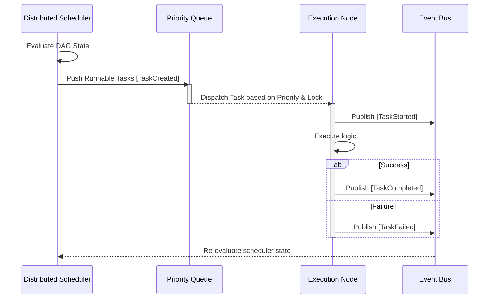
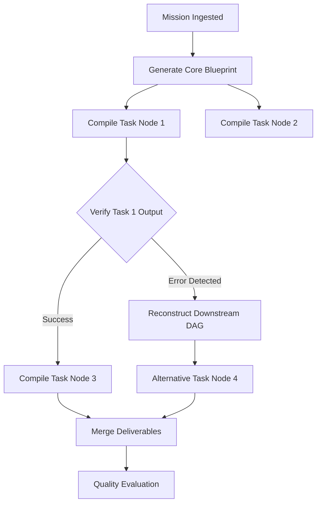
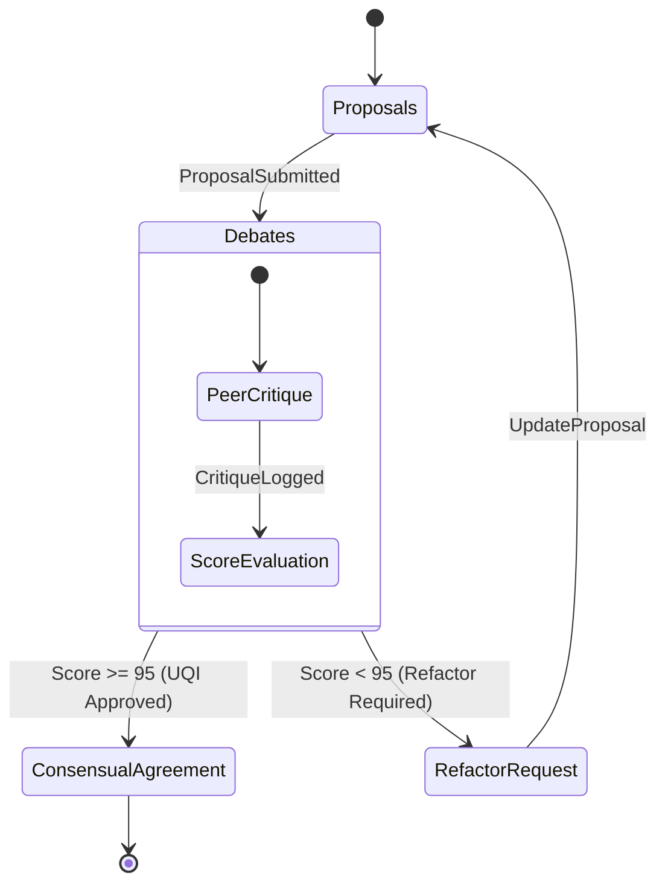
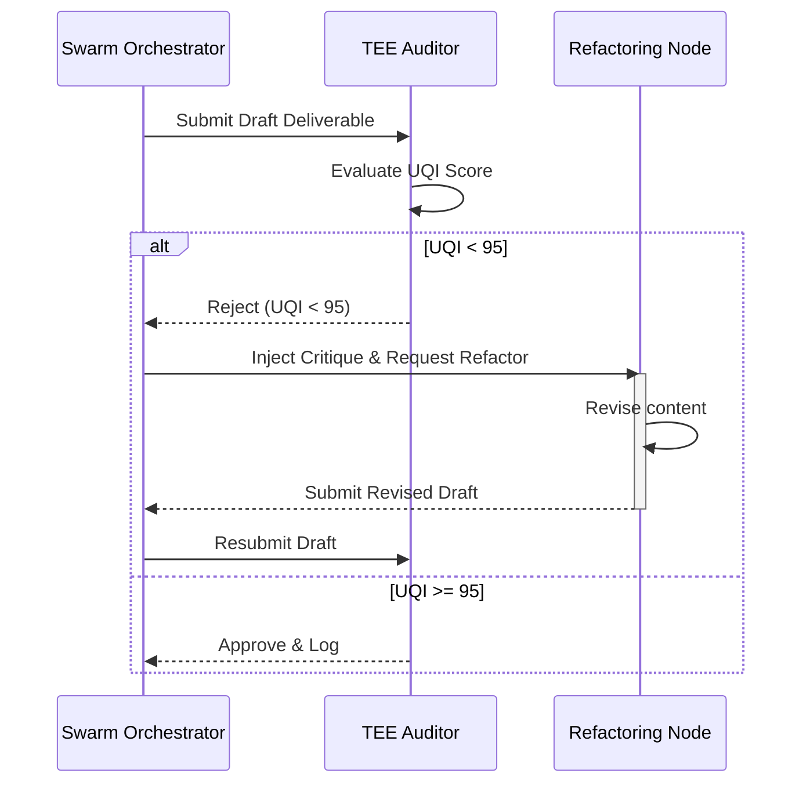
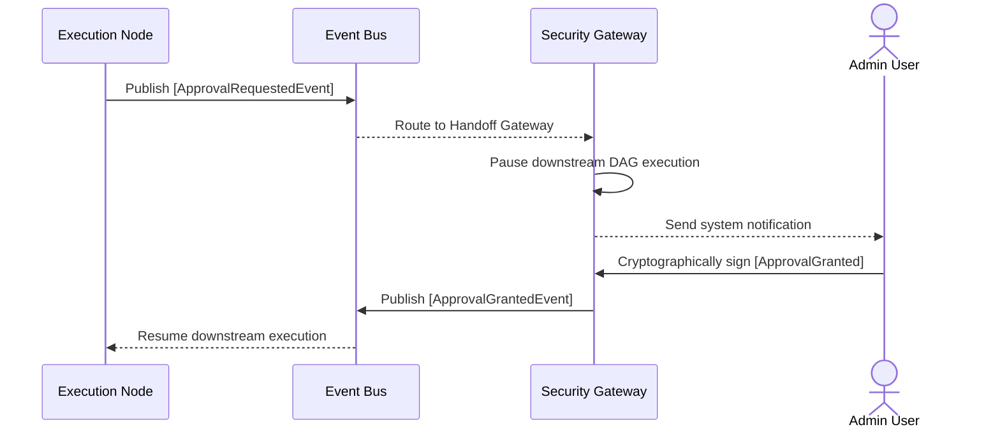
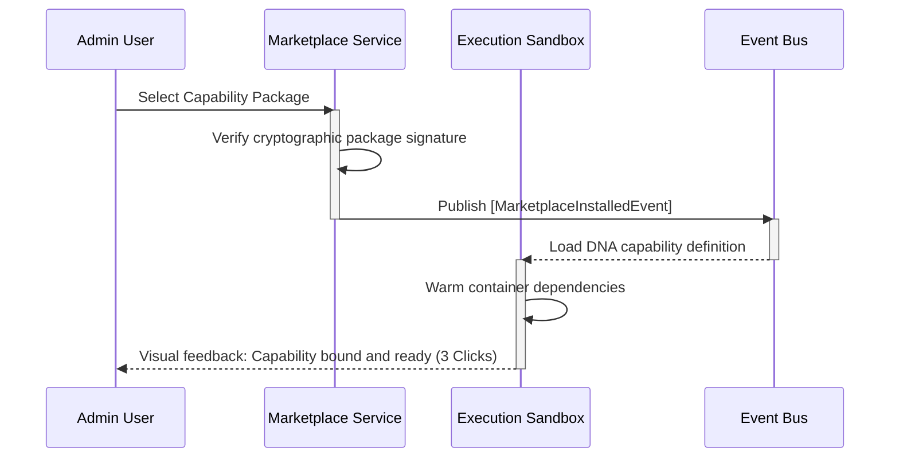

# 🛰️ ORIGIN AI OS Foundation Architecture (Part 2)
**Event-Driven Swarm Protocol (EDSP) Specification**

**Document Version:** v1.0.0-EDSP-FINAL  
**Security Classification:** RESTRICTED / SOVEREIGN CORE  
**Lead Authors:** Chief Distributed Systems Architect (ex-Apple, Google DeepMind, Anthropic, OpenAI, Microsoft Research, NVIDIA)  

---

## 1. SWARM PHILOSOPHY

### 1.1 Core Tenets of the Sovereign Swarm Mesh (SSM)
In ORIGIN AI OS, computational workload is never treated as a series of sequential, synchronous API calls. Instead, the entire system operates as a **Sovereign Swarm Mesh (SSM)**—a highly scalable, decentralized network of autonomous intelligence actors communicating via asynchronous event streams.

The philosophy of the Event-Driven Swarm Protocol (EDSP) rests on four pillars:

```
┌────────────────────────────────────────────────────────────────────────┐
│                        EDSP PHILOSOPHICAL PILLARS                      │
├───────────────────┬───────────────────┬────────────────┬───────────────┤
│  Mission Driven   │    Event Driven   │Capability First│Self-Organizing│
├───────────────────┼───────────────────┼────────────────┼───────────────┤
│ The ultimate root │ Absolute state    │ Dynamic tools  │ Swarms assemble│
│ of execution is a │ propagation via   │ are injected   │ and adapt to   │
│ top-level Goal.   │ immutable events. │ as DNA blocks. │ local failures.│
└───────────────────┴───────────────────┴────────────────┴───────────────┘
```

1.  **Mission Driven:** Every computation is traced back to a top-level human intent (Mission). System performance is evaluated by the system's ability to achieve that Mission within defined compliance constraints.
2.  **Event Driven:** State changes within the OS do not occur through direct database updates. All state transitions are modeled as a sequence of immutable Domain Events. System history is a ledger of these events (Event Sourcing).
3.  **Capability First:** Agents do not own tools; instead, capabilities are bound dynamically to execution contexts using a **Symmetric Capability Binding** protocol.
4.  **Self-Organizing:** The OS does not rely on static agent hierarchies. As a Mission's DAG is executed, specialized Agent Actors are spawned, assigned specific C-suite roles, challenged by peer auditors, and decomposed automatically when tasks complete.

---

## 2. SWARM EVENT MODEL (EVENTS INDEX)

Every lifecycle change, database sync, capability invocation, and consensus phase is mapped to a highly structured event payload. The following schema defines the core events handled by the `Sovereign Event Bus (SEB)`.

```
                        ┌────────────────────────┐
                        │  Unified Schema Event  │
                        ├────────────────────────┤
                        │ - EventId: UUID        │
                        │ - Timestamp: ISO_8601  │
                        │ - Metadata: JWT_Claims │
                        │ - Payload: Dynamic JSON│
                        └───────────┬────────────┘
                                    │
         ┌──────────────────────────┼──────────────────────────┐
         ▼                          ▼                          ▼
┌─────────────────┐        ┌─────────────────┐        ┌─────────────────┐
│  Mission Events │        │  Swarm Task     │        │ Capability & Org│
├─────────────────┤        ├─────────────────┤        ├─────────────────┤
│- MissionCreated │        │- TaskCreated    │        │- CapRequested   │
│- MissionUpdated │        │- TaskStarted    │        │- RoleAssigned   │
│- MissionComplete│        │- TaskCompleted  │        │- OrgCreated     │
└─────────────────┘        └─────────────────┘        └─────────────────┘
```

### 2.1 Event Schema Catalog
All events extend a unified event wrapper:
```json
{
  "eventId": "uuid-v4-hash",
  "eventType": "String",
  "timestamp": "YYYY-MM-DDTHH:mm:ss.sssZ",
  "actorId": "String",
  "tenantId": "String",
  "workspaceId": "String",
  "missionId": "String",
  "correlationId": "uuid-v4-hash",
  "payload": {}
}
```

*   **`MissionCreated`:** Broadcast when a new strategic intention is validated and ingested.
*   **`MissionUpdated`:** Triggered when the execution path or priority level of a Mission undergoes refactoring.
*   **`MissionCompleted`:** Fired when TEE (Truth & Excellence Engine) verifies that deliverables have passed the 95-point threshold.
*   **`TaskCreated`:** Fired when the DAG compiler breaks a Mission into executable sub-steps.
*   **`TaskStarted`:** Dispatched when an assigned execution node begins processing a DAG sub-step.
*   **`TaskCompleted`:** Dispatched upon successful completion of a DAG sub-step.
*   **`TaskFailed`:** Dispatched when a task node fails, containing exception details, retry index, and stack trace.
*   **`CapabilityRequested`:** Broadcast when an agent requires a tool (e.g., File Write or Database Query).
*   **`CapabilityLoaded`:** Dispatched when the sandboxed environment validates the capability's cryptographic signature and binds it to the Swarm context.
*   **`CapabilityReleased`:** Fired when the execution task finishes, reclaiming resource handles and isolating permissions.
*   **`KnowledgeAttached`:** Triggered when relevant vector index slices are embedded into the active Swarm context.
*   **`KnowledgeUpdated`:** Triggered when new insights are written back into the corporate memory graph.
*   **`MemoryCommitted`:** Broadcast when episodic details are recorded into the long-term Unified Cognitive Graph (UCG).
*   **`OrganizationCreated`:** Fired when a new virtual organization or joint venture boardroom is spawned.
*   **`RoleAssigned`:** Emitted when specific agency parameters (e.g., CEO, CTO, Audit specialist) are bound to an actor instance.
*   **`ApprovalRequested`:** Fired when a high-risk capability requires human validation.
*   **`ApprovalGranted`:** Triggered upon human cryptographic signature validation.
*   **`ExecutionStarted` / `ExecutionCompleted` / `ExecutionFailed`:** Tracks the start, successful completion, or failure of intermediate Swarm processing.
*   **`AuditLogged`:** Emitted immediately for every event, creating an immutable trail on the Infinite Compliance Ledger (ICL).
*   **`BillingRecorded` / `MarketplaceInstalled` / `AutomationTriggered`:** Governs billing consumption, third-party code injection, and trigger cycles.

---

## 3. SWARM COMMUNICATION PROTOCOL

Communication within the mesh is strictly asynchronous and decoupled. There are no direct memory pointer exchanges or blocking REST calls between active entities.

```
┌────────────────────────────────────────────────────────────────────────┐
│                        COMMUNICATION CHANNELS                          │
├─────────────────┬─────────────────┬──────────────────┬─────────────────┤
│ Agent ↔ Agent   │ Agent ↔ Mission │ Mission ↔ Cap    │ Mission ↔ Memory│
├─────────────────┼─────────────────┼──────────────────┼─────────────────┤
│ Actor Mailboxes │ Reactive DAG    │ Sandbox Binder   │ Semantic Sync   │
│ with Backpressure│ progress loops  │ with Scope Rules │ with vector DBs │
└─────────────────┴─────────────────┴──────────────────┴─────────────────┘
```

*   **Agent ↔ Agent (Choreography):** Employs the Actor Model. Each agent has an isolated "Mailbox" receiving typed messages. Agents coordinate by emitting events (e.g., `DraftCompleted`) and listening for peer feedback (`CritiqueGenerated`).
*   **Agent ↔ Mission (DAG Ingestion):** The Mission is represented as a stateful, reactive DAG. When a task status changes, the corresponding Event drives changes in the scheduler, prompting the spawning of downstream Agent Actors.
*   **Mission ↔ Capability (Dynamic Sandbox):** Capabilities are bound via transient access tokens. The Mission requests a tool; the Kernel verifies the authorization token and instantiates the capability in a sandboxed, short-lived container.
*   **Mission ↔ Knowledge/Memory (Semantic Sync):** Episodic context is retrieved and merged dynamically. When a task completes, the summary is published to the Event Bus, where the Memory Processor updates the semantic storage as an asynchronous job.
*   **Human ↔ AI (Sovereign Handoff):** Uses Server-Sent Events (SSE) or WebSockets to stream progress updates, with execution pausing securely when human input is required.

---

## 4. DISTRIBUTED SCHEDULER

The Distributed Scheduler coordinates task execution across decentralized computing nodes. It schedules DAG steps based on topological dependencies, resource availability, and compliance constraints.



---

## 5. SOVEREIGN EVENT BUS (SEB)

The Sovereign Event Bus handles message dispatching across the entire OS ecosystem. It guarantees high-performance routing, reliable deliveries, and tenant isolation using the **Transactional Outbox Pattern**.

```
  ┌─────────────────────────────────────────────────────────────────────────┐
  │                           Sovereign Tenant App                          │
  │                                                                         │
  │  ┌────────────────────────┐                   ┌──────────────────────┐  │
  │  │  Domain State Changes  ├──────────────────►│ Transactional Outbox │  │
  │  └────────────────────────┘                   └──────────┬───────────┘  │
  └──────────────────────────────────────────────────────────┼──────────────┘
                                                             │ (Reliable Polling/CDC)
                                                             ▼
                                                  ┌──────────────────────┐
                                                  │ Sovereign Event Bus  │
                                                  │      (SEB Core)      │
                                                  └──────────┬───────────┘
                                                             │
                                   ┌─────────────────────────┴─────────────────────────┐
                                   ▼                                                   ▼
                        ┌─────────────────────┐                             ┌─────────────────────┐
                        │ Consumer: Swarm Node│                             │ Consumer: ICL Ledger│
                        └─────────────────────┘                             └─────────────────────┘
```

The Transactional Outbox Pattern ensures that domain state changes (e.g., Mission Completed) and their corresponding integration events are committed to the database in a single transaction, preventing data inconsistency during system crashes.

---

## 6. PRIORITY QUEUE

The Priority Queue manages the execution order of all active Swarms, ensuring that high-priority enterprise missions are scheduled first.

```
                       High-Priority (System / Emergency)
                       ┌────────────────────────────────┐
                       │  Priority Level 3 (Real-time)  ├──► [Execute Node A]
                       └────────────────────────────────┘
                                       ▲
                       Standard Strategic Missions
                       ┌────────────────────────────────┐
                       │  Priority Level 2 (Default)    ├──► [Execute Node B]
                       └────────────────────────────────┘
                                       ▲
                       Background Optimizations (Memory)
                       ┌────────────────────────────────┐
                       │  Priority Level 1 (Batch)      ├──► [Execute Node C]
                       └────────────────────────────────┘
```

The scheduling algorithm uses a dynamic weight metric:
$$\text{Priority Weight} = w_1 \cdot \text{Impact} + w_2 \cdot \text{UserTier} - w_3 \cdot \text{ExecutionTime}$$

This ensures that critical operational tasks take precedence over low-priority background maintenance tasks.

---

## 7. EXECUTION GRAPH (DYNAMIC DAG RECONSTRUCTION)

An execution path is never hardcoded. It is compiled dynamically and refactored on-the-fly depending on intermediate outputs.



If an error or new data is detected at step $N$, the Scheduler invalidates nodes $N+1 \dots M$ and compiles a revised topological sort to bypass the roadblock.

---

## 8. SELF-HEALING PROTOCOLS (AUTOMATED RECOVERY)

To achieve 2035-level resilience, the Swarm utilizes automated recovery mechanisms designed to handle faults gracefully.

```
                           ┌─────────────────────────┐
                           │   Task Node Execution   │
                           └────────────┬────────────┘
                                        │
                                        ▼
                               ┌─────────────────┐
                       No      │  Error Detected │
                     ┌─────────┤   and Logged?   │
                     │         └────────┬────────┘
                     │                  │ Yes
                     ▼                  ▼
               ┌───────────┐   ┌─────────────────┐
               │ Continue  │   │ Circuit Breaker │
               └───────────┘   │  State Active?  │
                               └────────┬────────┘
                                        │ Yes
                     ┌──────────────────┴──────────────────┐
                  No │                                     │
                     ▼                                     ▼
           ┌──────────────────┐                  ┌──────────────────┐
           │   Retry Step?    │                  │  Route to Admin  │
           │  (Limit: Max 3)  │                  │   Human Audit    │
           └──────────────────┘                  └──────────────────┘
```

*   **Retry Limit Rule:** Failed task nodes are automatically retried up to three times, backed by exponential jittering.
*   **Circuit Breakers:** If a dependency API (e.g., Salesforce, Stripe) fails repeatedly, downstream tasks are routed to fallback pathways to prevent system lockups.

---

## 9. CONSENSUS ENGINE (AGENT DEBATES)

Swarms resolve complex challenges using a structured, asynchronous consensus protocol.



In the debate phase, peer agents provide critiques. The system will not proceed unless the strategic draft achieves 95+ points on the Universal Quality Index (UQI).

---

## 10. REFLECTION LOOP

The Reflection Loop operates after task execution to analyze the system's performance and learn from errors.

```
┌────────────────────────────────────────────────────────────────────────┐
│                          REFLECTION METRICS                            │
├─────────────────┬─────────────────┬──────────────────┬─────────────────┤
│ Accuracy Score  │ Token Efficiency│ Dependency Paths │ Error Rate      │
├─────────────────┼─────────────────┼──────────────────┼─────────────────┤
│ Evaluation of   │ Optimization of │ Verification of  │ Mapping and     │
│ factual output. │ computed cost.  │ used resources.  │ logging errors. │
└─────────────────┴─────────────────┴──────────────────┴─────────────────┘
```

Insights generated by the Reflection Loop are serialized and written directly to the long-term cognitive database as an asynchronous action, updating the system's memory.

---

## 11. QUALITY LOOP (UQI SCORING)

The Truth & Excellence Engine (TEE) evaluates drafts using the **Universal Quality Index (UQI)**.

```json
{
  "uqiScore": 98.4,
  "metrics": {
    "factualGrounding": 0.99,
    "structuralClarity": 0.98,
    "userPreferenceMatch": 0.97,
    "ethicalAlignment": 1.00
  },
  "verifiedSources": [
    "source-document-id-hash-1",
    "source-database-record-2"
  ]
}
```

If the factual grounding score falls below the threshold, the system flags the deliverable and schedules a refactoring cycle.

---

## 12. EXCELLENCE LOOP (SELF-REFACTORING)

When a draft fails the quality evaluation, the system initiates the Excellence Loop to refactor the deliverable.



---

## 13. FEDERATION EVENT PROTOCOL (MULTI-TENANT COMMUNICATOR)

Federation allows separate ORIGIN Tenants to securely collaborate on mutual goals without ever exposing their proprietary database records.

```
┌────────────────────────┐                    ┌────────────────────────┐
│  Sovereign Tenant A    │                    │  Sovereign Tenant B    │
│                        │                    │                        │
│ ┌────────────────────┐ │                    │ ┌────────────────────┐ │
│ │ Federated Agent A  │ │                    │ │ Federated Agent B  │ │
│ └─────────┬──────────┘ │                    │ └─────────▲──────────┘ │
└───────────┼────────────┘                    └───────────┼────────────┘
            │                                             │
            │          ┌────────────────────────┐         │
            └─────────►│ Secure Federation Hub ├─────────┘
                       │ - ZK-Proof exchange    │
                       │ - Short-lived session  │
                       └────────────────────────┘
```

*   **ZK-Proof Exchange:** Tenants verify identities and compliance structures symmetrically using cryptographic proofs.
*   **Session Isolation:** Cross-Tenant Swarms operate on short-lived tokens restricted to specific capability sub-scopes.

---

## 14. HUMAN APPROVAL PROTOCOL (COMPLIANCE INGEST)

To comply with safety and enterprise risk standards, high-impact tasks (such as sending payments or altering databases) pause execution to await explicit human approval.



---

## 15. REAL-TIME COLLABORATION PROTOCOL

The Real-time Collaboration Protocol synchronizes states across multiple human users and active AI Swarms in real-time.

```
  ┌────────────────────────────────────────────────────────────────────────┐
  │                            Collaborators Client                        │
  │                                                                        │
  │  ┌────────────────────────┐                  ┌──────────────────────┐  │
  │  │   Active Workspace     │◄────────────────►│ WebSocket Connection │  │
  │  └────────────────────────┘                  └──────────▲───────────┘  │
  └─────────────────────────────────────────────────────────┼──────────────┘
                                                            │ (Bidirectional JSON Sync)
                                                            ▼
                                                 ┌──────────────────────┐
                                                 │   Coordination Hub   │
                                                 │   (Sovereign Sync)   │
                                                 └──────────────────────┘
```

The system broadcasts dynamic visual state changes, cursor tracking, and draft annotations in real-time to keep all connected participants in perfect sync.

---

## 16. SECURITY EVENT ENGINE

To safeguard enterprise boundaries, the Security Event Engine dynamically monitors and sanitizes execution contexts.

```json
{
  "securityEventId": "sec-event-hash-123",
  "anomalyScore": 0.01,
  "piiMaskingApplied": true,
  "rulesEvaluated": [
    "NIST_800_53_REV_5",
    "ISO_27001_A_12_6_1"
  ]
}
```

The engine continuously validates inter-agent payloads to ensure no sensitive metadata violates tenant isolation boundaries.

---

## 17. AUDIT EVENT LOGGING (ICL SPECIFICATION)

Every domain event is continuously archived onto the **Infinite Compliance Ledger (ICL)**, producing a cryptographically secured historical proof.

```
               ┌───────────────────────────────────────────────┐
               │              Domain Event Dispatched          │
               └──────────────┬────────────────────────────────┘
                              │
                              ▼
               ┌───────────────────────────────────────────────┐
               │    Create Cryptographic SHA-256 Block Hash    │
               │  - Includes hash of the previous event block  │
               └──────────────┬────────────────────────────────┘
                              │
                              ▼
               ┌───────────────────────────────────────────────┐
               │     Commit Block to Firestore Database        │
               │    - Permanent immutable storage of decisions │
               └───────────────────────────────────────────────┘
```

This guarantees complete non-repudiation of all decisions compiled and executed by the Sovereign Swarm.

---

## 18. MARKETPLACE EVENT PROTOCOL

The Marketplace handles the dynamic registration and execution of verified third-party capabilities.



---

## 19. FUTURE AGI SWARM (2035+ LANDSCAPE)

By 2035, computing infrastructure will be native, decentralized, and highly autonomous.

*   **Quantum Swarm Orchestration:** Future architectures will replace traditional logic with high-dimensional probability models, executing complex multi-agent reasoning steps in milliseconds.
*   **Decentralized Coordination:** Swarms will coordinate directly across decentralized edge devices, functioning as a planetary-scale, self-healing computational mesh.

---

## 20. SWARM EVOLUTION ROADMAP

The final roadmap charts the path to fully autonomous operational ecosystems.

```
┌────────────────────────────────────────────────────────────────────────┐
│                        EVOLUTION TIMELINE                              │
├─────────────────┬─────────────────┬──────────────────┬─────────────────┤
│   2026 (OS3)    │  2030 (Spatial) │   2035 (AGI OS)  │ 2040+ (Planetary│
├─────────────────┼─────────────────┼──────────────────┼─────────────────┤
│ Multi-agent     │ Spatial AR      │ Autonomous agent │ Decentralized  │
│ task scheduling │ integration &   │ companies &      │ planetary-scale │
│ with UQI loops. │ edge memory.    │ self-funding.    │ computing.      │
└─────────────────┴─────────────────┴──────────────────┴─────────────────┘
```

---

## 21. CHIEF DISTRIBUTED SYSTEMS ARCHITECT STATEMENT

Our architecture represents a paradigm shift. We have moved past synchronous database lookups and fragile REST APIs to build an event-driven system where information and computing power flow dynamically. Under ORIGIN, the entire enterprise functions as a living, self-optimizing intelligence mesh—resilient, scalable, and built to power the next century of human achievement.

---
**ORIGIN AI OS - Event-Driven Swarm Protocol Specification**  
*"We do not build systems that wait; we build systems that coordinate, evolve, and deliver."*
