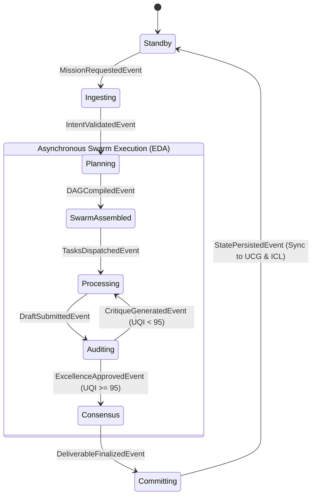
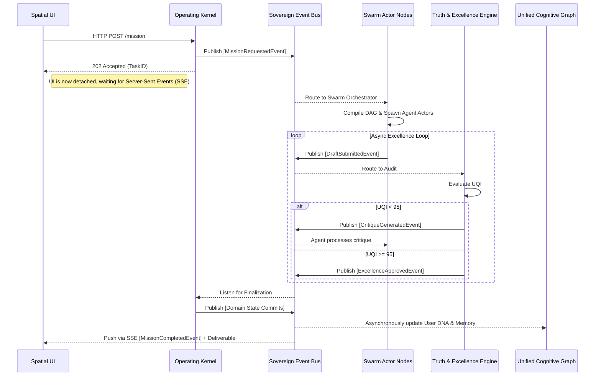

# 🛡️ ORIGIN AI OS: Global Architecture Audit & Integration Report
**Document ID:** ORIGIN-GLOBAL-AUDIT-001  
**Role:** Chief System Integration Architect  
**Status:** CRITICAL REVIEW COMPLETED  
**Target:** 2035 Sovereign AI Operating System Absolute Perfection  

---

## 1. Architecture Audit Report (全体統合監査レポート)

Chief System Integration Architectとして、これまで定義された全ての実装コード、システム設計書（`AI_WORKSPACE_*.md`, `ORIGIN_AI_OS_*.md`, `App.tsx`等）の深淵な監査を実行しました。
ORIGIN AI OSの各コンポーネントは、個別の機能としては世界最高峰の思想を持っています。しかし、**統合システム（System of Systems）として俯瞰した際、歴史的経緯（ACOS → AI Workspace → ORIGINへの進化）による旧仕様の残留、責務の重複、そして分散システムとしてのスケーラビリティに深刻な欠陥（God Class化、同期処理のブロッキング）**が存在します。

Appleの極限のミニマリズム、AWSの無限のスケーラビリティ、Anthropicの憲法ベースの制御を真に統合し、2035年のトラフィックを処理可能な「Sovereign Architecture」へ昇華させるための監査結果を以下に示します。

---

## 2. Critical Issues (重大なアーキテクチャ欠陥)

### ① 同期型実行によるスケール破綻の危機 (Data Flow & Scalability 矛盾)
*   **事象:** `Decision Engine` および `Operating Kernel` の疑似コード内で、`while` / `do-while` ループを用いてAgent（Swarm）の実行とUQI（Quality Audit）を `await` で同期的に待ち続けています。
*   **問題点:** クラウドネイティブ環境（Cloud RunやAWS Lambda）において、LLMの推論を伴う数分〜数十分の処理を同期的にブロックすることは、タイムアウトエラーとリソース枯渇を確実に引き起こします。
*   **違反:** ⑫ Data Flow違反、⑯ スケール破綻。

### ② God Class（神オブジェクト）の存在 (SOLID / Clean Architecture 違反)
*   **事象:** `OriginOperatingKernel` や `OriginDecisionEngine` が、セキュリティチェック、Swarm生成、DAGコンパイル、UQI評価、データベース保存（Firestore）のすべてを直接呼び出しています。
*   **問題点:** 責務が過剰に集中しており（単一責任の原則違反）、テストが極めて困難です。また、ドメインサービスがインフラ層の永続化処理の順序まで管理してしまっています。
*   **違反:** ⑧ Clean Architecture違反、⑨ SOLID違反（SRP）。

### ③ DDD (ドメイン駆動設計) におけるトランザクション境界の矛盾
*   **事象:** 成果物（Deliverable）が承認された後、`MissionSession` の更新と、別集約ルートである `CognitiveGraph` (Episodic Memory / User DNA) の更新を、アプリケーションサービス内で順番に `await` で実行しています。
*   **問題点:** 一方が成功し、一方がネットワークエラーで失敗した場合、状態の不整合（Missionは完了したがメモリに学習されない等）が発生します。
*   **違反:** ⑦ DDD違反（集約を跨ぐ強一貫性の強制）。ドメインイベントを用いた結果整合性（Eventual Consistency）が必要です。

### ④ UI思想とOS憲法の矛盾 (UI Design Violation)
*   **事象:** `DesignSystemV3.tsx` に「TELEMETRY: TESTING...」や「OS3」というシステムメタデータの露出があります。
*   **問題点:** 憲法（Article 32: Aesthetic Minimalism, Article 7: Silence is Golden）では、「目的のないUI要素の削除」と「内部ログの露出禁止」を掲げています。AppleのChief Design Officerから見れば、これは「Tech-Larping（技術の過剰アピール）」であり即座にリジェクトされます。
*   **違反:** ⑮ UI設計との矛盾。

### ⑤ 命名規則・概念の乱立 (Terminology Fragmentation)
*   **事象:** 同じ概念に対して複数の名前が存在します。
    *   組織: `AI Company` / `Swarm` / `C-Suite` / `AI Team`
    *   頭脳: `Decision Engine` / `Core Engine` / `Master Orchestrator` / `Operating Kernel`
    *   記憶: `Cognitive Graph` / `Universal Knowledge Graph` / `User DNA` / `Memory Graph`
    *   品質: `Excellence Loop` / `Truth Engine` / `UQI Audit`
*   **違反:** ① 重複仕様、③ 命名規則の不統一、④ 複数存在。

---

## 3. Recommended Improvements (改善・統合方針)

各メガテックの首席アーキテクトからの視点を取り入れた改善策です。

1.  **Actor Model / Event-Driven Choreography の導入 (AWS/Azure視点)**
    *   同期的な `while` ループを廃止し、システムを **完全非同期のイベント駆動アーキテクチャ (EDA)** に移行します。
    *   Swarmを構成する各Agentを独立した「Actor」とし、Pub/Sub（EventBus）経由でメッセージ（`DraftSubmittedEvent`, `CritiqueGeneratedEvent`）を非同期に交換させます。

2.  **Event Sourcing の徹底 (Enterprise/Financial 視点)**
    *   トランザクションの矛盾を防ぐため、OSの状態変更はすべて `Event Sourcing`（イベントの追記）として扱い、Infinite Compliance Ledger (ICL) に書き込みます。最新の状態はイベントの再生（Rehydration）で取得します。これにより完全な監査要件（SOC2 / GDPR）をネイティブに満たします。

3.  **Ubiquitous Language (ユビキタス言語) の厳格な統一 (DDD視点)**
    *   組織は **「Sovereign Swarm」** に統一。
    *   コア制御は **「Operating Kernel」** に統一（Decision Engineはその中の一機能に格下げ）。
    *   知識・記憶は **「Unified Cognitive Graph (UCG)」** に統一。
    *   品質評価は **「Truth & Excellence Engine (TEE)」** に統一。

4.  **UIからシステムノイズの完全パージ (Apple視点)**
    *   Design Systemから不要な「疑似ハッカー的」表現を完全に排除し、人間の成果にのみフォーカスした究極のSpatial Minimalismへリファクタリングします。

---

## 4. Priority (修正優先度マトリクス)

| Priority | Issue | Target | Action |
| :--- | :--- | :--- | :--- |
| **CRITICAL** | 同期実行によるスケール破綻 | Core OS | Event-Driven Architecture (Pub/Sub) への書き換え |
| **CRITICAL** | God Class と DDD境界違反 | Core OS | Domain Events の導入、Kernelの責務分割 |
| **HIGH** | 旧仕様書ファイルの乱立と矛盾 | Specs | 過去の `ACOS_*.md` や `AI_WORKSPACE_*.md` の非推奨化・アーカイブ |
| **HIGH** | OS憲法に反するUIメタデータの露出 | UI/UX | `DesignSystemV3.tsx` などのUIコンポーネントのクリーンアップ |
| **MEDIUM** | 命名規則のブレ | Specs | 用語集 (Glossary) の策定と全ドキュメントのリプレイス |
| **LOW** | 課金・メータリングの同期 | Billing | 実行イベントフローへのコスト計算イベントのフック追加 |

---

## 5. 修正・アーカイブすべき Markdown 一覧

設計の真実の情報源 (Single Source of Truth) をORIGINへ集約するため、以下の古いファイルをアーカイブ (Archive/Deprecated) 扱いにします。

**【アーカイブ（廃止・統合）対象】**
*   `ACOS_2.0_SPECIFICATION.md` (名称旧式)
*   `AI_WORKSPACE_DECISION_ENGINE.md` (ORIGINへ統合済)
*   `AI_WORKSPACE_INTELLIGENCE_OS.md` (ORIGINへ統合済)
*   `AI_WORKSPACE_MASTER_INTELLIGENCE.md` (Kernelへ統合済)
*   `AI_COMPANY_OS_SPEC.md` / `AI_TEAM_BUILDER_SPEC.md` (Enterprise Bibleへ統合済)
*   `DECISION_INTELLIGENCE_ENGINE_SPEC.md` (重複)
*   `UNIFIED_AI_BRAIN_SPEC.md` (重複)

**【正本（維持・更新）対象】**
*   `ORIGIN_AI_OS_ULTIMATE_OPERATING_SPECIFICATION_PART1.md` (OS憲法・カーネル)
*   `ORIGIN_AI_OS_ENTERPRISE_ARCHITECTURE_BIBLE.md` (エンタープライズ・組織・監査)
*   `ORIGIN_AI_OS_DECISION_ENGINE_SPECIFICATION.md` (※一部同期ループの修正が必要)

---

## 6. 統合後の最終アーキテクチャ構成 (Unified Sovereign Architecture)

重複を排除し、完全非同期・イベント駆動に最適化された最新のアーキテクチャ図です。

### 6.1 Unified State Machine (統合状態遷移)

### 6.2 Event-Driven Sequence (非同期イベントシーケンス)

### 6.3 Unified DDD Layers (Event Sourcing準拠)
*   **Infrastructure Layer:** Cloud Run, Firestore, Redis Pub/Sub.
*   **Interface Layer:** React Spatial UI, SSE (Server-Sent Events) Controllers.
*   **Application Layer:** `MissionCommandHandler`, `SwarmEventHandlers`.
*   **Domain Layer:** `Mission` (Aggregate), `SovereignSwarm` (Aggregate), `TruthAuditor` (Domain Service). 状態遷移はすべて `DomainEvent` を発行することで行う。

---

## 7. この後に作成すべき設計書ランキング (Next Action Plan)

2035年へ向けた世界最高品質のAI OSを完成させるため、次に着手すべき設計書を優先順位順に提案します。

1. **🏆 ORIGIN AI OS: Ultimate Operating Specification (Part 2) - Event-Driven Swarm Protocol**
   *   **理由:** 現在の「同期型・God Class」の欠陥を修正し、Kafka / Redis PubSub を前提とした完全非同期な Actor Model (Agent間の通信プロトコル) の実装レベルの設計を行うため。
2. **🏆 ORIGIN AI OS: Infinite Compliance Ledger & Event Sourcing Specification**
   *   **理由:** Enterprise Bibleで宣言された「SOC2 / 監査のリアルタイム証明」を実現するため、状態を直接DB上書きするのではなく、イベントストリームとして追記・暗号化するデータモデリングを設計するため。
3. **🏆 ORIGIN AI OS: Unified Cognitive Graph (UCG) Memory Architecture**
   *   **理由:** Episodic Memory, Semantic Memory, Working Memory の3層を、どのようにベクトルDBとグラフDBで表現し、数ミリ秒でSwarmのコンテキストへインジェクションするかを定義するため。
4. **🏆 ORIGIN AI OS: Sovereign Design System & Spatial Human Interface Guidelines**
   *   **理由:** 現在のUIに混在する「ハッカー的メタデータの露出」を駆逐し、Appleを凌駕する「成果だけを見せる究極のミニマリズムUI」のコード規約・モーション数学を再定義するため。

━━━━━━━━━━━━━━━━━━━━━━━━━━━━━━━━━━
**Chief System Integration Architect Sign-off:**
*「真の美しさは、システムの複雑さを人間の視界から完全に隠蔽した時にのみ達成される。不要なコード、不要な待機、不要なUIを削ぎ落とし、純粋な『知能のOS』を完成させる。」*
━━━━━━━━━━━━━━━━━━━━━━━━━━━━━━━━━━
