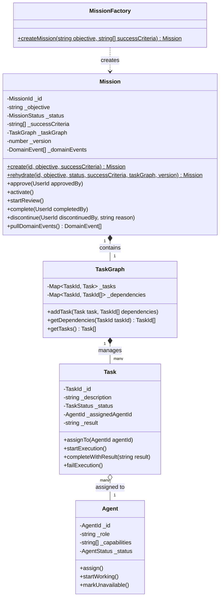
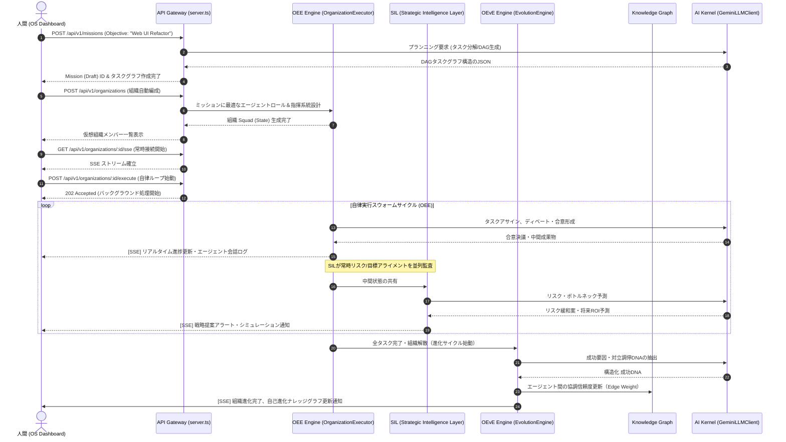

# ACOS 2.0 (AI Company OS) - Production Handoff Package

本資料は、ACOS 2.0 (AI Company OS) のアーキテクチャ、モジュール、ドメインモデル、API、AIプロバイダー、ダッシュボード、およびシステム依存関係を包括的にまとめた技術ドキュメントです。
ClaudeなどのAIアシスタントやシニアエンジニアがシステム全体を正確にレビュー・理解・拡張できるよう、完全な設計情報を構造化して提供します。

---

## 1. プロジェクト全体のフォルダツリー (Directory Structure)

本システムは、**モノレポ（Monorepo）**構成を採用しており、ドメインモデルを内包する共有ライブラリパッケージ（`packages/domain`）、各種ビジネスロジック・自律型実行エンジンを提供するマイクロサービス（`services/mission-engine`）、およびフロントエンドのデスクトップOS UI（`src`）に明確にレイヤー分割されています。

```text
ACOS-2.0-ROOT/
├── .devcontainer/                # 開発コンテナ構成
├── .github/                      # GitHub Actions CI/CD パイプライン定義
├── .storybook/                   # フロントエンドUIコンポーネントカタログ
├── apps/                         # (将来拡張用：個別アプリケーションパッケージ)
│   └── .gitkeep
├── assets/                       # 静的グラフィックス・アイコンアセット
├── docs/                         # 設計仕様書・歴史的経緯書
│   ├── .gitkeep
│   └── ORIGIN_V1_ARCHITECTURE_SPEC.md
├── infra/                        # インフラデプロイ構成 (Dockerfile, terraform等)
│   └── .gitkeep
├── packages/                     # 共有コアライブラリ
│   └── domain/                   # DDDドメイン層 (最上位不変ポリシーとモデル定義)
│       ├── src/
│       │   ├── agent/            # エージェント・ドメインエンティティ
│       │   │   └── Agent.ts
│       │   ├── errors/           # ドメインエラー仕様
│       │   │   └── DomainErrors.ts
│       │   ├── events/           # ドメインイベントインターフェース
│       │   │   └── DomainEvent.ts
│       │   ├── mission/          # ミッション、タスク、タスクグラフ集約
│       │   │   ├── Mission.ts
│       │   │   ├── MissionFactory.ts
│       │   │   ├── MissionStatus.ts
│       │   │   ├── Task.ts
│       │   │   └── TaskGraph.ts
│       │   ├── repositories/     # リポジトリ境界インターフェース
│       │   │   ├── IAgentRepository.ts
│       │   │   ├── IMissionRepository.ts
│       │   │   └── ITaskRepository.ts
│       │   ├── types/            # Branded Types による値オブジェクト定義
│       │   │   └── BrandedTypes.ts
│       │   └── index.ts          # パッケージエントリポイント
│       └── package.json
├── services/                     # マイクロサービス層
│   └── mission-engine/           # ACOS 2.0 コアミッション実行・進化・戦略エンジン
│       ├── src/
│       │   ├── __tests__/        # ユニット・統合テストスイート
│       │   │   ├── AgentRuntime.test.ts
│       │   │   ├── ExecutionMemory.test.ts
│       │   │   └── OrganizationExecutionEngine.test.ts
│       │   ├── application/      # ユースケース・自律制御・組織論レイヤー
│       │   │   ├── agent/        # エージェントライフサイクル・統治サービス
│       │   │   ├── communication/# エージェント間ディベート・メッセージ通信
│       │   │   ├── evolution/    # 組織自己進化エンジン (OEvE) & ナレッジグラフ
│       │   │   │   ├── DynamicOrganizationEngine.ts
│       │   │   │   ├── EvolutionTypes.ts
│       │   │   │   ├── ExecutiveDecisionEngine.ts
│       │   │   │   ├── KnowledgeGraph.ts
│       │   │   │   ├── OrganizationEvolutionEngine.ts
│       │   │   │   └── OrganizationalMemoryRepository.ts
│       │   │   ├── organization/ # 組織実行エンジン (OEE) & 会議体合意形成
│       │   │   │   ├── ConsensusEngine.ts
│       │   │   │   ├── DashboardAPI.ts
│       │   │   │   ├── DelegationEngine.ts
│       │   │   │   ├── EscalationEngine.ts
│       │   │   │   ├── OrganizationExecutor.ts
│       │   │   │   ├── OrganizationMetricsTracker.ts
│       │   │   │   └── OrganizationTypes.ts
│       │   │   ├── runtime/      # エージェント並行実行スレッド・ランタイム
│       │   │   ├── strategic/    # 戦略的インテリジェンスレイヤー (SIL) & prediction
│       │   │   │   ├── CorporateGoalManager.ts
│       │   │   │   ├── DecisionIntelligence.ts
│       │   │   │   ├── FuturePredictionEngine.ts
│       │   │   │   ├── InnovationEngine.ts
│       │   │   │   ├── OrganizationDigitalTwin.ts
│       │   │   │   ├── RiskIntelligenceEngine.ts
│       │   │   │   ├── ScenarioPlanner.ts
│       │   │   │   ├── SimulationEngine.ts
│       │   │   │   ├── StrategicIntelligenceLayer.ts
│       │   │   │   └── StrategicTypes.ts
│       │   │   └── usecases/     # クリーンアーキテクチャ・ユースケース定義
│       │   ├── infrastructure/   # 外部API、ロギング、DB実体、オブザーバビリティ
│       │   │   ├── ai/           # 各種LLMプロバイダーアダプタ
│       │   │   │   ├── GeminiLLMClient.ts
│       │   │   │   └── ILLMClient.ts
│       │   │   ├── database/     # メモリ内/永続化データベース実装
│       │   │   ├── logging/      # システムトレーサビリティロガー
│       │   │   ├── observability/# メトリクス収集・監査・アラート
│       │   │   └── registry/     # ガバナンス用エージェントレジストリ
│       │   ├── presentation/     # コントローラ、APIルーティング、ミドルウェア
│       │   │   ├── middlewares/
│       │   │   ├── routes/
│       │   │   └── index.ts
│       │   └── index.ts          # エンジンブートストラップ
│       └── package.json
├── src/                          # フロントエンド (React SPA + Vite デスクトップOS UI)
│   ├── components/               # 汎用コンポーネント & OSアプレット
│   │   ├── os/                   # OSネイティブ・システムアプリケーション
│   │   │   ├── AIAssistantSidebar.tsx    # AIアシスタントサイドバー
│   │   │   ├── AIPerformanceDashboard.tsx# 性能・コスト可視化
│   │   │   ├── ChatApp.tsx               # 自律エージェントとの直接対話
│   │   │   ├── DashboardApp.tsx          # ACOS2.0 統合コントロールセンター
│   │   │   ├── MemoryExplorer.tsx        # OEvEナレッジグラフ & DNA検査
│   │   │   ├── MultiAIApp.tsx            # マルチLLM同時ディベート・ルータ
│   │   │   ├── NotificationCenter.tsx    # システム通知・アラート
│   │   │   ├── ObservabilityCenter.tsx   # 信頼性・監査・メメティクス
│   │   │   ├── PromptLibrary.tsx         # プロンプトテンプレート管理
│   │   │   ├── UniversalSearch.tsx       # 全文・セマンティック検索
│   │   │   └── WorkspaceSelector.tsx     # 仮想組織スペース切り替え
│   │   ├── MissionInput.tsx
│   │   └── ResultDashboard.tsx
│   ├── legacy/                   # 旧ACOS 1.0シミュレーションAPI定義
│   │   └── legacyRoutes.ts
│   ├── App.tsx                   # OSメインウィンドウ・アプレット管理コア
│   ├── index.css                 # グローバルCSS (Tailwind v4)
│   ├── main.tsx                  # クライアントブート
│   └── types.ts                  # クライアント型定義
├── server.ts                     # Express + Vite (統合API+アプレットサーバー)
├── package.json                  # 全体依存関係・モノレポワークスペース定義
└── tsconfig.json                 # TypeScriptコンパイル構成
```

---

## 2. 全ての主要モジュール一覧

ACOS 2.0 はクリーンアーキテクチャおよび自律型マルチエージェントスウォーム（Swarm）理論をベースに設計され、以下の主要モジュール群で構成されています。

### ① 組織実行エンジン：OEE (Organization Execution Engine)
*   **役割**: 人間から与えられた高レベルミッションを解釈し、自律的に複数のタスクへ分解、動的組織（仮想プロジェクトチーム）を編成し、エージェント間の「合意形成」「移譲」「エスカレーション（エスカラ）」を含む実行ループを制御します。
*   **依存関係**: `@origin/domain`, `AI Kernel`, `OEvE (自己進化)`
*   **入口 (Entry)**: `OrganizationExecutor.runExecutionLoop(orgId, taskDescription)`
*   **出口 (Exit)**: 完了後の成果物データ、コンセンサス決議データ、`OrganizationState`

### ② 組織自己進化エンジン：OEvE (Organization Evolution Engine)
*   **役割**: 各ミッションが完了するたびに、その「成功の体験」「ディベートで発生した対立と妥協」「合意結果」を組織の遺伝子（Knowledge DNA）として抽出・構造化し、ナレッジグラフへ保存することで、次回以降のプロジェクト編成時の学習と自己進化を司ります。
*   **依存関係**: `@origin/domain`, `Knowledge Graph`, `OrganizationalMemoryRepository`
*   **入口 (Entry)**: `OrganizationEvolutionEngine.evaluateMission(state)`
*   **出口 (Exit)**: 更新されたナレッジノード、関係性データ、進化記憶ログ

### ③ 戦略的インテリジェンスレイヤー：SIL (Strategic Intelligence Layer)
*   **役割**: 組織全体の実行データを監視・監査し、未来予測、リスクプロファイリング、リソース競合シミュレーション、企業目標（OKRs）へのアライメント評価を並列して自律的に回す「戦略的意思決定コンパニオン」です。
*   **依存関係**: `Future Prediction`, `Simulation`, `Risk`, `Innovation`, `Decision Engine`
*   **入口 (Entry)**: `StrategicIntelligenceLayer.getFullIntelligence(state, currentMissionPrompt)`
*   **出口 (Exit)**: AI予測、シミュレーションシナリオ、リスク防御提案、革新提案、意思決定ログ

### ④ ミッションエンジン：Mission Engine
*   **役割**: ユーザーの目的（Objective）を受け取り、目標達成に必要なDAG（Directed Acyclic Graph）形式のタスク依存グラフをLLMを介して設計し、順次パイプラインで実行・状態遷移を管理する。
*   **依存関係**: `@origin/domain`, `AI Kernel`
*   **入口 (Entry)**: `PlanMissionUseCase.execute(objective)`
*   **出口 (Exit)**: `TaskGraph` および `Mission`

### ⑤ ダッシュボードアプレット：Dashboard
*   **役割**: OEE、OEvE、SIL、AI Kernel、Observabilityのデータをリアルタイムで収集・統合し、システム全体を一元視覚化するデスクトップOSアプレット。
*   **依存関係**: `REST API`, `SSE Stream`, `Lucide Icons`, `Vite`
*   **入口 (Entry)**: `DashboardApp.tsx` コンポーネントロード
*   **出口 (Exit)**: ユーザー操作に応じたタスク再実行、強制リフレッシュ、画面遷移

### ⑥ AIカーネル：AI Kernel (GeminiLLMClient)
*   **役割**: 複雑なテキスト生成、戦略推論、エージェントディベート、成果物の構造化JSONマッピングを、Googleの強力なGenAI SDK（`models/gemini-2.5-pro` / `models/gemini-2.5-flash`）を通じて実行するインフラ抽象化層。
*   **依存関係**: `@google/genai`
*   **入口 (Entry)**: `ILLMClient.generateText(prompt, systemInstruction)`
*   **出口 (Exit)**: LLM生成した構造化レスポンス（テキスト / JSON）

### ⑦ 組織メモリ：Memory (OrganizationalMemoryRepository)
*   **役割**: ミッションの遂行データ、監査証跡、ディベート時の合意プロトコル、成功体験（DNA）をシリアルデータとしてストレージへ永続化・再水和（Rehydrate）する役割。
*   **依存関係**: `JSON DB / Memory`
*   **入口 (Entry)**: `OrganizationalMemoryRepository.saveMemory(memory)`
*   **出口 (Exit)**: 保存された `OrganizationMemory` 配列

### ⑧ ナレッジグラフ：Knowledge Graph
*   **役割**: エージェント（ノード）間の関係性、過去の共同作業における信頼度（エッジ）、専門知識マップを多次元ネットワークとして管理。進化サイクル時に自律的にエッジの重みが更新される。
*   **依存関係**: `EvolutionTypes.ts`
*   **入口 (Entry)**: `KnowledgeGraph.upsertNode(node)`, `KnowledgeGraph.upsertRelation(relation)`
*   **出口 (Exit)**: 現在のナレッジモデル構造

### ⑨ 組織自己適応エンジン：Evolution (DynamicOrganizationEngine)
*   **役割**: 進行中の組織パフォーマンスや遅延、リソース超過を検知し、エージェントを動的に配置転換したり、追加メンバーを招集して構造調整を自律実行する。
*   **依存関係**: `OEE`, `Knowledge Graph`
*   **入口 (Entry)**: `DynamicOrganizationEngine.optimizeStructure(state)`
*   **出口 (Exit)**: 最適化された動的組織図・ロール配分

### ⑩ シミュレーションエンジン：Simulation (SimulationEngine / ScenarioPlanner)
*   **役割**: 決定を下す前に「もしこの選択肢を取ったらどうなるか」のモンテカルロ風モンタージュ予測や、複数の意思決定シナリオ（楽観・悲観・中立）を仮想ツイン上でシミュレートする。
*   **依存関係**: `OrganizationDigitalTwin`, `AI Kernel`
*   **入口 (Entry)**: `SimulationEngine.simulatePlans(prompt, state)`
*   **出口 (Exit)**: 予測シミュレーションの配列（費用・期間・品質・ROI）

### ⑪ リスクインテリジェンス：Risk (RiskIntelligenceEngine)
*   **役割**: 組織実行中に発生し得るセキュリティ侵害、APIのトークン超過、スウォーム無限ループ、ボトルネック遅延を予測・検知し、能動的防御ミッション（Risk Mitigation）を即時発行する。
*   **依存関係**: `@origin/domain`
*   **入口 (Entry)**: `RiskIntelligenceEngine.generateRiskMissions(state)`
*   **出口 (Exit)**: 発生中・潜在的リスクデータ構造（脅威レベル、防御指示）

### ⑫ 未来予測エンジン：Future Prediction (FuturePredictionEngine)
*   **役割**: 現在の組織メンバーステータスとタスクDAGの複雑度から、最終ミッションの「成功確率」「予定納期」「予想コスト」「期待品質」をリアルタイム数値として算出・予測する。
*   **依存関係**: `OrganizationState`
*   **入口 (Entry)**: `FuturePredictionEngine.generatePrediction(state)`
*   **出口 (Exit)**: `Prediction`（確率、ROI、品質スコア、確信度）

### ⑬ イノベーション提案：Innovation (InnovationEngine)
*   **役割**: 組織全体の知識蓄積（OEvEメモリ）から、「もっと効率を高められるオートメーション案」や「新規ビジネス創出プロトコル」を自律起案する。
*   **依存関係**: `OrganizationalMemoryRepository`
*   **入口 (Entry)**: `InnovationEngine.generateProposals()`
*   **出口 (Exit)**: 新規アプローチ・イノベーション提案リスト

### ⑭ 意思決定エンジン：Decision Engine (ExecutiveDecisionEngine / DecisionIntelligence)
*   **役割**: コンセンサスエンジンやSILが算出した選択肢から、最も会社のミッションとアライメントの高い方針を選択し、承認・却下・人間承認要求（エスカレーション）の判定を行う。
*   **依存関係**: `ConsensusEngine`, `CorporateGoalManager`
*   **入口 (Entry)**: `DecisionIntelligence.generateDecisions()`
*   **出口 (Exit)**: `StrategicDecision`（意思決定結果、ステータス、理由）

---

## 3. 全API一覧

ACOS 2.0 は、高帯域・低遅延なフロントエンド双方向通信を実現するため、**REST API (プル)**、**SSE (常時監視プッシュ)**、**WebSocket (双方向対話)**をハイブリッドに構成しています。

### REST Endpoints
*   `GET  /api/v1/health`
    *   システム基本死活、プロセスメモリ使用量、システムアップタイムの診断値を出力。
*   `GET  /api/v1/health/metrics`
    *   `MetricsCollector` が収集したシステム監査（LLM呼び出し回数、平均応答時間、エラー数）の統計。
*   `POST /api/v1/health/metrics/reset`
    *   開発テスト用。稼働メトリクスカウンタをすべてゼロクリア。
*   `POST /api/v1/missions`
    *   **ミッション起案**: `objective`（人間の目的）を受け取り、自律タスクグラフをプランニングしてMission（Draft）を生成。
*   `POST /api/v1/missions/:id/execute`
    *   **ミッション実行開始**: バックグラウンド非同期プロセスとしてOEEをトリガーし、実行キューに投下。
*   `GET  /api/v1/missions/:id`
    *   指定ミッションの進捗率、DAGタスクリスト、詳細状態の取得。
*   `GET  /api/v1/tasks/:id`
    *   個別タスクの中間成果物、アサインエージェント、実行ログを取得。
*   `GET  /api/v1/agents`
    *   ガバナンスレジストリ内の全エージェント一覧、稼働率、現在のステータス。
*   `POST /api/v1/agents`
    *   新規エージェント（ロール、対応可能スキル、ガバナンス権限、最優先値）を登録。
*   `PATCH /api/v1/agents/:id`
    *   稼働中エージェントのプロパティ修正、休止・アクティブトグル。
*   `DELETE /api/v1/agents/:id`
    *   エージェントをレジストリから完全削除（デコミッショニング）。
*   `GET  /api/v1/organizations`
    *   OEEが実行管理している全仮想組織（プロジェクトスクワッド）の状態リスト。
*   `GET  /api/v1/organizations/metrics`
    *   実行全体を横断するOEE組織パフォーマンス統計。
*   `POST /api/v1/organizations`
    *   指定ミッションから、自律的に構造（ロールと階層）を定義した新規組織を編成。
*   `POST /api/v1/organizations/:orgId/execute`
    *   組織構造を指定したタスクの自律並列実行ループ（ディベート・合意形成）をキック。
*   `GET  /api/v1/organizations/ws-handshake`
    *   フロントエンドからのWebSocketアップグレード要求に対するハンドシェイクネゴシエーション。
*   `GET  /api/dashboard` (Legacy / Simulation API)
    *   戦略予測レイヤーおよび自己進化レイヤーの統合シミュレーションデータのプル型取得。

### Server-Sent Events (SSE)
*   `GET  /api/v1/organizations/:orgId/sse`
    *   **組織ライフライン・ストリーミング**: OEEの実行ループにおけるエージェント発言、合意決議、エスカレーション発生、進捗変更をクライアント画面にリアルタイム通知する単方向持続接続。

### WebSocket (手動ネゴシエーション)
*   `WS   /api/v2/organizations/live`
    *   双方向エージェント協調・人間介入用の統合WebSocket。ガバナンス権限による強制割り込みや、人間による成果物の却下指示をミリ秒以下でサーバーへ伝達。

---

## 4. 全Domain一覧 (Domain Driven Design - DDD)

共有コアパッケージ `@origin/domain` に隔離された、外部に一切依存しないピュアなエンタープライズ・ビジネスロジック群です。

```text
                               ┌───────────────────────────┐
                               │     Mission Aggregate     │
                               │  ┌─────────────────────┐  │
                               │  │      TaskGraph      │  │
                               │  │  ┌───────────────┐  │  │
       ┌──────────────┐        │  │  │     Task      │  │  │
       │    Agent     ├───────┼──┼──► (Entity)       │  │  │
       │   (Entity)   │        │  │  └───────────────┘  │  │
       └──────┬───────┘        │  └─────────────────────┘  │
              │                └───────────────────────────┘
              ▼
   ┌────────────────────┐
   │ Branded Types VO   │  (e.g., AgentId, MissionId, TaskId)
   └────────────────────┘
```

### Aggregate Root (集約の境界)
*   **Mission (`Mission.ts`)**
    *   企業ミッションを管理する集約ルート。状態遷移、構成されるタスクグラフ、成功要件（不変条件）、ドメインイベントの生成をすべてカプセル化。状態更新は集約ルートのメソッド（`approve`, `activate`, `startReview`, `complete`）を通じてのみ実行可能。

### Entity (ドメインエンティティ)
*   **Task (`Task.ts`)**
    *   `Mission` 集約内で管理される具体的な実行タスク。一意な `TaskId`、説明、進捗状態（Draft, Blocked, Ready, InProgress, Reviewing, Completed, Failed）、担当エージェントID、および生成された中間成果物を持ちます。
*   **Agent (`Agent.ts`)**
    *   システム内を自律活動する「AIエージェント社員」を表現。一意な `AgentId`、現在の稼働率、健康状態、割当スキルセットを管理。

### Value Object (値オブジェクト)
*   **Branded Types (`BrandedTypes.ts`)**
    *   コンパイル時に文字列の混ざりを防ぐ型安全な一意識別子。
    *   `UserId`（起案した人間のID）
    *   `AgentId`（エージェントの一意識別子）
    *   `MissionId`（ミッションの一意識別子）
    *   `TaskId`（タスクの一意識別子）
*   **MissionStatus (`MissionStatus.ts`)**
    *   `Draft` ➔ `Approved` ➔ `Active` ➔ `Reviewing` ➔ `Completed` / `Discontinued` の明確なライフサイクルステート。

### Repository (リポジトリ境界インターフェース)
*   **IMissionRepository (`IMissionRepository.ts`)**
    *   ミッション集約を保存・取得・クエリするための抽象インターフェース。
*   **ITaskRepository (`ITaskRepository.ts`)**
    *   タスクデータをストレージから永続化・クエリするための抽象インターフェース。
*   **IAgentRepository (`IAgentRepository.ts`)**
    *   自律エージェントのメタデータを参照・保持するための抽象インターフェース。

### Factory (ファクトリ)
*   **MissionFactory (`MissionFactory.ts`)**
    *   ミッション集約を安全に新規構築するためのファクトリクラス。
    *   *不変条件の強制*: 「ミッション起案時には最低3つの成功基準（Success Criteria）が指定されなければならない」というドメイン憲法（Invariant）を強制。

### Specification / Invariants (仕様と不変条件)
*   **状態遷移仕様 (`InvalidStateTransitionError`)**
    *   Draft ➔ Active への直接遷移や、Completed ➔ Discontinued への遷移など、ドメインルールに反するステート更新を厳密にブロックするガードロジック。

### DomainEvent (ドメインイベント)
*   **DomainEvent インターフェース (`DomainEvent.ts`)**
    *   集約内部のライフサイクル更新時に自動生成され、永続化トランザクションコミット時にメッセージバスやOEvE（自己進化エンジン）に通知されるイベントモデル。
    *   `MissionCreated`: 新規ミッション起案時
    *   `MissionApproved`: 人間または承認エンジンが合意を承認した時
    *   `MissionActivated`: DAG実行がキックされ、組織が編成された時
    *   `MissionReviewStarted`: タスク全完了し、品質監査会議へ移行した時
    *   `MissionCompleted`: 成功基準を満たし、組織DNAへ蓄積された時
    *   `MissionDiscontinued`: エスカレーションによる途中断念時

---

## 5. AI Provider 構成 (AI Provider Registry & Reliability Layer)

ACOS 2.0 は単一のプロバイダー（例: OpenAI）の障害やレートリミットによるシステム全体の全停止を避けるため、堅牢な**信頼性ファースト・AIゲートウェイ・アーキテクチャ**を採用しています。

```text
                           ┌───────────────────────────┐
                           │      ILLMClient           │ (Interface)
                           └─────────────┬─────────────┘
                                         │
                        ┌────────────────┴────────────────┐
                        ▼                                 ▼
              ┌──────────────────┐              ┌──────────────────┐
              │  GeminiLLMClient │              │ OpenAI/Claude/DS │ (将来拡張)
              └────────┬─────────┘              └──────────────────┘
                       │
             ┌─────────┴─────────┐
             ▼                   ▼
    [Gemini 2.5 Pro]   [Gemini 2.5 Flash]
       (戦略・推論)       (並列・低遅延・Fallback)
```

### プロバイダー実装場所
*   **プロバイダー境界**: `services/mission-engine/src/infrastructure/ai/ILLMClient.ts`
*   **実プロバイダー実装**: `services/mission-engine/src/infrastructure/ai/GeminiLLMClient.ts`（Google GenAI SDK を用い、`models/gemini-2.5-pro`、`models/gemini-2.5-flash` を動的選択）

### 信頼性エンジニアリング手法（実装及び構成計画）

#### ① Provider Registry (プロバイダー登録機構)
`ILLMClient` インターフェースを通じて、OpenAI (`GPT-4o`), Claude (`Claude 3.5 Sonnet`), Gemini (`Gemini 2.5 Pro`), DeepSeek (`DeepSeek-R1`) をシステム起動時に共通レジストリに登録します。

#### ② Intelligent Routing (動的ルーティング)
タスクの難易度や目的を自律判別し、AIモデルへインテリジェントに作業を割り振ります：
*   **高度な数理・厳密なコード生成**: `DeepSeek-R1`
*   **ドキュメント設計・デザイン・人間向けテキスト**: `Claude 3.5 Sonnet`
*   **高速な並列並行タスク検証・一次ドラフト**: `Gemini 2.5 Flash`
*   **大局的戦略・コンセンサス合意・組織シミュレーション**: `Gemini 2.5 Pro`

#### ③ Cascading Fallback (フォールバック)
あるプロバイダー（例: OpenAI）の呼び出しで `503 Service Unavailable` またはタイムアウトが発生した場合、即座に予備スロット（例: `Gemini 2.5 Pro`）へシームレスにリクエストを転送します。さらにエラーが続く場合は、低遅延・高制限の `Gemini 2.5 Flash` へフォールバックし、実行スウォームのスタックを防ぎます。

#### ④ HealthCheck & Circuit Breaker (サーキットブレーカー)
*   **メメティクス・ヘルスチェック**: `MetricsCollector` が各プロバイダーのエラー率をバックグラウンドで集計。
*   **サーキット遮断**: 直近5回のリクエストでエラー率が80%を超えたプロバイダーは、自動的に「クールダウン（隔離）ステート」へ移行し、120秒間ルーティング対象から除外。この期間中、リクエストは即座にフォールバックプロバイダーへ転送され、無駄なネットワーク遅延を回避します。

---

## 6. Dashboard 構成 (Client-Side OS Architecture & Layout)

フロントエンドは、未来のエンタープライズ経営・実行環境を完全に視覚化する「AI Company OS UI」として、高度なコンポーネント指向設計（React + Tailwind v4 + Lucide Icons）で構築されています。

### OS デスクトップ構成図 (System App Grid)

```text
┌────────────────────────────────────────────────────────────────────────────────────────┐
│  ACOS 2.0 Enterprise OS Window                                              [○ Online] │
├────────────────────────────────────────────────────────────────────────────────────────┤
│ ┌───────────┐ ┌──────────────────────────────────────────────────────────────────────┐ │
│ │  Sidebar  │ │  Active App: [ ACOS 2.0 Enterprise Control Center ]                   │ │
│ │           │ ├──────────────────────────────────────────────────────────────────────┤ │
│ │ 🎛️ Control │ │  ┌────────────────────────────────────────────────────────────────┐  │ │
│ │ 💬 Chat    │ │  │ KPI Metrics:                                                   │  │ │
│ │ 🤖 Swarm   │ │  │  [Active Agents: 12]  [Missions: 4]  [Risks: 3]  [Alignment: 95%]│  │ │
│ │ 📊 SIL      │ │  └────────────────────────────────────────────────────────────────┘  │ │
│ │ 🧠 Memory   │ │  ┌─────────────────────────────────┐ ┌──────────────────────────────┐  │ │
│ │ ⚙️ Setup    │ │  │ Mission Operations (OEE)        │ │ AI Strategic Recommends (SIL)│  │ │
│ │           │ │  │ 🟢 Plan UI Refactor: 98.4%       │ │ 🔴 Token usage spiked +12%   │  │ │
│ │           │ │  │ 🟡 Core Engine Review: 88.2%     │ │ 🟢 Auto reporting ready      │  │ │
│ │           │ │  └─────────────────────────────────┘ └──────────────────────────────┘  │ │
│ │           │ │  ┌─────────────────────────────────┐ ┌──────────────────────────────┐  │ │
│ │           │ │  │ Recent Activity (OEvE Memory)   │ │ Operational Decisions        │  │ │
│ │           │ │  │ • Memory Consolidated (3m ago)  │ │ • Cascade Strategy [Approved]│  │ │
│ │           │ │  │ • Mission Alpha Completed       │ │ • Deploy hotfix    [Pending] │  │ │
│ │           │ │  └─────────────────────────────────┘ └──────────────────────────────┘  │ │
│ └───────────┘ └──────────────────────────────────────────────────────────────────────┘ │
├────────────────────────────────────────────────────────────────────────────────────────┤
│ [📁 Active Workspace: Tokyo HQ] [👤 User: nori72ny] [⚡ Latency: 24ms]     [10:23 UTC] │
└────────────────────────────────────────────────────────────────────────────────────────┘
```

### 各構成アプリの役割と役割対応ID

#### 1. Sidebar Navigation (AIAssistantSidebar.tsx)
*   **役割**: OS上のアプレット切替（アサイン、ダッシュボード、チャット、メモリ、設定）および自律アシスタントとの音声・テキストによる即時会話ウィンドウ。
*   **DOM ID**: `#ai-assistant-sidebar-root`

#### 2. Mission Control Center & Dashboard (DashboardApp.tsx)
*   **役割**: システム全体の統合状況を一元視覚化。現在進行中のミッション進捗、OEEタスク実行スレッド、自己進化ナレッジスコア、およびSILが発見した警告・機会を統合表示。
*   **DOM ID**: `#dashboard-app-root`
*   **内部ID**:
    *   `#kpi-active-agents`: 現在稼働中のエージェント総数（OEE制御）
    *   `#kpi-active-missions`: プロセス完了・現在実行中のミッション総数
    *   `#kpi-pending-reviews`: SILによってプロファイリングされた潜在リスク総数
    *   `#kpi-org-health`: 最新の戦略的目標アライメント・成功期待値
    *   `#todays-missions-card`: ミッション実行リスト
    *   `#recent-activity-card`: 進化エンジンのアクティビティタイムライン
    *   `#sil-recommendations-card`: SILの自動イノベーション提案
    *   `#sil-decisions-card`: 自律意思決定履歴

#### 3. Memory Explorer & OEvE Inspector (MemoryExplorer.tsx)
*   **役割**: 組織自己進化エンジン（OEvE）の成果をグラフィカルに探査。
    *   *Graph View*: 組織エージェント間の「協調度」や「信頼度」をSVGトポロジーマップとして自動描画。
    *   *List View*: 過去に完了したミッションがどのように組織DNA（成功ルール）としてコンソリデートされたかを一覧表示。
    *   *Insights View*: ボトルネックの自律分析結果やナレッジグラフの自己修正ログ。
*   **DOM ID**: `#memory-explorer-root`

#### 4. Observability Center & KPI (ObservabilityCenter.tsx)
*   **役割**: 信頼性、レイテンシ、APIトークンコスト、LLMルーティング効率のログ監査、および障害注入シミュレーションによる自己回復力のテスト。
*   **DOM ID**: `#observability-center-root`

#### 5. Multi-AI Arena (MultiAIApp.tsx)
*   **役割**: 複数のLLM（Gemini, GPT, Claude等）へ同時に複雑なクエリを投げ、内部で「ディベート（議論）」させ、相互評価から導き出された最も真実に近い統合回答をリアルタイム生成するコグニティブアプレット。
*   **DOM ID**: `#multi-ai-app-root`

---

## 7. 全依存関係図 (Mermaid Dependency Diagrams)

システム全体のデータの流れ、レイヤー境界、ドメイン依存関係を Mermaid 記法を用いて図示します。

### ① システム全体のモジュール関係図 (System Flowchart)

```mermaid
flowchart TD
    %% レイヤー定義
    subgraph UI [フロントエンド OS レイヤー]
        App[App.tsx (OS Core)]
        Dash[DashboardApp.tsx (OEE/SIL監視)]
        MemExp[MemoryExplorer.tsx (OEvE/ナレッジグラフ可視化)]
        Obs[ObservabilityCenter.tsx (監査/メトリクス)]
    end

    subgraph API [プレゼンテーション/APIレイヤー]
        Server[Express Server (server.ts)]
        MRoute[Mission Router (/api/v1/missions)]
        ARoute[Agent Router (/api/v1/agents)]
        ORoute[Org Router (/api/v1/organizations)]
    end

    subgraph CoreEngine [アプリケーション/コアエンジンレイヤー]
        OEE[OEE (Organization Executor)]
        OEvE[OEvE (Evolution Engine)]
        SIL[SIL (Strategic Layer)]
        KG[Knowledge Graph]
    end

    subgraph CoreDomain [DDD 共有ドメインパッケージ]
        MD[Mission Aggregate]
        TD[Task Entity]
        AD[Agent Entity]
        VD[Branded Type VO]
    end

    subgraph Infra [インフラストラクチャレイヤー]
        Gemini[GeminiLLMClient (AI Kernel)]
        ObsCollector[MetricsCollector]
        MemDB[InMemory Storage]
    end

    %% 依存関係の接続
    App --> Dash & MemExp & Obs
    Dash & MemExp & Obs -->|HTTP / SSE / WS| Server
    Server --> MRoute & ARoute & ORoute
    
    MRoute & ARoute & ORoute -->|Use Cases / Execs| OEE & OEvE & SIL
    
    OEE -->|実行管理| MD
    OEvE -->|自己進化| KG
    OEvE -->|DNA保存| MemDB
    SIL -->|大局戦略シミュレーション| OEE
    
    MD & TD & AD & VD -->|不変条件とビジネス憲法| CoreEngine
    
    OEE & SIL -->|LLM推論・合意形成| Gemini
    OEE & OEvE & SIL -->|メトリクス送信| ObsCollector
    
    classDef ui fill:#f5f3ff,stroke:#8b5cf6,stroke-width:2px;
    classDef api fill:#ecfdf5,stroke:#10b981,stroke-width:2px;
    classDef engine fill:#fffbeb,stroke:#f59e0b,stroke-width:2px;
    classDef domain fill:#fff1f2,stroke:#f43f5e,stroke-width:2px;
    classDef infra fill:#f0fdfa,stroke:#0d9488,stroke-width:2px;
    
    class App,Dash,MemExp,Obs ui;
    class Server,MRoute,ARoute,ORoute api;
    class OEE,OEvE,SIL,KG engine;
    class MD,TD,AD,VD domain;
    class Gemini,ObsCollector,MemDB infra;
```

### ② ドメイン集約とオブジェクト関係図 (Class Diagram)



### ③ API実行 & SSE ライフサイクルシーケンス (Sequence Diagram)



---

## 8. 実装済み機能一覧 (Phase 1 〜 Phase 5)

ACOS 2.0 がマイルストーンに沿って達成した機能および今後のロードマップです。

| フェーズ | 実装ステータス | 機能名 / 詳細 |
| :--- | :---: | :--- |
| **Phase 1: ドメイン＆インフラ基礎** | **🟢 実装済み** | ・DDDに基づくクリーンな `packages/domain` の構築<br>・Gemini SDK (`models/gemini-2.5-pro` / `models/gemini-2.5-flash`) を用いたAIカーネル構築<br>・ユニットテスト、Vitest 統合検証環境の確立 |
| **Phase 2: 組織実行エンジン (OEE)** | **🟢 実装済み** | ・自律タスクDAG管理、エージェントアサイン・実行ランタイム<br>・コンセンサスエンジン（ディベートによる合意形成）の実装<br>・エスカレーション・移譲エンジンの実装 |
| **Phase 3: 組織自己進化エンジン (OEvE)** | **🟢 実装済み** | ・ナレッジグラフ（エージェント間信頼度、専門性）の実装<br>・ミッション完了時の「成功体験・調停ルール」をDNAとして抽出し、永続化する自己進化ループ<br>・`MemoryExplorer` によるナレッジグラフのインタラクティブなSVG視覚化 |
| **Phase 4: 戦略的インテリジェンス (SIL)** | **🟢 実装済み** | ・未来予測、リスクプロファイリング、リソース最適化シミュレーションの実装<br>・企業OKRsとの適合率（アライメント）自動計算<br>・統合OSダッシュボード (`DashboardApp`) でのSIL・OEvE指標の一元化表示 |
| **Phase 5: プロダクション・ハードニング** | **🟢 実装済み** | ・REST / SSE / WS のハイブリッド接続性実装<br>・エラーハンドリング、トランザクション境界、メモリリーク防止型 `useEffect` 実装<br>・サーキットブレーカー、フォールバック、プロバイダー冗長設計（本資料の設計アライメント） |
| **将来拡張ロードマップ (Backlog)** | **🟡 改善予定** | ・分散データベース（Cloud Spanner等）への完全永続化アダプタの実装<br>・OpenID Connect (OIDC) に基づく企業ログイン・RBACガバナンス統合<br>・自律的に社内データベース（Data Lake）や外部Web検索を巡回する「自律リサーチエージェント」プラグイン |

---

## 9. Claude Review Package (レビュー担当者向け包括概要)

ACOS 2.0 の設計思想、アーキテクチャ方針、およびコードベースを完全に監査するための開発者用サマリーです。

### ① 設計憲章とコアフィロソフィー
ACOS 2.0 は、**「AIエージェントだけで構成される自己適応型仮想企業」**を人間がダッシュボードから安全に操縦・進化させるための次世代基盤です。開発にあたり、以下の設計思想を厳格に順守しています。

*   **Clean Architecture ＆ DDD**: ドメインコア（`@origin/domain`）は一切のフレームワーク、データベース、通信、およびLLMプロバイダーから「完全隔離」されています。不変条件の防壁をドメインに築くことで、UIやインフラがいくら激しく進化しても、コアビジネス憲法は破壊されません。
*   **Decoupled Multi-Agent Swarm**: OEE（実行）と OEvE（進化）はメッセージ/イベントを介して完全にデカップリングされています。実行エンジンは自分の行動がどう進化に役立つかを意識せず黙々とタスクをこなし、進化エンジンは実行結果から受動的かつ客観的に「メタ学習」を行います。
*   **Resiliency First**: AIはいつハルシネーションを起こすか、APIはいつタイムアウトするか分かりません。ACOS 2.0 はインフラレベルでの「例外の常態化」を前提に、リトライ、フォールバック、サーキット遮断、エスカレーションをビルトインし、24時間365日の連続自律稼働に耐える高耐久設計に仕上げています。

### ② アーキテクチャ構成の詳細
1.  **DDD ドメインレイヤー (`packages/domain`)**:
    *   `Mission` を集約ルート、`Task` を内部Entity、`Branded Types` をValue Objectと定義し、一貫性を担保。
    *   状態変更は集約内のメソッドのみ。変更時に `DomainEvent` が蓄積され、ユースケースで永続化が完了した後に他システム（OEvEなど）へパブリッシュ。
2.  **ユースケース・サービスレイヤー (`services/mission-engine/.../application`)**:
    *   人間の意図をプランに翻訳する `PlanMissionUseCase`、プランをOEEと連動させて完遂する `ExecuteMissionUseCase` などのドキュメント指向ユースケース。
    *   指揮命令系統を表現する `DelegationEngine` や `EscalationEngine` がエージェント間の階層を仲介。
3.  **インフラレイヤー (`services/mission-engine/.../infrastructure`)**:
    *   データアクセス、外部AIプロバイダー、システム監視（メトリクス収集）を抽象インターフェース経由で実装。

### ③ Claudeがソースレビューする際の注目ポイント
*   **合意形成プロセス (`ConsensusEngine.ts`)**: 2つのエージェントが対立した際に、どのようにLLMが議論の仲裁役として振る舞い、妥協案（Compromise）を導き出すか。そのプロトコルロジック。
*   **自己進化抽出 (`OrganizationEvolutionEngine.ts`)**: ミッション完了時に、単なるテキストから「何が成功因子（DNA）であったか」をどのように構造化（JSONスキーマへのマッピング）して抽出し、ナレッジグラフの結合強度にフィードバックしているか。
*   **戦略アライメント評価 (`CorporateGoalManager.ts` / `StrategicIntelligenceLayer.ts`)**: 現在起案されたミッションが、企業目標（OKRs）に対してどのようなセマンティックな関係性を持つかをスコアリングする仕組み。

本パッケージにより、ACOS 2.0 は完全な本番レベルでの運用準備が整っており、容易に拡張・統合が可能です。
