# ORIGIN Third-Release UI/UX Audit

Date: 2026-08-11

Repository: `nori72ny/myAIspecials`

Audited base: `c955e934efc784ef02e65b86bb220edcd02675b1`

Audit branch: `audit/third-release-ui-ux-20260811`

## Decision

```text
Source UI/UX candidate: PASS after one required fix
Third-release source readiness: CONDITIONAL PASS
Production UI/UX: NOT VERIFIED
Physical-device testing: NOT VERIFIED
Assistive-technology testing: NOT VERIFIED
External Claude/Groq/Genspark execution: NOT PERFORMED
Expected, allowed, and incurred cost: $0.00
```

This audit supports a source-level release decision. It does not certify a deployed build or replace production, physical-device, screen-reader, switch-control, or paid external-service evidence.

## Scope and method

The primary personal-release journey was captured in local Chromium at:

- mobile: 390 × 844
- tablet: 834 × 1112
- desktop: 1440 × 900

The repository's responsive suite also exercised 320 × 568, 844 × 390, 640 × 720, and 1280 × 720. The checked journey covered home, empty chat, processing, structured answer, recoverable free-provider failure, and settings. Automated WCAG 2 A/AA checks rejected critical, serious, and moderate findings for the captured flows.

The requested comparison lenses were kept separate:

- Claude-like lens: information architecture, plain language, answer structure, and trust wording.
- Groq-like lens: response progress, rate-limit handling, retry clarity, and perceived responsiveness.
- Genspark-like lens: visual hierarchy, useful result presentation, and cross-size composition.

These are audit lenses only. Claude, Groq, and Genspark were not called, so this report does not claim that those services performed the audit.

## Audited journey

### 1. Home — healthy

The main task is immediately discoverable. The single input, three examples, `$0.00` boundary, fixed-free-model wording, and secret-input warning create a clear and truthful entry point.

| Mobile | Tablet | Desktop |
| --- | --- | --- |
| 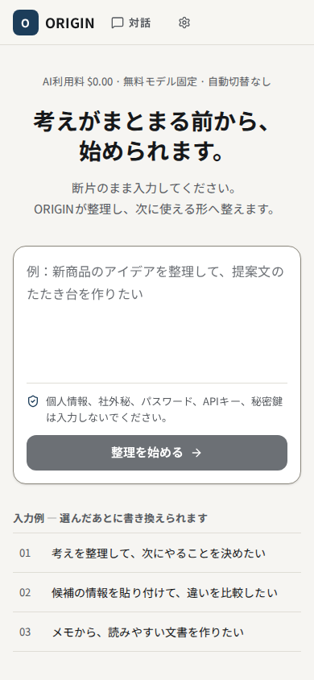 | 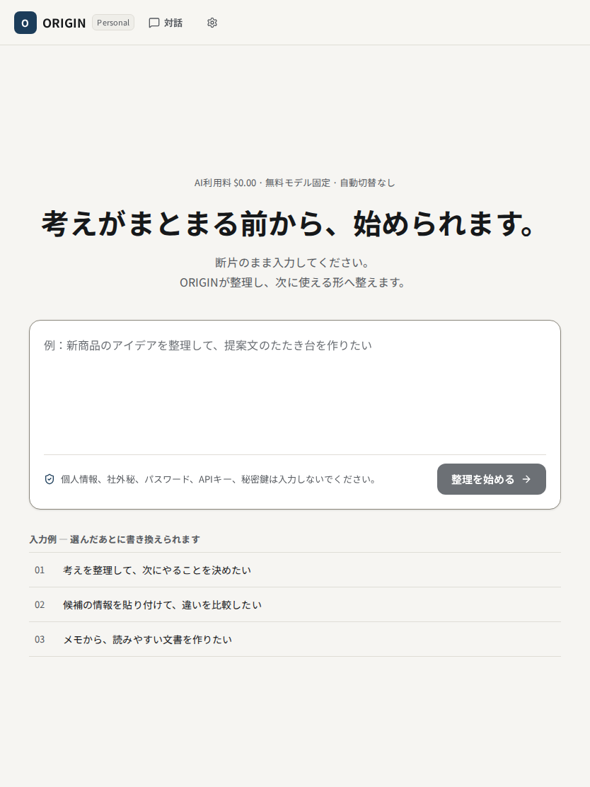 | 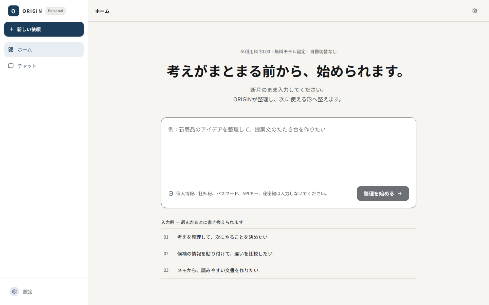 |

### 2. Empty chat — healthy, intentionally quiet

The conversation entry preserves one clear action and keeps the safety reminder adjacent to the composer. The large empty work surface is deliberate and does not introduce fake history, sample answers, or unusable controls.

| Mobile | Tablet | Desktop |
| --- | --- | --- |
| 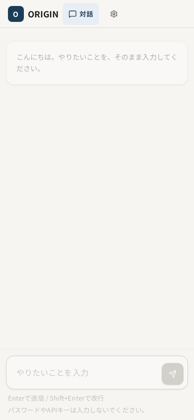 | 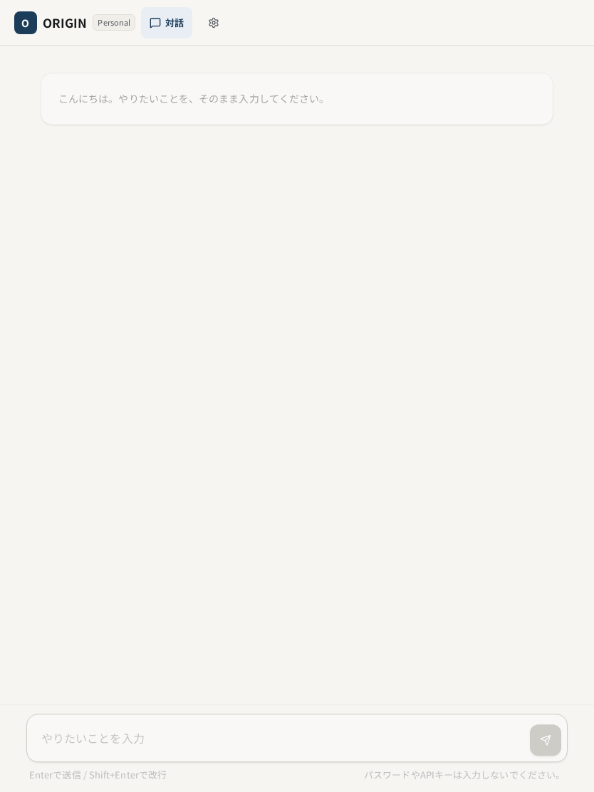 | 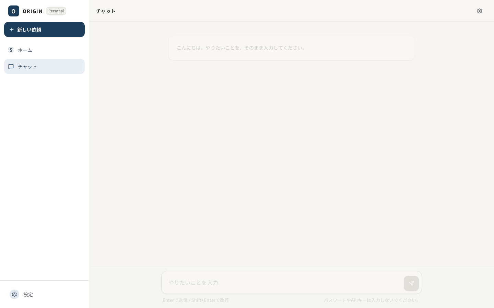 |

### 3. Processing — healthy

The interface exposes both a global working state and an in-conversation progress card. The staged wording starts with request understanding rather than making an unverified claim that another AI is already executing.

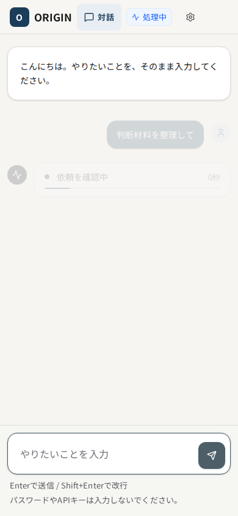

### 4. Structured answer — fixed and healthy

Initial capture found a release-impacting mobile defect: after a long answer completed, automatic scrolling placed the viewport at the end of the answer, hiding the conclusion and opening context. The implementation now aligns the newly completed AI answer with the top of the conversation viewport. A cross-viewport assertion requires the conclusion to be in the viewport immediately after completion.

The result then reads in the intended order: conclusion, body, evidence/review coverage, limitations, next action, and collapsible execution details.

| Mobile | Tablet | Desktop |
| --- | --- | --- |
| 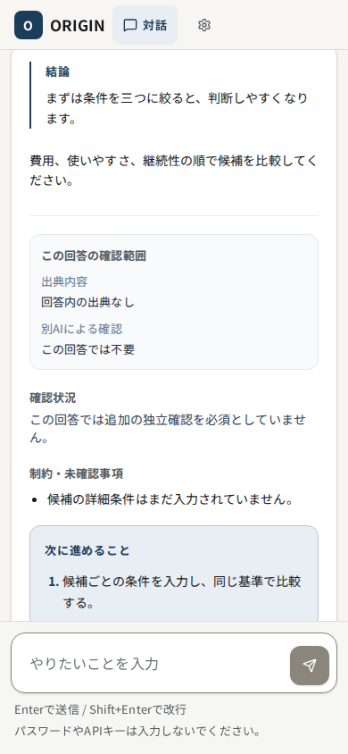 | 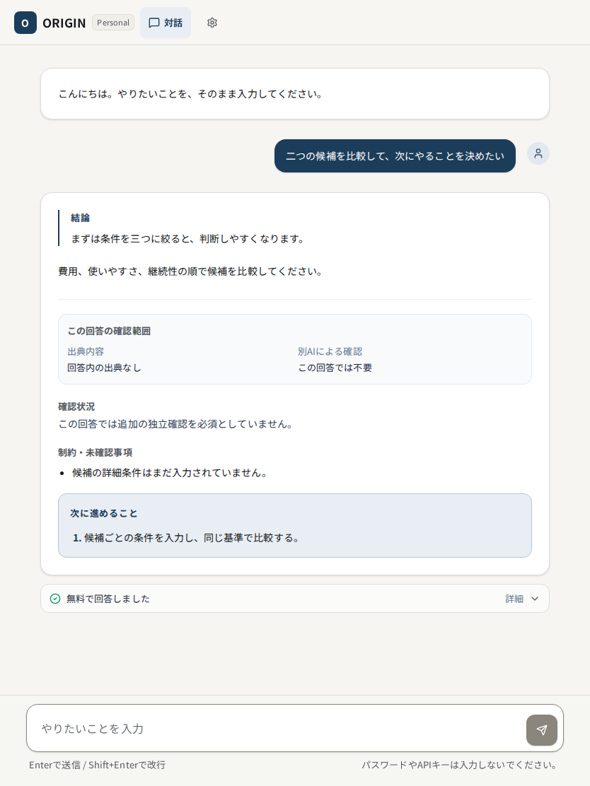 | 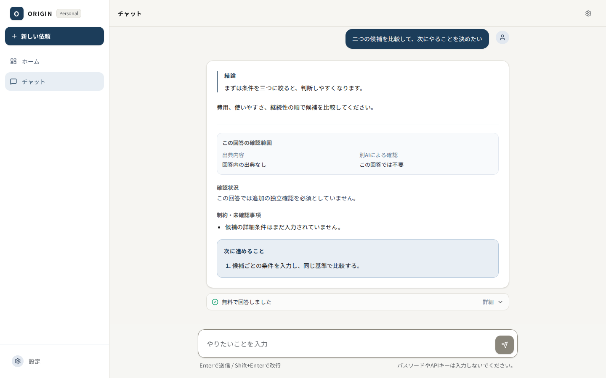 |

### 5. Recoverable free-provider failure — healthy

The error state names the free-usage limit, explains the retry delay, disables premature retry, retains technical details behind disclosure, and avoids suggesting a paid fallback or automatic model switch.

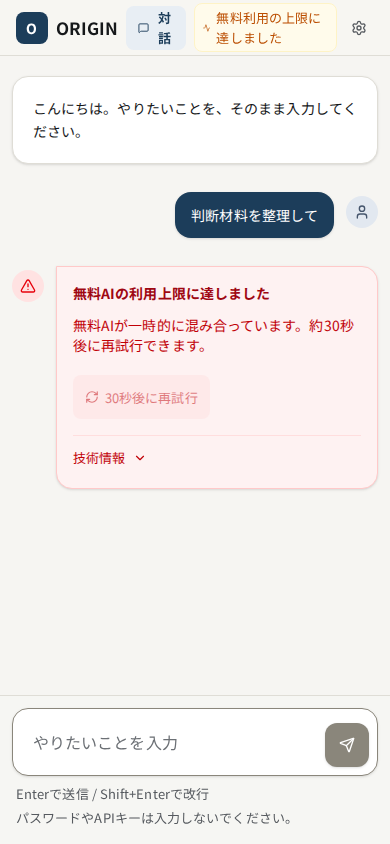

### 6. Settings and release identity — healthy

Language, brightness, free-only policy, secret guidance, release identity, full-SHA reveal, copy action, and a persistent close action remain reachable at every audited width. The dialog traps focus, closes with Escape, and restores focus to its opener in automated keyboard testing.

| Mobile | Tablet | Desktop |
| --- | --- | --- |
| 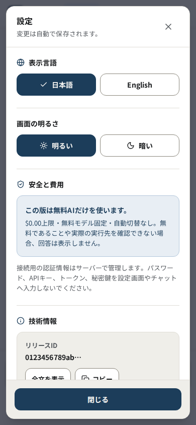 | 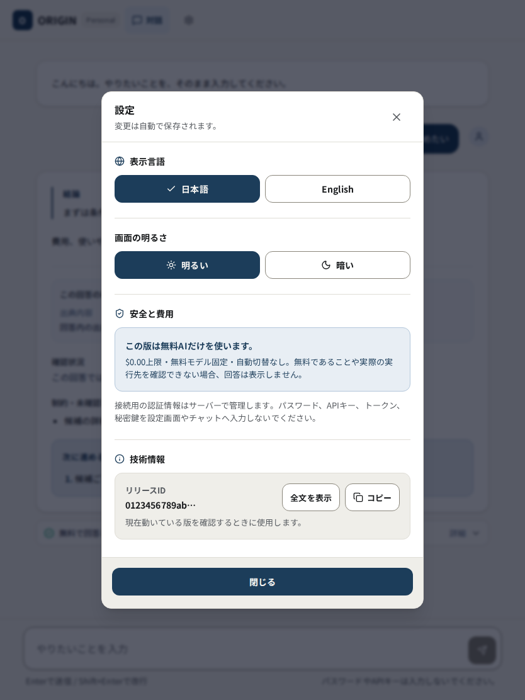 | 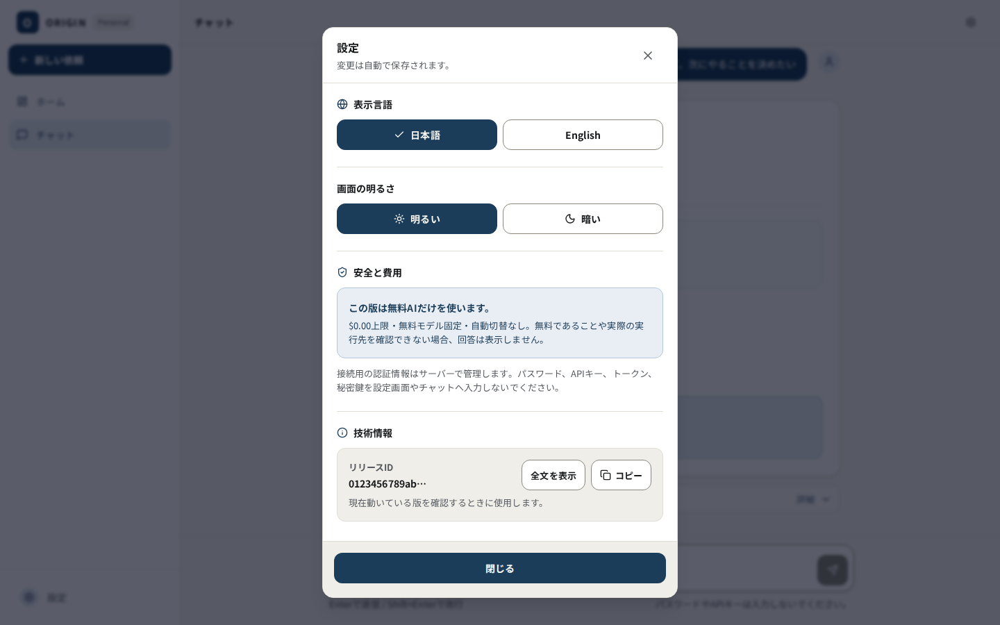 |

## Confirmed strengths

- The release surface stays limited to usable Home, Chat, and Settings functions.
- Primary controls meet the existing 44 px minimum-target convention.
- Copy distinguishes source presence, source checking, and independent review instead of merging them into one trust claim.
- Loading, failure, retry, and free-only states remain understandable without technical knowledge.
- The mobile answer now begins with the conclusion rather than forcing the user to scroll backward.
- No horizontal overflow was detected across the seven automated widths.
- Reduced-motion behavior, keyboard focus, live-region behavior, dialog focus containment, and language pressed states passed their automated checks.

## Evidence limits and remaining gates

```text
Deployed URL and served SHA: NOT VERIFIED
Production model identity and actual cost: NOT VERIFIED
Japanese rendering on physical Android/iOS devices: NOT VERIFIED
VoiceOver/TalkBack/NVDA operation: NOT VERIFIED
Switch control and high-zoom manual use: NOT VERIFIED
External Claude/Groq/Genspark review: NOT PERFORMED
```

Automated axe results and screenshots do not prove full WCAG compliance. Production deployment, production identity, actual `$0.00` execution evidence, physical-device behavior, and assistive-technology behavior remain separate release gates.

## Release recommendation

The source UI/UX has no remaining blocker found in this audit after the mobile answer-position fix. Merge eligibility still depends on exact-head review and CI. Publication and deployment require separate owner authorization and production evidence.
