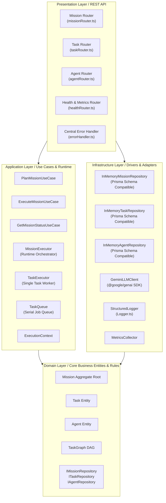
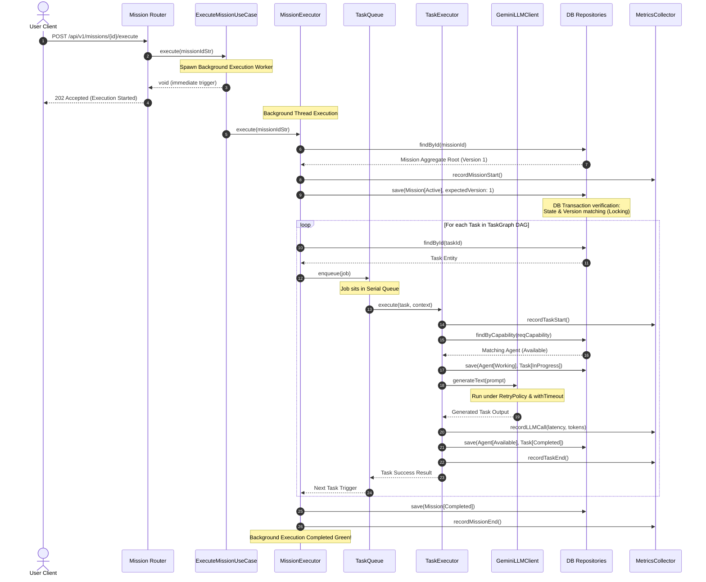

# ORIGIN Mission Engine - Version 1 Core Runtime

Welcome to the **ORIGIN Mission Engine (Version 1)**. This service acts as the central orchestrator coordinating complex, multi-agent missions. It is built strictly adhering to **Clean Architecture** patterns, ensuring a decoupling of core domain rules, application flow, and infrastructure mechanisms.

---

## 🗺️ System Architecture Overview

Below is the conceptual Clean Architecture dependency diagram for ORIGIN. Dependencies point **strictly inward** toward the core domain.



---

## 📂 Directory Structure Diagram

```
/services/mission-engine
├── README.md                           # Architectures, sequence diagrams & API spec
├── src
│   ├── index.ts                        # Module entry point & dependency injector
│   ├── application                     # Application Layer (Use Cases & Orchestration)
│   │   ├── runtime
│   │   │   ├── ExecutionContext.ts     # Metadata and Correlation-ID tracking
│   │   │   ├── ExecutionResult.ts      # Structured outputs for steps and missions
│   │   │   ├── MissionExecutor.ts      # Mission aggregate runtime manager
│   │   │   ├── RetryPolicy.ts          # Configurable exponent backoff retrier
│   │   │   ├── TaskExecutor.ts         # Coordinates individual task runs via LLMs
│   │   │   ├── TaskQueue.ts            # Serial in-memory execution queue
│   │   │   └── Timeout.ts              # Promise-based execution timeout guard
│   │   └── usecases
│   │       ├── ExecuteMissionUseCase.ts
│   │       ├── GetMissionStatusUseCase.ts
│   │       └── PlanMissionUseCase.ts
│   ├── infrastructure                  # Infrastructure Layer (Databases, AI clients, Logs)
│   │   ├── ai
│   │   │   ├── GeminiLLMClient.ts      # @google/genai SDK wrapper with mock fallbacks
│   │   │   └── ILLMClient.ts           # Decoupled interface
│   │   ├── database
│   │   │   ├── InMemoryMissionRepository.ts # Relational record mock (Prisma-ready)
│   │   │   └── InMemoryTaskRepository.ts    # Relational record mock (Prisma-ready)
│   │   ├── logging
│   │   │   └── Logger.ts               # Structured, key-value logger (info, warn, error)
│   │   ├── observability
│   │   │   └── MetricsCollector.ts     # Performance, LLM tokens, and error metrics
│   │   └── registry
│   │       └── InMemoryAgentRepository.ts   # Relational agent status mock (Prisma-ready)
│   ├── presentation                    # Presentation Layer (API Routers, Middlewares)
│   │   ├── middlewares
│   │   │   ├── asyncHandler.ts         # Wrapper to forward async router errors
│   │   │   └── errorHandler.ts         # Maps Domain exceptions to REST status codes
│   │   └── routes
│   │       ├── agentRouter.ts          # Agent discovery API
│   │       ├── healthRouter.ts         # Health diagnostics and detailed /metrics API
│   │       ├── missionRouter.ts        # Plannings, Async Triggering and Querying
│   │       └── taskRouter.ts           # Individual task status querying
│   └── __tests__
│       └── MissionEngine.test.ts       # 23-assertion deep Unit & Integration suite
```

---

## 🔄 Mission Execution Flow (Sequence Diagram)

This sequence diagram details the runtime flow when an execution requests arrives.



---

## 🚦 REST API Endpoints List

| HTTP Method | Route Path | Description | Payload Structure / Query | Successful Status |
| :--- | :--- | :--- | :--- | :--- |
| **POST** | `/api/v1/missions` | Plan and define tasks for an objective | `{"objective": "..."}` | `201 Created` |
| **POST** | `/api/v1/missions/:id/execute` | Asynchronously execute a planned mission | *None* | `202 Accepted` |
| **GET** | `/api/v1/missions/:id` | Fetch current execution graph, statuses & outputs | *None* | `200 OK` |
| **GET** | `/api/v1/tasks/:id` | Query details of a specific task | *None* | `200 OK` |
| **GET** | `/api/v1/agents/capability/:cap` | Retrieve agents matching specific capabilites | *None* | `200 OK` |
| **GET** | `/api/v1/health` | Service diagnostics and RSS memory status | *None* | `200 OK` |
| **GET** | `/api/v1/health/metrics` | Retrieve structured performance, LLM & Error metrics | *None* | `200 OK` |
| **POST** | `/api/v1/health/metrics/reset` | Clear all metrics back to empty | *None* | `200 OK` |

---

## 🛡️ Exception Translation Mapping

Whenever an exception rises inside the domain/application, our Presentation Error Handler (`errorHandler.ts`) catches it and transforms it into the appropriate HTTP code:

| Exception Type | Trigger Cause | HTTP Response Status | Error Body `code` |
| :--- | :--- | :--- | :--- |
| `CircularDependencyError` | Attempting to link tasks in a closed cycle DAG | **400 Bad Request** | `BAD_REQUEST_DOMAIN_VIOLATION` |
| `DomainInvariantViolationError` | Violating aggregate rules (e.g., version conflict, insufficient success criteria) | **400 Bad Request** | `BAD_REQUEST_DOMAIN_VIOLATION` |
| `InvalidStateTransitionError` | Requesting state change unsupported by machine | **400 Bad Request** | `BAD_REQUEST_DOMAIN_VIOLATION` |
| `UnauthorizedActionError` | Executing admin operations without credentials | **403 Forbidden** | `FORBIDDEN_ACTION` |
| *General Error with "not found"* | Requesting non-existent mission, task, or agent | **404 Not Found** | `NOT_FOUND` |

---

## 🧪 Running the Tests

To execute the unit and integration suites of the Mission Engine, simply invoke:

```bash
npx vitest run
```
This runs the complete test suite including standard component checks, integration flows, and the 63-assertion safety verification suite.

---

## 🛡️ Version 1.1 Hardening & Safety Policies

In Version 1.1, the Mission Engine underwent critical architectural hardening to block malicious execution loops and prevent container/host exploitation:

### 1. Zero-Trust SSRF & DNS Rebinding Shield
Our outgoing request wrapper `secureFetch` protects server systems against Server-Side Request Forgery:
- **Protocol Whitelisting**: Restricts calls solely to `http://` and `https://` schemes.
- **Strict Host Verification**: Rejects `localhost`, loopback blocks, and link-local ranges.
- **Address Filtering**: Denies all RFC1918 Private networks (`10.x`, `172.16-31.x`, `192.168.x`) and IPv6 Unique Local address space.
- **DNS Rebinding Protection**: Resolves domain names to IP addresses first, and validates the IP address before making the connection.
- **Metadata Endpoints Shield**: Rejects metadata addresses (such as `169.254.169.254`).
- **Domain Whitelisting**: Outgoing calls are constrained to an explicit whitelist of safe services (`wikipedia.org`, `github.com`, `httpbin.org`).

### 2. Path Traversal & Sandbox Escape Guard
File interactions via `FileTool` run under severe confinement policies:
- **Workspace Confinement**: Resolves and forces paths to run strictly inside a secure workspace directory sandbox.
- **Canonical Validation**: Decodes URL encoding (e.g., `%2e%2e%2f`), normalizes Unicode sequences, resolves symbolic links, and filters out absolute/relative traversal patterns.
- **OS Bypass Protection**: Rejects multi-operating system traversal tricks, preventing Windows-style separation (`..\..\`) or UNC/drive escapes.

### 3. Agent Tool Loop Explosion prevention
To guard against uncontrollable infinite-execution loops and prompt/API token budget drainage:
- **Tool Call Budget**: Enforces a strict maximum of `6` total tool calls per execution.
- **Tool Circuit Breaker**: Aborts execution instantly if `3` consecutive tool execution failures are recorded.
- **Duplicate Tool Detection**: Blocks the agent from running identical tools with identical inputs more than `2` times within the same execution turn.

