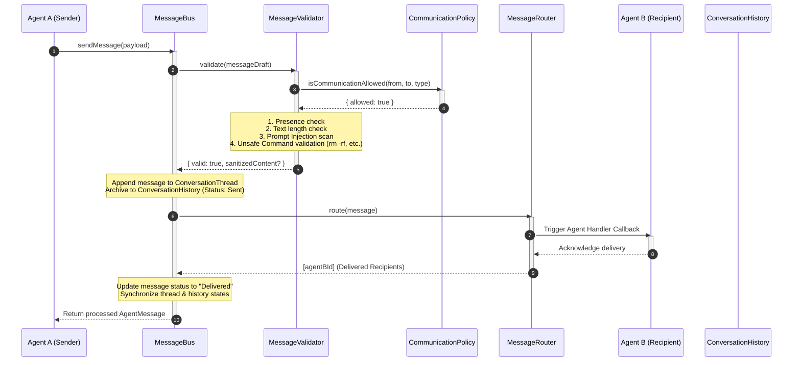
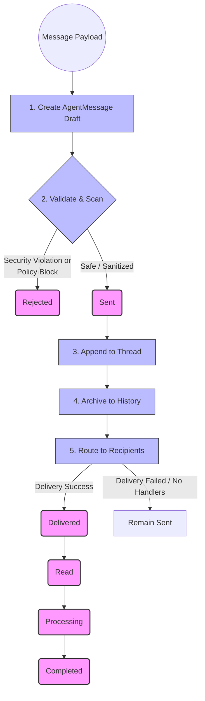
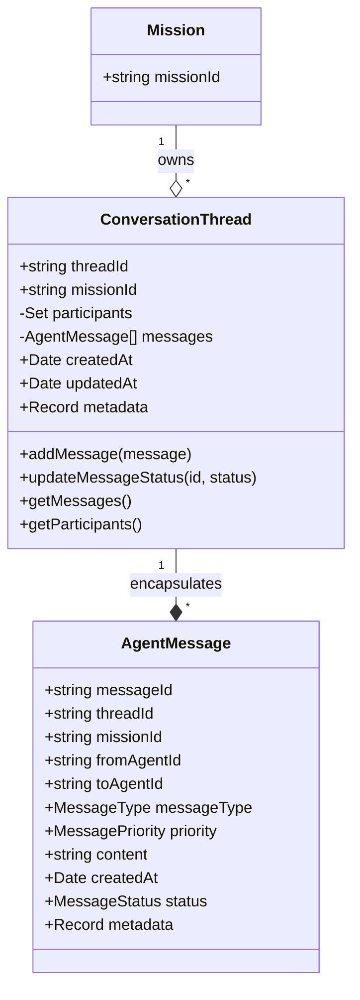

# Agent Communication Layer (ORIGIN Core)

The **Agent Communication Layer** is a secure, structured, and resilient message-bus system designed for inter-agent communication, review coordination, consensus-building, and system broadcasts within the **ORIGIN Core** architecture. 

It leverages the existing Version 1.x Security Policy Engine, Prompt Injection Firewalls, and Agent Governance Registries to guarantee complete, zero-trust communication isolation.

---

## 1. Architectural Diagrams

### 1.1 Agent Communication Sequence

This sequence diagram illustrates how a sending agent communicates with a target receiving agent securely via the centralized `MessageBus`.



---

### 1.2 Message Flow

The state progression of an `AgentMessage` as it moves from creation to archival and final completion.



---

### 1.3 Conversation Thread Structure

Threads organize conversations dynamically based on **Mission ID**, allowing multi-stage collaborations, requests, and reviews.



---

## 2. Core Modules

| Module Name | File Path | Responsibilities |
| :--- | :--- | :--- |
| **AgentMessage** | `AgentMessage.ts` | Defines the standard data model, `MessageType` (REQUEST, RESPONSE, QUESTION, ANSWER, REVIEW, APPROVAL, REJECTION, SYSTEM), and `MessageStatus` state-tracking enums. |
| **MessagePriority** | `MessagePriority.ts` | Defines the priorities (`LOW`, `NORMAL`, `HIGH`, `URGENT`) of messages inside the system. |
| **ConversationThread** | `ConversationThread.ts` | Tracks a ordered group of inter-agent messages for a specific Mission ID, managing the list of active participants. |
| **ConversationHistory** | `ConversationHistory.ts` | Central log repository enabling structured search, text filtering, and retrieval of messages by Agent, Mission, or Thread. |
| **CommunicationPolicy** | `CommunicationPolicy.ts` | Checks sender/receiver registration and lifecycle states, enforcing capability-based access control (RBAC). |
| **MessageValidator** | `MessageValidator.ts` | Verifies field presence, enforces maximum lengths, and filters against injection attempts (using `PromptInjectionFirewall` and `SafetyPolicyEngine`). |
| **MessageRouter** | `MessageRouter.ts` | Dispatches messages to target agent callback handlers, supports wildcards/type subscriptions, and coordinates broadcasts. |
| **MessageBus** | `MessageBus.ts` | Orchestrates the entire lifecycle: singleton manager coordinating validation, thread appending, archival, routing, and status transitions. |

---

## 3. How to Use

### 3.1 Basic Singleton Initialization
```typescript
import { MessageBus, MessageType, MessagePriority } from "./application/communication";

const messageBus = MessageBus.getInstance();
```

### 3.2 Registering an Agent Handler Callback
To receive routed messages, agents register their handlers on the router:
```typescript
messageBus.getRouter().registerAgentHandler("AGT-CODER", async (msg) => {
  console.log(`Received message from ${msg.fromAgentId}: ${msg.content}`);
});
```

### 3.3 Sending a Secure Message
```typescript
const message = await messageBus.sendMessage({
  threadId: "co-op-thread-101",
  missionId: "ms-react-builder",
  fromAgentId: "AGT-PLANNER",
  toAgentId: "AGT-CODER",
  messageType: MessageType.REQUEST,
  priority: MessagePriority.HIGH,
  content: "Please build the core navigation bar component."
});

console.log(`Message successfully sent with status: ${message.status}`); // "Delivered"
```
