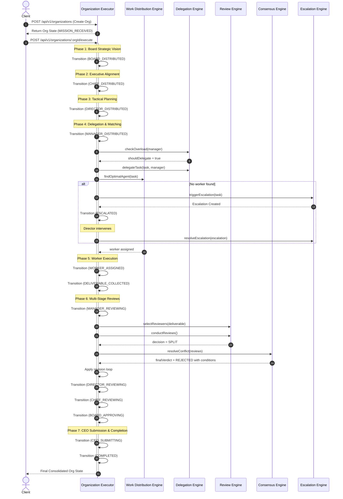

# ACOS 2.0: Organization Execution Engine

Welcome to the **Organization Execution Engine** (OEE) of ACOS 2.0 (AI Operating System). This engine operates as a strategic orchestration layer above individual AI agent runtimes, simulating a fully functional automated corporate enterprise that collaborates to achieve complex missions.

---

## 1. Engine Core Philosophy

In ACOS 1.x, we pioneered the transition from isolated agent interactions to structured pipelines. ACOS 2.0 elevates this paradigm into a true **AI Corporate Operating System**, where complex objectives (Missions) are automatically distributed, reviewed, refined, debated, and approved through a rigorous hierarchical corporate lifecycle:

```
Mission Received 
      │
      ▼
Board of Directors (Strategic Vision & Directives)
      │
      ▼
Chief Executive Officers (CTO/CMO: Tactical Milestone Decomposition)
      │
      ▼
Directors (Engineering/Research: Department Tasks & Deliverables Planning)
      │
      ▼
Managers (Workload Distribution, Scheduling, and Automated Delegation)
      │
      ▼
Workers (Execution and Deliverable Construction)
      │
      ▼
Multi-Stage Review Chain (Manager Check -> Director QA -> Chief Alignment -> Board Sign-off)
      │
      ▼
CEO Submission & Real-time Metrics Compilation
```

---

## 2. Seven Specialized Micro-Engines

The Organization Execution Engine is built in a modular, clean, and highly decoupled DDD (Domain-Driven Design) structure consisting of seven specialized engines:

### ① Organization Executor (`OrganizationExecutor.ts`)
The central coordinator that drives a mission through its entire organizational lifecycle. It maintains state transitions, invokes sub-engines, and ensures tasks move systematically from strategic planning to ultimate delivery.

### ② Work Distribution Engine (`WorkDistributionEngine.ts`)
Matches tasks to candidate agents. It scores suitability based on:
- **Capability Requirements**: Possession of exact matching capabilities (Planning, Coding, Writing, ToolUse).
- **Workload Limits**: Active assignment loads (penalizes busy agents to balance corporate workloads).
- **Performance & Health Metrics**: Past success rates, error rates, and response latency.

### ③ Delegation Engine (`DelegationEngine.ts`)
Enables automated corporate delegation when an agent is overloaded or faces a capability mismatch. It shifts responsibility down the hierarchical organizational chart:
$$\text{CEO} \rightarrow \text{Board} \rightarrow \text{Chief} \rightarrow \text{Director} \rightarrow \text{Manager} \rightarrow \text{Worker}$$

### ④ Review Engine (`ReviewEngine.ts`)
Manages the validation of worker outputs.
- Dynamically assigns reviewers based on task priority (2 to 5 reviewers).
- Automatically excludes the original author from participating in the review.
- Scores deliverables and aggregates feedback into an overall corporate verdict (**APPROVED**, **REJECTED**, or **SPLIT**).

### ⑤ Consensus Engine (`ConsensusEngine.ts`)
Handles **SPLIT** review outcomes through a reasoned debate mechanism. Reviewers engage in simulated dialogue to share opinions, propose compromises, and reach a unified corporate resolution rather than relying on standard majority voting.

### ⑥ Escalation Engine (`EscalationEngine.ts`)
Handles unresolved blockades or lack of qualified agents at lower operational tiers. It escalates blockages up the management chain (e.g. from Worker to Manager to Director) and logs resolutions when executives intervene.

### ⑦ Organization Metrics Tracker (`OrganizationMetricsTracker.ts`)
Maintains rolling statistics for each department:
- **Productivity**: Percentage of tasks successfully finalized.
- **Review Quality**: Departmental review scores.
- **Success & Failure Rates**: Outcomes of completed vs. escalated tasks.
- **Average Time**: Mean speed from creation to finalization.
- **Improvement Rate**: Percentage improvement of quality across document versions.

---

## 3. Sequence & Interaction Flow



---

## 4. REST, SSE, and Real-time APIs

The Dashboard API is exposed under `/api/v1/organizations`:

### REST Endpoints
*   `GET /api/v1/organizations` — Lists all current active organizations.
*   `GET /api/v1/organizations/:orgId` — Retrieves full JSON details of an active corporate state.
*   `POST /api/v1/organizations` — Bootstraps a new dynamic corporate structure.
*   `POST /api/v1/organizations/:orgId/execute` — Invokes the automated corporate lifecycle.
*   `GET /api/v1/organizations/metrics` — Retrieves real-time rolling metrics across all departments.

### Real-Time Update Stream (SSE)
*   `GET /api/v1/organizations/:orgId/sse` — Real-time event stream. Consuming applications receive server ticks pushing the state transitions during active execution.
